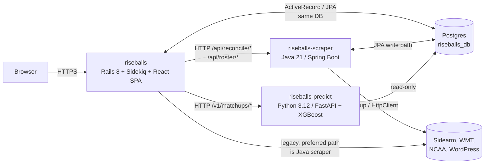
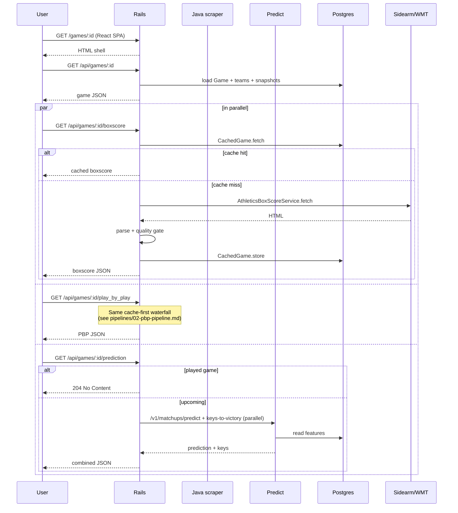

# System Overview

Riseballs is three cooperating services over one shared Postgres database.



---

## Why three services

| Concern | Why it's in this service |
|---------|--------------------------|
| **HTTP surface** | Rails — single Devise auth, single SPA mount, everything users hit |
| **Cron** | Rails (Sidekiq cron) — 12 scheduled jobs, unified scheduling point (see [rails/14-schedule.md](../rails/14-schedule.md)) |
| **Heavy scraping + reconciliation** | Java — JVM concurrency (virtual threads + semaphores) handles 592 teams' schedule pages in one pass far more reliably than Ruby with Sidekiq workers; Jsoup is also the strongest HTML parser available |
| **Roster/coach augmentation** | Java — Sidearm bio pages, WordPress, WMT all hit from one service so URL discovery + parsing + update lives together |
| **Predictions** | Python — XGBoost + isotonic calibration + scipy/numpy feature engineering is painful to replicate in Ruby; Python ecosystem is the natural fit |

Rails is the front door and the orchestrator. Java is a scraper that happens to have a JPA write path. Python is a pure read-compute-respond service.

---

## Shared state

All three services talk to the same Postgres database (`riseballs_db` in prod, `riseballs_local` in dev). Only Rails and Java write. Python reads.

**Writes are not symmetric.** See [architecture/01-service-boundaries.md](01-service-boundaries.md) for the detailed split, but the headline hazard:

> **Java writes bypass Ruby quality gates.** When `GameStatsWriter` inserts a `player_game_stat` row, no Rails callback fires. When the Java scraper stores PBP in `cached_games`, `CachedGame.pbp_quality_ok?` is not invoked. Quality validation is Ruby code; the Java path has to replicate it or skip it, and today it mostly skips it.

This is a known live hazard, not a bug to fix in one PR. It shapes how operators debug data issues — always check both write paths.

---

## Deployment shape

All three services run on a single self-hosted Dokku box (`ssh.edentechapps.com` / `ssh.mondokhealth.com`). One app per service:

| Dokku app | Git remote | Internal hostname | Public URL |
|-----------|-----------|------------------|-----------|
| `riseballs` | `dokku` (main branch) | `riseballs.web:3000` | `riseballs.com` (Cloudflare tunnel) |
| `riseballs-scraper` | `dokku` | `riseballs-scraper.web:8080` | internal only |
| `riseballs-predict` | `dokku` | `riseballs-predict.web:8080` | internal only |

Services reach each other by internal Dokku hostname. `dokku run` one-off containers **cannot** reach other Dokku apps (the internal network is only attached to `web`/`worker` containers) — that's why `dokku enter` is required for any rake task that calls Java. See [operations/database-access.md](../operations/database-access.md).

Cloudflare tunnel fronts the public site (`edentechapps` / `mondokhealth` tunnel), handling SSL termination. No Let's Encrypt on Dokku.

---

## Request: anatomy of a page load

Tracing a user viewing a game page (`/games/:id`):



The scraper is not on the read path — Rails serves everything the browser sees. Rails calls the scraper for reconciliation and roster augmentation from background jobs, not request threads.

---

## Write: anatomy of a game result

Tracing new game data from "team just finished playing" to "it shows on scoreboard":

```mermaid
sequenceDiagram
    participant Cron as Sidekiq cron
    participant Rails
    participant Scraper as Java scraper
    participant DB as Postgres
    participant External as Sidearm/WMT

    Cron->>Rails: GamePipelineJob (every 15 min)
    Rails->>Scraper: POST /api/team-schedule/sync-all<br/>(3 AM full; per-team otherwise)
    Scraper->>External: fetch 592 team schedule pages
    External-->>Scraper: HTML
    Scraper->>Scraper: TeamScheduleSyncService<br/>normalize opponent + game_number<br/>snapshot game_id links
    Scraper->>DB: upsert team_games<br/>restore game_id links

    Rails->>Rails: TeamGameMatcher.match_scheduled<br/>(create shell Games)
    Rails->>Rails: TeamGameMatcher.match_all<br/>(update shells with scores)

    Rails->>Rails: BoxScoreBackfillJob<br/>(for games just gone final)
    Rails->>External: AthleticsBoxScoreService.fetch
    External-->>Rails: boxscore HTML
    Rails->>Rails: parse + quality gate
    Rails->>DB: CachedGame.store + PlayerGameStat upsert

    Rails->>Rails: Game after_update_commit<br/>(state flipped to final)
    Rails->>Rails: PbpOnFinalJob enqueued
    Rails->>External: athletics PBP fetch (retries w/ polynomial backoff)
    External-->>Rails: PBP HTML/JSON
    Rails->>Rails: PBP quality gate
    Rails->>DB: CachedGame.store (athl_play_by_play)
```

Every 15 minutes the pipeline re-runs. Daily at ~3 AM the reconciliation jobs go through all 592 schedules in depth (see [pipelines/06-reconciliation-pipeline.md](../pipelines/06-reconciliation-pipeline.md)).

---

## Where to go next

- [architecture/01-service-boundaries.md](01-service-boundaries.md) — the "who writes what" table in detail
- [architecture/02-data-flow.md](02-data-flow.md) — full end-to-end journey of a game record, cradle to screen
- [pipelines/](../pipelines/) — one doc per major pipeline
- [reference/glossary.md](../reference/glossary.md) — vocabulary (Shell, Locked, quality gate, etc.)
