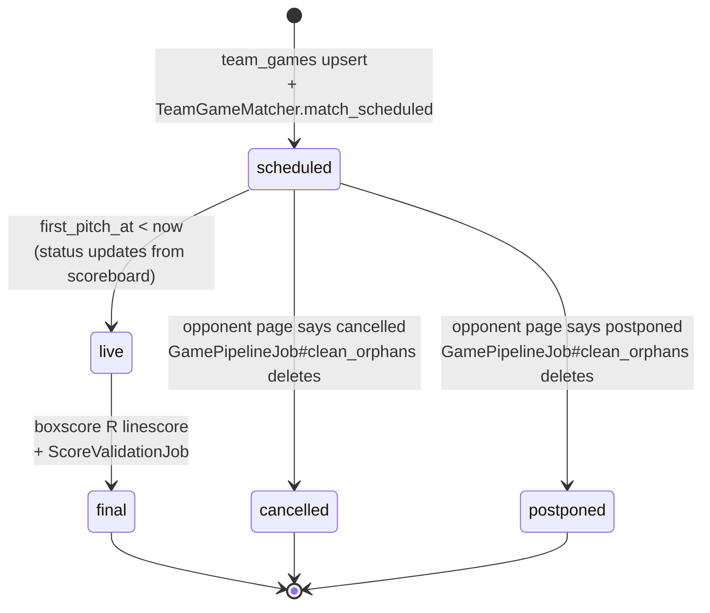

# End-to-End Data Flow

One game, cradle to screen. Trace the journey of a single game record from "doesn't exist yet" through "showing on scoreboard with PBP and prediction".

---

## Lifecycle states



`Game.state` transitions drive callbacks. The most important one: `scheduled → final` fires `Game#enqueue_pbp_refresh_if_finalized` which enqueues `PbpOnFinalJob`. See [rails/01-models.md](../rails/01-models.md).

---

## Phase 1 — Scheduling (upstream of the game)

**Trigger:** Nightly Java schedule scrape + Rails `ScheduleReconciliationJob` at 3 AM (also re-runs via `GamePipelineJob` every 15 minutes for in-season teams).

**Java side (`TeamScheduleSyncService`):**
1. Fetches team schedule HTML (Sidearm / PrestoSports / WMT / WordPress) — parser dispatched by `ConferenceSource.parser_type` or team-level config.
2. For each row, calls `OpponentResolver` to resolve the opponent name to a `team_slug` in our DB.
3. Calls `normalizeForDedup(name)` — strips rankings (`#5 Georgia` → `Georgia`), resolves through aliases. This is what assigns `game_number` consistently across both teams' schedules.
4. **Shell link preservation:** snapshots existing `team_games.game_id` values before deleting non-final rows, then restores them after insert using the natural key `(game_date, opponent_slug, game_number)`. This prevents the matcher from having to re-link existing Games every sync.
5. Upserts into `team_games` honoring the unique constraint `(team_slug, game_date, opponent_slug, game_number)`.

**Rails side (`TeamGameMatcher`):**
6. `match_scheduled` pairs team_games from opposing teams into a single shared `Game` shell. Uses `game_number` as the doubleheader tiebreaker.
7. Inserts `game_team_links` rows pointing both team_games at the shared Game.

After phase 1: `Game` exists with `state = scheduled`, no scores, no boxscore, no PBP.

See [pipelines/01-game-pipeline.md](../pipelines/01-game-pipeline.md) and [rails/08-matching-services.md](../rails/08-matching-services.md).

---

## Phase 2 — Live (game in progress)

**Trigger:** `Api::ScoreboardController` requests — driven by the frontend scoreboard polling (every 30–60s per page).

The scoreboard render path is a fan-out via `Concurrent::FixedThreadPool`:
1. For each game-of-interest, call `EspnScoreboardService` / `NcaaScoreboardService` / other sources in parallel (POOL_SIZE=10, 15s joint wait).
2. Merge results; extract live scores, inning, pitcher ids.
3. Writes back to `Game`: `state = live`, `home_score`, `away_score`, `current_inning`.

Live games don't persist boxscore/PBP yet (too volatile). `Api::GamesController#boxscore` and `#play_by_play` will call external sources on-demand during live games (see [pipelines/03-boxscore-pipeline.md](../pipelines/03-boxscore-pipeline.md) and [pipelines/02-pbp-pipeline.md](../pipelines/02-pbp-pipeline.md)).

---

## Phase 3 — Final (game just ended)

### 3a: score lands

The scoreboard fetch detects the game went final; `Game.state` updates to `final`. This fires `Game#enqueue_pbp_refresh_if_finalized` which enqueues `PbpOnFinalJob`.

`TeamGameMatcher.match_all` (in the every-15min `GamePipelineJob`) also picks up newly-final `team_games` and pushes their scores to the Game shell (subject to `game.locked?`).

### 3b: boxscore backfill

`BoxScoreBackfillJob` (daily at 6 AM, also triggered inline from reconciliation) walks games needing boxscore and runs `BoxscoreFetchService`:

```
BoxscoreFetchService.fetch
  ├─ try AthleticsBoxScoreService  (sidearm HTML)
  │   └─ parse via BoxScoreParsers::SidearmParser / PrestoSportsParser
  ├─ fallback: WmtBoxScoreService  (WMT JSON API)
  │   └─ parse via BoxScoreParsers::WmtParser
  ├─ fallback: CloudflareBoxScoreService  (legacy, Playwright)
  └─ fallback: AiBoxScoreService  (LLM extraction; last resort)
```

On success:
- `CachedGame.store(data_type: "athl_boxscore", ...)` with quality validation
- `GameStatsExtractor.extract(game, boxscore_json)` → inserts/upserts `player_game_stats` rows (with `decision`, `pitch_count`)
- `ScrapedPage` row persists raw HTML for later reparse

### 3c: PBP backfill

`PbpOnFinalJob` fires (triggered by the callback in 3a). It mirrors the on-demand path:
1. Find athletics boxscore source URL (from cache or fall back to `[home_team_slug, away_team_slug]`).
2. `AthleticsBoxScoreService.fetch` returns boxscore + PBP.
3. PBP validated through `CachedGame.pbp_quality_ok?`.
4. On pass: `CachedGame.store_for_game(game, "athl_play_by_play", pbp)` + `PitchByPitchParser.parse_from_cached_pbp!` (populates `plate_appearances` + `pitch_events` normalized rows).
5. On fail: raises `PbpOnFinalJob::PbpNotReadyError`, which triggers `retry_on ... wait: :polynomially_longer, attempts: 5` — roughly an hour of backoff while the source finishes publishing.

See [pipelines/02-pbp-pipeline.md](../pipelines/02-pbp-pipeline.md).

### 3d: score validation

`ScoreValidationJob` at 8:30 AM daily compares `Game.home_score`/`away_score` against `player_game_stats` team totals:
- **Consistent** (player sums match team totals match game score): sets `game.locked = true`. Future matcher passes can't overwrite.
- **Inconsistent but game totals match player sums**: auto-corrects `Game`, sets `locked = true`, creates a `GameReview` with `status = approved`.
- **Inconsistent, totals don't match player sums**: creates `GameReview` with `status = pending` for human review via `/admin/reviews`.

---

## Phase 4 — Analytics propagation (overnight)

Daily jobs extract higher-order stats from the game data:

| Job | Time | Reads | Writes |
|-----|------|-------|--------|
| `SyncRankingsJob` | 3:30 AM | NCAA rankings JSON | `teams.rank` |
| `CalculateRpiJob` | 4 AM | `games`, `team_games` | `site_metrics` (RPI per team) |
| `StandingsRefreshJob` | 7 AM | Java `/api/standings/refresh` | `conference_standings` (written by Java) |
| `ComputeD1MetricsJob` | 9 AM | `games`, `player_game_stats`, `pitch_events` | `site_metrics` (league averages) |

See [rails/12-jobs.md](../rails/12-jobs.md) and [rails/14-schedule.md](../rails/14-schedule.md).

---

## Phase 5 — Read (user opens the page)

A browser request for `/games/:id` kicks off the read waterfall (detailed sequence in [00-system-overview.md](00-system-overview.md)):

```
GET /api/games/:id                  → Rails DB read
GET /api/games/:id/boxscore         → cached_games hit OR live scrape → cache
GET /api/games/:id/play_by_play     → cached_games hit OR live scrape → cache (with negative cache on fail)
GET /api/games/:id/prediction       → 204 if played, else Predict service parallel call
```

Caching layers:
- `cached_games` (Postgres) — boxscore, PBP, stats; keyed by `(data_type, game identity)`
- `Rails.cache` (Redis) — `pbp_miss:<gid>` 5-min negative cache for failed live PBP fetches
- Predict internal `TTLCache` — 5-min prediction cache keyed on `model_version`

---

## Phase 6 — Reconciliation (the safety net)

Two reconciliation jobs run at 2:30/3 AM daily and delegate to the Java scraper. They catch data drift:

### `NcaaDateReconciliationJob` (2:30 AM)

Queries NCAA GraphQL API for the full season; for every game with `ncaa_contest_id`, checks `game_date` against NCAA's date. Corrections are written as `MOVE` / `NCAA_WRONG` / `REVIEW` actions based on stat fingerprint (`boxScoresMatch`). Empty-shell games get merged into the NCAA-source record.

### `ScheduleReconciliationJob` (3 AM)

Walks every `ConferenceSource`, fetches the schedule page for every team (≈592 teams), compares against our `games` table:
- Missing in DB → create
- Cancelled in DB but not in source → uncancel
- Score mismatch → correct (unless locked)
- Date mismatch → correct
- Scheduled → final transition → finalize + trigger `BoxScoreBackfillJob`

Both jobs write `GameReview` audit rows for anything they change.

See [pipelines/06-reconciliation-pipeline.md](../pipelines/06-reconciliation-pipeline.md).

---

## Where the data actually lives

```mermaid
flowchart TD
    subgraph Ingestion
        Java[Java TeamScheduleSyncService] -.->|upserts| TG[team_games]
        Rails[Rails matcher] -.->|creates shells<br/>from paired team_games| G[games]
        Rails -.->|links| GTL[game_team_links]
        Rails -.->|caches raw HTML| SP[scraped_pages]
        Rails -.->|extracts| PGS[player_game_stats]
        Rails -.->|normalizes PBP| PA[plate_appearances]
        PA --> PE[pitch_events]
        Rails -.->|blob cache| CG[cached_games]
        Java -.->|blob cache<br/>bypasses quality gate| CG
    end

    subgraph Conference
        Java -.->|writes| CS[conference_standings]
        Rails -.->|seeds| CSo[conference_sources]
    end

    subgraph Audit
        Rails -.->|corrections| GR[game_reviews]
        Rails -.->|snapshots| GS[game_snapshots]
        Rails -.->|scrape log| SSL[standings_scrape_logs]
    end

    subgraph Analytics
        Rails -.->|metrics| SM[site_metrics]
        Rails -.->|WAR| WAR[player_war_values]
        Rails -.->|aggregate| TPS[team_pitching_stats]
    end
```



The split between `cached_games` (blob cache of raw payload) and `player_game_stats` / `plate_appearances` / `pitch_events` (normalized rows) is intentional:
- **Blob cache** is the source of truth for fidelity — raw JSON in its native shape, always re-parseable.
- **Normalized rows** are for fast SQL queries (leaderboards, season totals, pitch charts).

A failing parser updates the normalized rows but the blob cache keeps the raw payload for later reparse via `stats:backfill_decisions` / `stats:backfill_pitch_counts` / `reparse_pbp_from_html`.

---

## Related pipelines

Every phase above has a dedicated pipeline doc:

- [pipelines/01-game-pipeline.md](../pipelines/01-game-pipeline.md) — Phase 1 and Phase 3 orchestration
- [pipelines/02-pbp-pipeline.md](../pipelines/02-pbp-pipeline.md) — Phase 3c + on-demand
- [pipelines/03-boxscore-pipeline.md](../pipelines/03-boxscore-pipeline.md) — Phase 3b + on-demand
- [pipelines/04-standings-pipeline.md](../pipelines/04-standings-pipeline.md) — daily conference standings scrape + scenarios
- [pipelines/05-roster-pipeline.md](../pipelines/05-roster-pipeline.md) — roster and coach augmentation
- [pipelines/06-reconciliation-pipeline.md](../pipelines/06-reconciliation-pipeline.md) — Phase 6
- [pipelines/07-prediction-pipeline.md](../pipelines/07-prediction-pipeline.md) — Phase 5 prediction branch
