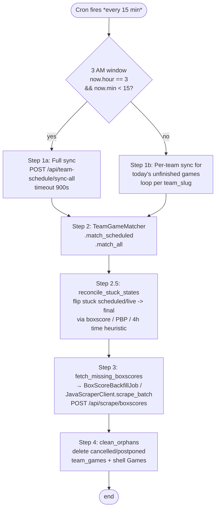

# Game Pipeline (`GamePipelineJob`)

The 15-minute heartbeat of the system. This one job is the orchestrator that calls the Java scraper, runs matching, backfills box scores, and cleans orphans.

- **File:** `app/jobs/game_pipeline_job.rb`
- **Schedule:** `*/15 * * * *` — every 15 minutes (`config/initializers/sidekiq.rb`)
- **Queue:** `default`

---

## What it does (in order)



### Step 1 — Sync (Java scrape)

Rails POSTs to the Java scraper via HTTParty (not `JavaScraperClient` for this endpoint — `GamePipelineJob` calls `HTTParty.post` directly at `app/jobs/game_pipeline_job.rb:50`). There are two modes:

- **Full sync** (3 AM window only): `POST http://riseballs-scraper.web:8080/api/team-schedule/sync-all` (timeout 900s). Fans out across every team with an `athletics_url`.
- **Per-team sync** (all other runs): iterates teams with today's unfinished `team_games` and sync each individually.

Java's `TeamScheduleSyncController` → `TeamScheduleSyncService`:

- For each team of interest (in-season + scheduled next 7 days), fetch team schedule page (parser dispatched by site type).
- `TeamScheduleSyncService` parses and upserts `team_games`:
  - Calls `OpponentResolver` to resolve opponent name → slug.
  - Calls `normalizeForDedup` — strips rankings, resolves aliases — to assign `game_number` consistently for doubleheaders.
  - Snapshots existing `team_games.game_id` before deletion.
  - Deletes non-final team_games for that team.
  - Inserts fresh rows.
  - Restores `game_id` links by natural key `(game_date, opponent_slug, game_number)`.

**Why the snapshot dance:** deleting + reinserting means the `TeamGameMatcher` would otherwise have to re-link every shell Game every 15 minutes. Shell link preservation makes the matcher idempotent and stops DH instability.

Details: [scraper/02-services.md](../scraper/02-services.md) `TeamScheduleSyncService`.

### Step 2 — Match

Rails runs `TeamGameMatcher`:

1. `match_scheduled` — for each scheduled `team_games` without `game_id`, find the opposing team's row with the same `(game_date, opponent_slug, game_number)` inverted pair. If found + unclaimed, create a shared `Game` shell and link both.
2. `match_all` — for each final `team_games` with diverging state from its Game shell, update scores. Respects `game.locked?`.

`find_opponent_game` priority when multiple candidates exist (DH case):

1. Unclaimed candidate with matching `game_number` (strongest)
2. Any unclaimed candidate (prevents duplicate shell creation)
3. Claimed candidate with matching `game_number` (links to existing Game)
4. First claimed candidate (fallback)

Details: [rails/08-matching-services.md](../rails/08-matching-services.md).

### Step 2.5 — Stuck-state reconciliation (issue #86)

After `match_all` and before box score backfill, `reconcile_stuck_states` flips `Game.state` to `final` for games where:

- `state IN ('scheduled', 'live')` and `game_date IN (today, yesterday)`
- AND any of:
  1. Cached `athl_boxscore` is good + scores match (`BoxscoreFetchService.good_boxscore?` + `scores_match?`).
  2. Cached `athl_play_by_play` is complete (`BoxscoreFetchService.pbp_is_complete?` -- >=40 real plays + `CachedGame.pbp_quality_ok?`).
  3. `start_time_epoch < 4.hours.ago` (time heuristic fallback).

Forward-only: never demotes `final` / `postponed` / `cancelled`. Uses `update!` so the `after_update_commit` callback fires and `PbpOnFinalJob` gets enqueued.

**Doubleheader guard** (companion to scraper#11): for Games where a same-date-same-teams sibling exists (`GamePipelineJob#doubleheader?`), signals 1 and 3 are suppressed when `Game.home_score` is blank. A cached boxscore could belong to the OTHER half of the doubleheader (race condition at cache-write time), and `scores_match?` returns true when the Game has null scores — so the boxscore check alone can't distinguish halves. The time heuristic is also unsafe for DHs because game 1 can look "stale" while game 2 is still finishing. Signal 2 (PBP completeness) is left unguarded — 40+ real plays is a direct observation of an actual game, and the downstream scrape has its own DH fix via scraper#11.

Why it exists: WMT-platform teams (auburn, vt, etc.) derive `TeamGame.state` from score-presence in the WMT schedule feed, which lags the actual game end by 60-120+ min. Without this step `fetch_missing_boxscores` would skip recently-ended games and users would see "No box score data available" for hours.

Also fixed: `WmtScheduleParser.java` now consumes `stats_finalized` from the WMT schedule response as an additional "final" signal, independent of score presence.

### Step 3 — Box score backfill

Any game that flipped to `final` in step 2 (or needs a re-fetch) goes into `BoxScoreBackfillJob`. That job runs `BoxscoreFetchService` which is the fallback waterfall:

```
athletics → WMT → cloudflare (legacy) → AI (last resort)
```

Each path:
- Fetches
- Parses
- Passes through `CachedGame.pbp_quality_ok?` if PBP is embedded
- `CachedGame.store` on success
- `GameStatsExtractor.extract` writes `player_game_stats`

Details: [pipelines/03-boxscore-pipeline.md](03-boxscore-pipeline.md).

### Step 4 — Clean orphans

`GamePipelineJob#clean_orphans` **immediately** deletes:

- `team_games` with `state = cancelled` or `state = postponed`
- The Game shells they were linked to (via `game_team_links`) — only if no other team_games reference the Game

**No 7-day waiting period.** These are confirmed dead — the source page explicitly says cancelled or postponed. If the status later flips back to scheduled, the next 15-min sync recreates everything.

Known tradeoff: rain delays that get marked "postponed" then "rescheduled" get deleted then re-created. Historical game_ids change (URL ids stay stable as `rb_<id>` but a fresh deletion + recreation means a fresh `id`). Acceptable per operator.

**Ghost-game guards (shipped 2026-04-19, commit `ecb186b`):** three independent guards skip any Game that holds `ncaa_contest_id` so NCAA-attached rows cannot get orphan-swept:

- `GamePipelineJob#clean_orphans` (this step) — skip Games with a non-null `ncaa_contest_id`.
- Java `ScheduleComparisonEngine` — `DELETE_GHOST` action never fires on a Game with `ncaa_contest_id`.
- Java `ReconciliationExecutor.executeDeleteGhost` — redundant check at execution time.

The motivation: NCAA-tagged games are authoritative external records. If a transient schedule-page scrape misses them, we must not nuke the row.

---

## Side effect: `Game.after_update_commit`

Not triggered by this job directly, but a common consequence:

When `Game.state` transitions to `final` during step 2, `Game#enqueue_pbp_refresh_if_finalized` fires (via `after_update_commit :enqueue_pbp_refresh_if_finalized`). That enqueues `PbpOnFinalJob.perform_later(game_id)` — independent of this pipeline. See [pipelines/02-pbp-pipeline.md](02-pbp-pipeline.md).

---

## Related jobs

| Job | Relationship | Schedule |
|-----|--------------|----------|
| `BoxScoreBackfillJob` | Enqueued by step 3 + daily standalone at 6 AM | `0 6 * * *` |
| `PbpOnFinalJob` | Fires from `Game` callback during step 2 | event-triggered |
| `GameDedupJob` | Parallel safety net for duplicate Games | `*/15 * * * *` |
| `ScheduleReconciliationJob` | Daily deep reconciliation (does what this does, but in depth against every team) | `0 3 * * *` |
| `StuckScheduleRecoveryJob` | Hourly — detects teams whose schedules got wiped by empty-payload scrape | `5 * * * *` |
| `ScoreValidationJob` | Daily score audit after all data settled | `30 8 * * *` |

---

## Failure modes

1. **Java scraper unreachable.** `JavaScraperClient#available?` returns false; `#sync_schedules` returns nil. Step 1 silently skips, the pipeline continues with steps 2–4 using existing DB state. Next run retries.
2. **Partial sync** (Java scraper returns partial results). Java currently returns partial success — some teams synced, some not. Matcher processes whatever landed.
3. **Empty schedule payload** for a team (Sidearm rate-limited / returned empty). `StuckScheduleRecoveryJob` (hourly at `:05`) detects this and retriggers that single team's sync.
4. **DH instability across syncs.** Historically the #1 cause of game duplication. Root cause was the matcher re-linking shells every sync because Java deletes + reinserts team_games. Fix: shell link preservation (Java snapshots + restores `game_id`). See [scraper/02-services.md](../scraper/02-services.md) `TeamScheduleSyncService`.
5. **`clean_orphans` removes a game that shouldn't be removed.** The status flipped to `cancelled` by mistake at the source. Operator recovery: wait for next sync (source corrects itself) or manually insert via a rake task. No undo without a scrape.

---

## Operator actions

Run the full pipeline manually (e.g., after a hotfix):

```sh
ssh dokku@ssh.mondokhealth.com enter riseballs web 'bin/rails runner "GamePipelineJob.perform_now"'
```

Must be `dokku enter` — the job calls `JavaScraperClient` which needs the internal network.

Enqueue from admin UI: `/admin/jobs` → "Game Pipeline". The admin controller hardcodes `matt.mondok@gmail.com` as the only authorized user.

---

## Related docs

- [pipelines/02-pbp-pipeline.md](02-pbp-pipeline.md)
- [pipelines/03-boxscore-pipeline.md](03-boxscore-pipeline.md)
- [pipelines/06-reconciliation-pipeline.md](06-reconciliation-pipeline.md)
- [rails/08-matching-services.md](../rails/08-matching-services.md) — `TeamGameMatcher` deep dive
- [scraper/02-services.md](../scraper/02-services.md) — `TeamScheduleSyncService` deep dive
- [rails/12-jobs.md](../rails/12-jobs.md) — every job reference
