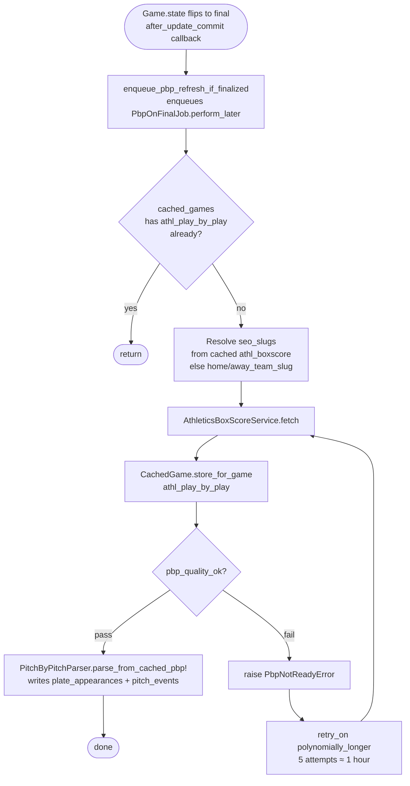
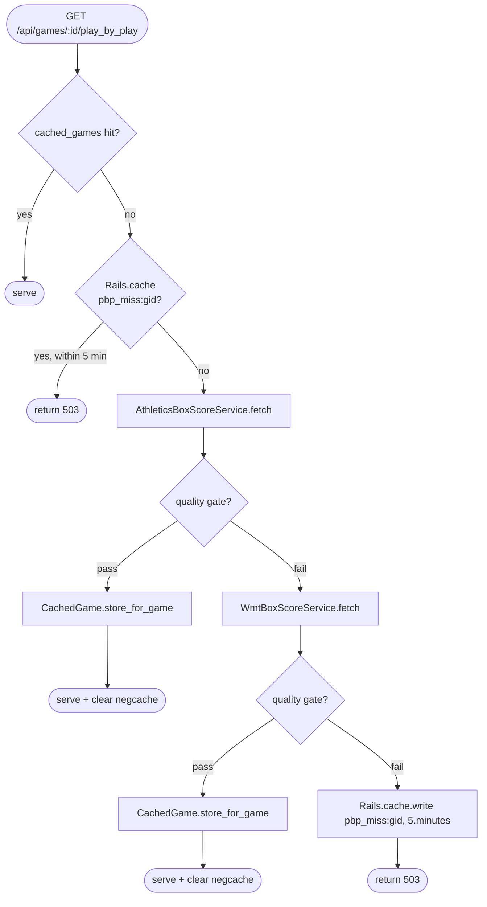

# Play-by-Play (PBP) Pipeline

PBP is the hardest pipeline in the system. Multiple sources, fragile HTML, stale caches, legitimate partial data, negative cache, proactive + reactive retrieval, and normalized + blob storage — all need to coexist.

---

## Sources

PBP comes from three external sources, tried in order of reliability:

| Rank | Source | `_source` tag | When used |
|------|--------|---------------|-----------|
| 1 | **Athletics HTML** (Sidearm team sites) | `athletics` | Default; most reliable. `<caption>` tag like "FAU - Top of 1st" identifies team + half-inning. |
| 2 | **NUXT Data** | `nuxt_data` | Sidearm sites using Nuxt.js. Embedded in `<script id="__NUXT_DATA__">` JSON. Uses hybrid splitting (roster-based + out-counting). |
| 3 | **WMT API** | `wmt_api` | Learfield/WMT schools (LSU, Clemson, Purdue, …). `https://api.wmt.games/api/statistics/games/{id}`. Filters per-pitch entries by requiring play verbs. |

See [rails/07-parsers.md](../rails/07-parsers.md) for each source's parser internals.

---

## Storage

Two storage layers:

**Blob cache:** `cached_games` row with `data_type: "athl_play_by_play"`:

```json
{
  "teams": [
    { "teamId": "athl_away_id", "nameShort": "Away Team", "isHome": false },
    { "teamId": "athl_home_id", "nameShort": "Home Team", "isHome": true }
  ],
  "periods": [
    {
      "periodNumber": 1,
      "periodDisplay": "Inning 1",
      "playbyplayStats": [
        { "teamId": "athl_away_id", "plays": [ /* strings */ ] },
        { "teamId": "athl_home_id", "plays": [ /* strings */ ] }
      ]
    }
  ],
  "_source": "athletics"
}
```

Each inning has 2 `playbyplayStats` groups (one per team); the last inning may have 1 if the home team didn't bat.

**Normalized tables:** `plate_appearances` and `pitch_events` — populated by `PitchByPitchParser.parse_from_cached_pbp!` after a successful cache store. These power the per-pitch charts on the frontend.

---

## The quality gate

`CachedGame.pbp_quality_ok?` (`app/models/cached_game.rb`) is the single source of truth. It rejects PBP that has:

- Single stat-groups in non-last innings for multi-period games (teams not split)
- Multiple stat-groups all sharing the same `teamId` in non-last innings (parser failed to distinguish teams)
- Empty `teams` array for multi-period games (no team names for frontend)
- Garbage plays: bare names without play verbs, >50% of total
- Single-period dumps with >20 plays (indicates all plays dumped into one inning)

The gate fires:
- On `CachedGame.store` and `CachedGame.store_for_game` (Ruby write path)
- Via `BoxscoreFetchService` delegating call

The gate does **not** fire:
- On `CachedGame.fetch` (stale cache can still be served)
- On Java writes via JPA (bypass — see [architecture/01-service-boundaries.md](../architecture/01-service-boundaries.md))

See [rails/01-models.md](../rails/01-models.md) `CachedGame` for the full method body.

---

## The three retrieval paths

### Path A — Proactive backfill (`PbpOnFinalJob`) — PRIMARY



- **File:** `app/jobs/pbp_on_final_job.rb`
- **Trigger:** `Game#enqueue_pbp_refresh_if_finalized` callback (fires once per state transition when `saved_change_to_state?` and `state == "final"`)
- **Retry:** `retry_on PbpOnFinalJob::PbpNotReadyError, wait: :polynomially_longer, attempts: 5` — roughly 1 hour of backoff

**Why proactive:** before PR #66 (April 18, 2026), PBP was lazy-only. If a user hit the page before Sidearm finished publishing, the quality gate rejected the partial dump and nothing retried. The user had to refresh hours later. The proactive backfill closes that gap.

### Path B — Lazy on-demand (`Api::GamesController#play_by_play`) — USER-FACING



- **File:** `app/controllers/api/games_controller.rb`
- **Negative cache key:** `pbp_miss:<gid>` in `Rails.cache`, 5-minute TTL
- **Purpose of neg cache:** Sidearm scrape can spend up to ~60s of wall clock on repeated timeouts. Without the neg cache, a broken game's page would hang every request.

Frontend handling: `lib/api.js` uses a custom `validateStatus` that lets 503 through without throwing; `GameDetail.jsx` / `GamePrediction.jsx` silently hide the PBP tab content when the fetch fails.

### Path C — Reparse / repair (rake tasks) — OPERATOR-TRIGGERED

These run against the stored `ScrapedPage` HTML or re-call the sources. No user triggers them.

| Task | Purpose |
|------|---------|
| `rake audit_pbp` | Scan all PBP for garbage / missing teamIds; delete garbage. |
| `rake fix_pbp_groups` | Fix single-group PBP. **Strategy 1:** HTML re-parse via `ScrapedPage`. **Strategy 2:** roster splitting (boxscore rosters primary, `Player` table fallback). |
| `rake fix_missing_team_ids` | Add `teamId` to stat groups that are correctly split but missing the field. |
| `rake reparse_pbp_from_html` | Re-parse PBP from stored `ScrapedPage` HTML. Uses `TeamAlias` for URL matching. |
| `rake backfill_missing_pbp` | Fetch PBP for games that have boxscore but no PBP. Athletics then WMT. |
| `rake reparse_nuxt_pbp` | Clear single-period PBP entries (for re-discovery). |
| `rake refetch_missing_pbp` | Send games to Java scraper for PBP. **Requires `dokku enter`** (needs Java internal URL). |
| `rake pbp:purge_bad` | Delete all cached PBP that fails `pbp_quality_ok?`. `DRY_RUN=1` to preview. |

See [rails/13-rake-tasks.md](../rails/13-rake-tasks.md).

---

## The "stale cache" problem

`CachedGame.fetch` serves cached data without re-running the quality gate. PBP stored before the quality gate was deployed (April 13–15, 2026) may contain garbage. Fix: run `rake pbp:purge_bad`, then the on-demand fetch pipeline re-fetches clean PBP when users visit game pages.

This is why the rake task exists and why it is run after every quality-gate change.

---

## The "box score discovery" bug (issue #65, fixed April 18, 2026)

`AthleticsBoxScoreService.fetch` does discovery-based Sidearm scraping keyed on team slugs with no date filter. For a not-yet-played game it can return the most recent prior meeting's final box score. Mitigation is in `Api::GamesController#boxscore`, not in the service:

- If `Game.state == "scheduled"` AND returned boxscore has a final R linescore with `runs > 0`, the controller rejects the scrape: does not cache, does not render.
- Zero-run R linescores still pass through (legit "game just started" state).
- Rejection logged at WARN with game id and source_url.
- A secondary score-match guard runs at `games_controller.rb:121-133` for games that already have scores.

See [rails/04-api-endpoints.md](../rails/04-api-endpoints.md) `Api::GamesController#boxscore`.

---

## Name cleanup

All parsers run `clean_play_names` which converts:

- `Torres,Isa` → `Isa Torres` (Last,First format)
- `Ganje, G.` → `G. Ganje` (Last, Initial. format)

Implementations exist in three places — **they must stay in sync**:

- `BoxScoreParsers::Base#clean_play_names`
- `AthleticsBoxScoreService#clean_play_names`
- `WmtParser#wmt_clean_names`

See [rails/07-parsers.md](../rails/07-parsers.md).

---

## Dual storage: blob + normalized

| Storage | Written by | Read by |
|---------|-----------|---------|
| `cached_games` blob | `CachedGame.store_for_game`, `CachedGame.store` | `GamesController#play_by_play` (cache hit path) |
| `plate_appearances` + `pitch_events` | `PitchByPitchParser.parse_from_cached_pbp!` | Pitch analytics API, pitch count charts on `PlayerDetail` |

The blob is source of truth for PBP display. The normalized tables are derived — rebuilt any time via reparse tasks. Losing normalized data is recoverable from the blob; losing the blob requires re-fetching from the external source.

---

## Related docs

- [rails/04-api-endpoints.md](../rails/04-api-endpoints.md) — `Api::GamesController#play_by_play`
- [rails/06-ingestion-services.md](../rails/06-ingestion-services.md) — `AthleticsBoxScoreService`, `WmtBoxScoreService`
- [rails/07-parsers.md](../rails/07-parsers.md) — parser internals (caption reading, NUXT, WMT verb filter)
- [rails/12-jobs.md](../rails/12-jobs.md) — `PbpOnFinalJob`, `RefetchMissingPbpJob`, `ReparsePbpJob`
- [rails/13-rake-tasks.md](../rails/13-rake-tasks.md) — PBP maintenance tasks
- [rails/01-models.md](../rails/01-models.md) — `CachedGame` model with quality gate method
- [operations/runbook.md](../operations/runbook.md) — "PBP missing for a game" playbook
