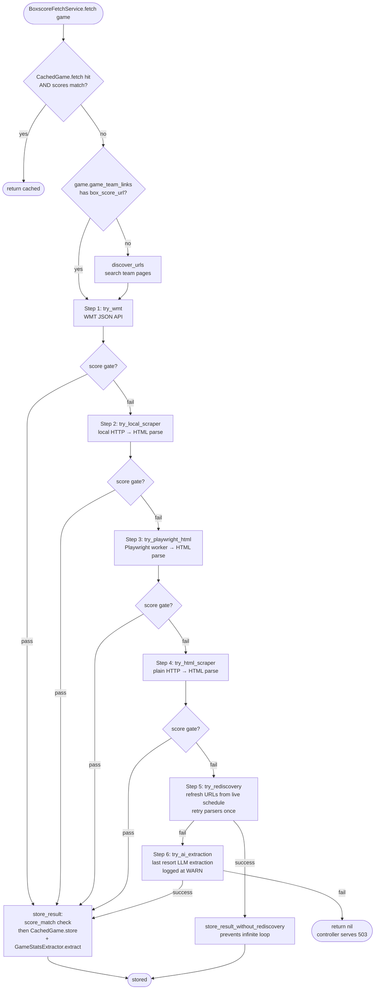

# Box Score Pipeline

How a box score goes from "external source has it" to "our frontend shows it". Shares orchestration with PBP (both live in `BoxscoreFetchService`) but has its own fallback chain and stat-extraction stage.

---

## Fallback chain

The actual order in `BoxscoreFetchService.fetch` (`app/services/boxscore_fetch_service.rb:5-53`):



The score-match guard (`scores_match?` + `store_result`) is the critical difference from PBP. A box score that claims 5-3 but our Game says 8-2 is a wrong-game match (often the prior meeting in a series). When step 1–4 pass parse but fail the score check, the service falls through to `try_rediscovery` before giving up.

`store_result_without_rediscovery` is the post-rediscovery sink — prevents the rediscovery path from looping back to itself on a close-but-not-matching store.

---

## Source services

All live in `app/services/`. See [rails/06-ingestion-services.md](../rails/06-ingestion-services.md) for deep dives.

| Step | Private method | Service called | Notes |
|------|---------------|----------------|-------|
| 1 | `try_wmt` | `WmtBoxScoreService` | WMT JSON API. `WMT_DOMAINS` + `SCHOOL_IDS` constants for dispatch. See [scraper/02-services.md](../scraper/02-services.md) `WmtFetcher` for the Java counterpart — which now disambiguates doubleheaders via the captured `wmt://<id>` URL from `game_team_links` (scraper#11), not by score-matching candidates. |
| 2 | `try_local_scraper` | `AthleticsBoxScoreService.sidearm_fetch_html` + `AthleticsBoxScoreService.parse` | Plain HTTP fetch, then HTML parse. Fastest for non-JS pages. |
| 3 | `try_playwright_html` | `CloudflareBoxScoreService` (HTML fetch only) → `AthleticsBoxScoreService.parse` | Playwright worker. Browser-rendered HTML for JS-heavy pages. **Legacy / preferred path is Java scraper.** |
| 4 | `try_html_scraper` | `AthleticsBoxScoreService.sidearm_fetch_html` + `.parse` | Same as step 2 but iterates differently — covers a different link set. |
| 5 | `try_rediscovery` | `CloudflareScheduleService` / link rediscovery + `try_single_url` | Re-scrapes team schedules to refresh `box_score_url` values in `game_team_links`, then retries parsers. Terminal sink: `store_result_without_rediscovery`. |
| 6 | `try_ai_extraction` | `CloudflareBoxScoreService.fetch` (with AI prompt) | LLM extraction. Logged at WARN. |

Parsers used at steps 2–4: `BoxScoreParsers::SidearmParser`, `BoxScoreParsers::PrestoSportsParser` (newer Sidearm). See [rails/07-parsers.md](../rails/07-parsers.md).

URL-discovery helper: `SidearmHelper#sidearm_find_all_box_score_urls` (`app/services/concerns/sidearm_helper.rb:19`) — used during the `discover_urls` pre-step when a game has no `box_score_url` yet, and again during `try_rediscovery`. Consults `TeamAlias` for slug mismatches. Single-URL variant: `#sidearm_find_box_score_url` (`:76`). HTML fetch: `#sidearm_fetch_html` (`:7`).

`AiWebSearchBoxScoreService` is **DEPRECATED / DEAD** — do not propose as recovery path (per project memory).

---

## Stat extraction (`GameStatsExtractor`)

After a box score is cached, `GameStatsExtractor.extract(game, boxscore_json)` converts the blob into normalized rows in `player_game_stats`.

Stages inside `extract`:

1. **`verify_team_assignment`** — checks that the away/home team IDs in the boxscore match our Game's teams. Uses two paths:
   - **Score path:** `batterTotals.runsScored` sums to team total matches `Game.home_score`/`away_score`.
   - **Roster path:** roster overlap with `Player` table.
2. **`correct_team_slugs`** — if Sidearm HTML has the teams reversed, swap them.
3. **Runs stash-and-restore** — temporarily remove runs from player stats (so upsert doesn't touch them), then restore after team assignment is verified.
4. **`build_player_attrs`** — per player: name, position, `decision` (parsed via `\(([WLS])[,)]/i`), `pitch_count` (from `NP` column / `sNumberOfPitches`), batting/pitching line.
5. **`upsert_player_stat`** — abbreviation-aware upsert (handles "J. Smith" vs "Smith, J." as same player).
6. **`distribute_team_batting_breakdowns`** — splits team-level LOB / 2B / 3B / HR / SF breakdowns back onto players when the breakdown row is available.
7. **`enrich_with_sb_pitchers`** — scoreboard pitcher enrichment. Sets `decision` (from `p["dec"]`) and `pitch_count` (from `p["tp"]`) on top of existing row.
8. **`snapshot`** — writes a `GameSnapshot` row for audit.

Key extraction behaviors:
- Decision extraction regex: `\(([WLS])[,)]/i`
- Pitch count: maps `np` header (Sidearm), `sNumberOfPitches` (WMT), `p["tp"]` (scoreboard)
- XBH sanity check: rejects player rows where `2B + 3B + HR > H`

See [rails/09-analytics-services.md](../rails/09-analytics-services.md) for the full walkthrough.

---

## Storage

| Blob cache | Normalized |
|-----------|-----------|
| `cached_games` row with `data_type: "athl_boxscore"` or `"boxscore"` | `player_game_stats` rows, one per player-per-game |
|           | `team_pitching_stats` (aggregated season stats) |
|           | `game_snapshots` (audit snapshot of full game state) |

Raw HTML also stored in `scraped_pages` (page_type: `boxscore`) for reparse.

---

## Backfill jobs

- `BoxScoreBackfillJob` (`0 6 * * *` daily + inline after `ScheduleReconciliationJob`) — walks games with scores but no cached boxscore, runs the fallback chain.
- `rake fill_missing_boxscores` — ad-hoc backfill with env-var filters (`LIMIT`, `SINCE_DATE`, `TEAM`).
- `rake stats:backfill_decisions` — re-reads cached boxscores, updates `decision` column on existing `player_game_stats`. No re-extract.
- `rake stats:backfill_pitch_counts` — full re-extract (because old cached JSON doesn't include `pitchCount`).

See [rails/13-rake-tasks.md](../rails/13-rake-tasks.md).

---

## On-demand fetch (read path)

`Api::GamesController#boxscore` serves from cache. On cache miss, it runs the fallback chain inline (synchronous). Caveats:

- **Locked games:** if `game.locked == true`, fast-path: skip the fetch, return the DB-recorded score summary without calling external sources.
- **Pre-game 404 guard:** if game is `scheduled` and has no scores, return 404 (no box score exists yet).
- **Box score discovery gate:** if `state == scheduled` and the fetched box score has runs > 0 on R linescore, reject (likely prior meeting in the series). See issue #65 context in [pipelines/02-pbp-pipeline.md](02-pbp-pipeline.md#the-box-score-discovery-bug-issue-65-fixed-april-18-2026).
- **On-demand Java scrape (issue #87, April 19, 2026):** if all existing fallbacks fail AND the game is "probably finished" per `probably_finished?` (final, OR `start_time_epoch > 1.hour.ago` AND not a null-scored doubleheader half), the controller calls `JavaScraperClient.scrape_game(game_id)` synchronously and retries `BoxscoreFetchService.best_from_db`. Rate-limited via `Rails.cache.write("bs_ondemand:<game_id>", true, expires_in: 2.minutes)`. This self-heals the stuck-scheduled-game case on user request without waiting for the 15-minute cron tick.
- **Doubleheader guard on `probably_finished?`:** a Game where `home_score.nil? && Game#has_doubleheader_sibling?` is never classified as "probably finished", even past the 1-hour mark. The downstream Java scrape's pre-scraper#11 candidate-picker would have pulled the sibling's boxscore for this game when scores aren't available to disambiguate. With scraper#11 (direct-id lookup via `wmt://<id>`) this is belt-and-suspenders — both layers guard the same failure mode.

## Cron-tick scrape filter (write path)

Two jobs scrape box scores on a schedule:

- `GamePipelineJob#fetch_missing_boxscores` -- every 15 min, today/yesterday.
- `BoxScoreBackfillJob` -- 6 AM daily, last 60 days.

Both (as of issue #87) filter eligible games by:

```ruby
"state = 'final' OR (state = 'scheduled' AND start_time_epoch IS NOT NULL AND start_time_epoch < ?)"
# cutoff = 4.hours.ago.to_i
```

The widened predicate catches "stuck-scheduled" Games whose state has not flipped to final yet. Soft ceiling: scraper's own quality gates (`good_boxscore?`, `scores_match?`) reject bad data if the game really has not started.

Additional doubleheader guard: both jobs append `.reject { |g| g.home_score.nil? && g.has_doubleheader_sibling? }`. A null-scored half of a doubleheader is never sent into the scrape pipeline — `Game#has_doubleheader_sibling?` looks up a same-date-same-teams row on a different `game_number`. Paired with scraper#11's direct-id lookup in `WmtFetcher`, this prevents the historical failure mode where game 1's scrape silently pulled game 2's boxscore.

---

## Known hazards

1. **Java bypasses the stat extraction path.** `GameStatsWriter` (Java) writes `player_game_stats` directly via JPA. It does not run `GameStatsExtractor` equivalents — particularly the XBH sanity check and the team-assignment verification. Java-written rows have been known to include abbreviations as separate players or misassigned team_slugs. Mitigation: re-extract via rake.
2. **AiWebSearchBoxScoreService still appears in the controller fallback.** The controller at `app/controllers/api/games_controller.rb` includes a reference to it, flagged per project memory as dead code. Do not extend that path.
3. **Score-match guard vs. partial box score.** Early in a live game, the box score may match with 0-0 while the game shows a score. Guard has a zero-run escape hatch; still, rapid polling early in a game can occasionally store a slightly-out-of-sync cache that auto-refreshes next poll.

---

## Related docs

- [rails/06-ingestion-services.md](../rails/06-ingestion-services.md) — every source service
- [rails/07-parsers.md](../rails/07-parsers.md) — parser internals for each source
- [rails/09-analytics-services.md](../rails/09-analytics-services.md) — `GameStatsExtractor`
- [rails/04-api-endpoints.md](../rails/04-api-endpoints.md) — `Api::GamesController#boxscore`
- [rails/12-jobs.md](../rails/12-jobs.md) — `BoxScoreBackfillJob`
- [rails/13-rake-tasks.md](../rails/13-rake-tasks.md) — backfill + reparse tasks
