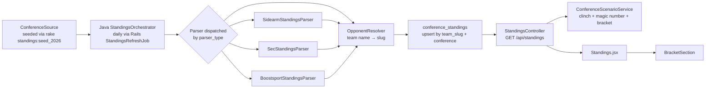

# Standings Pipeline

From conference-site HTML to the `/standings` page with clinch indicators, scenarios, and bracket.

---

## Flow

---

## Configuration (`conference_sources`)

Seeded via `rake standings:seed_2026` (in `lib/tasks/standings.rake`). Each row defines:

| Column | Meaning |
|--------|---------|
| `season` | e.g., `2026` |
| `division` | `d1`, `d2`, `d3`, `naia`, `njcaa` |
| `conference` | human name |
| `standings_url` | where Java fetches |
| `parser_type` | `sidearm`, `sec`, `boostsport` — picks parser |
| `tournament_spots` | how many teams qualify for the conf tournament; `0` for no tournament |
| `tournament_format` | `double_elim`, `single_elim`, `best_of_3`, `none` |

`tournament_spots` and `tournament_format` values live in `tournament_style.md` at the repo root, sourced from conference handbooks.

See [reference/conference-tournaments.md](../reference/conference-tournaments.md) for the full matrix.

---

## Java side: `StandingsOrchestrator`

- **Trigger:** Rails `StandingsRefreshJob` (cron `0 7 * * *`) calls `JavaScraperClient#refresh_standings`, which POSTs to Java `/api/standings/refresh`.
- **Controller:** `StandingsController` in Java (package `com.riseballs.scraper.standings`).
- **Orchestration:**
  1. Load active `ConferenceSource` rows (in-season, matching division).
  2. For each conference: fetch `standings_url`, dispatch parser by `parser_type`.
  3. For each parsed row: resolve team name → `team_slug` via `OpponentResolver`.
  4. Upsert `conference_standings` row keyed by `(team_slug, conference, season)`.
  5. Log to `standings_scrape_logs` for audit.

**Parser type dispatch:**

| `parser_type` | Parser class | Site shape |
|---------------|-------------|------------|
| `sidearm` | `SidearmStandingsParser` | Most D1/D2/D3 conferences — Sidearm standings widget |
| `sec` | `SecStandingsParser` | SEC API format (names include mascots) |
| `boostsport` | `BoostsportStandingsParser` | Boost Sports (some D2 conferences) |

See [scraper/02-services.md](../scraper/02-services.md) and [scraper/03-parsers.md](../scraper/03-parsers.md).

---

## Slug resolution for standings

`OpponentResolver` in the Java scraper (`reconciliation/schedule/OpponentResolver.java`) follows this chain:

1. `TeamAlias` exact match (highest priority)
2. Exact slug match
3. Parenthetical-suffix stripping ("Lee University (Tenn.)" → "Lee University" → name/longName lookup)
4. `Team.name` / `Team.longName` exact match
5. Common suffix stripping ("University", "State")
6. State abbreviation expansion / contraction ("St" ↔ "State", "Tenn" ↔ "Tennessee")

**SEC-style names** come from the SEC API with mascots ("Alabama Crimson Tide"). Aliases were added for all 15 SEC teams mapping mascot-format names to slugs.

**Ambiguous names** ("MC", "Southeastern", "Concordia", "Saint Mary's") could match multiple teams. These are NOT resolved via global aliases — instead, `team_slug` is set directly on the `conference_standings` row because the conference context disambiguates. Adding a global alias for an ambiguous name would contaminate other conferences.

See [reference/slug-and-alias-resolution.md](../reference/slug-and-alias-resolution.md) for the side-by-side table with Rails `TeamMatcher`.

---

## Scenario computation (`ConferenceScenarioService`)

Runs per-request (no caching). Inputs:

- `ConferenceStanding` rows (current wins/losses per team)
- `Game.scheduled` where both teams are in the conference (remaining conf games)
- `ConferenceSource.tournament_spots`

Algorithms (from baseball magic-number math):

- **Title clinch:** team's current wins > every other team's max possible wins (wins + remaining).
- **Title elimination:** team's max possible wins < some other team's current wins.
- **Title magic number:** `other_remaining + 1 - (my_wins - other_wins)` computed pairwise; max across all rivals is the team's overall magic number.
- **Tournament clinch:** even losing all remaining, fewer than `tournament_spots` teams can finish above them.
- **Tournament elimination:** even winning all remaining, `tournament_spots` teams already have more wins.

Clinch indicators in the standings table:

| Letter | Meaning |
|--------|---------|
| `x` | Clinched #1 seed (regular season title) |
| `y` | Clinched tournament berth |
| `e` | Eliminated from title race |

Scenario text tiers:

| Complexity | Text |
|-----------|------|
| Leader, can clinch alone | "Wins title by going X-Y or better in remaining Z games" |
| 1–3 conditions | "Wins title if they go X-0 and [Team] loses N+" |
| 4+ conditions | Top 2 conditions + "and N other teams lose multiple games" |
| Eliminated | Listed at bottom grouped |

**Data quality caveat:** scenarios are only as accurate as `games.scheduled`. Missing mid-major series-game-3s cause remaining-game undercounting and false clinch/elim. As of 2026-04-12, many mid-major D1 and D2 conferences have incomplete series data (2 games per series instead of 3).

See [rails/10-scenario-service.md](../rails/10-scenario-service.md) for the full deep dive with formulas.

---

## Bracket builder (`ConferenceScenarioService#build_bracket`)

"Bracket as of Today" — what the tournament would look like if the season ended today.

1. Sort standings by conf record; take top `tournament_spots`.
2. Apply hardcoded per-size seeding:

| Size | Conferences | Seeding |
|------|-------------|---------|
| 4 | Ivy, NEC, Patriot (best-of-3 format) | 1v4, 2v3 |
| 6 | Several mid-majors | byes for 1–2; 3v6, 4v5 in round 1 |
| 8 | Most common | 1v8, 4v5, 3v6, 2v7 |
| 11 | Big 12 | byes for top seeds |
| 12 | ACC, Big Ten | byes for 1–4 |
| 15 | SEC | two-bracket layout |

3. Only first-round matchups are filled; later rounds show TBD.
4. Format label (Double Elimination / Single Elimination / Best-of-3 Series) shown above bracket.
5. Conferences with `tournament_format: "none"` (Big West, Mountain West, WCC) show text notice instead.

Frontend: `BracketSection` component in `Standings.jsx` renders rounds as columns with `Matchup` sub-components. Hardcoded sizing constants (`SLOT_H`, `MATCHUP_H`, `R1_GAP`, `ROUND_W`, `CONN_W`) are load-bearing.

See [rails/17-frontend-components.md](../rails/17-frontend-components.md) for `BracketSection` internals.

---

## Frontend (`Standings.jsx`)

- Calls `GET /api/standings?division=d1` (or whatever division).
- Renders table with clinch indicator column (x / y / e letters prefixed to team name).
- Below table: scenarios section with per-team text.
- Below scenarios: `BracketSection` showing the bracket-as-of-today.

See [rails/16-frontend-pages.md](../rails/16-frontend-pages.md) `Standings`.

---

## Jobs involved

| Job | Schedule | Role |
|-----|----------|------|
| `StandingsRefreshJob` | `0 7 * * *` daily | Triggers Java scrape |
| (no Rails job) | — | `ConferenceScenarioService` runs per-request, no caching |

See [rails/12-jobs.md](../rails/12-jobs.md).

---

## Related docs

- [rails/10-scenario-service.md](../rails/10-scenario-service.md) — clinch/elim/magic math
- [scraper/02-services.md](../scraper/02-services.md) — `StandingsOrchestrator`
- [scraper/03-parsers.md](../scraper/03-parsers.md) — parser internals + `OpponentResolver`
- [reference/conference-tournaments.md](../reference/conference-tournaments.md) — per-conference format matrix
- [reference/slug-and-alias-resolution.md](../reference/slug-and-alias-resolution.md)
- [rails/16-frontend-pages.md](../rails/16-frontend-pages.md) — `Standings.jsx`
- [rails/17-frontend-components.md](../rails/17-frontend-components.md) — `BracketSection`
