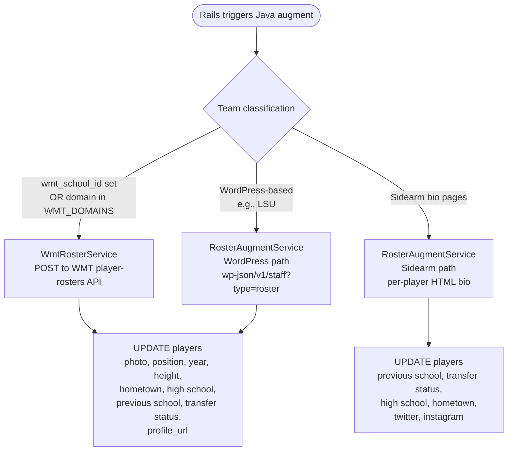

# Roster & Coach Pipeline

Player and coach bio augmentation. **All new logic lives in the Java scraper.** Rails has legacy `RosterService` code that is kept for reference but is not on the primary path.

---

## Key invariant

> Augment services **UPDATE** only. They never create or delete players or coaches. Player/coach rows are created elsewhere (e.g., during box score extraction when a previously-unknown player appears in a game).

This prevents augment runs from deleting rosters when a source returns empty for any reason.

---

## Three augmentation paths



### WMT path (`WmtRosterService`)

- **For:** Learfield / WMT schools.
- **Identification:** either `team.wmt_school_id` is set, or the team's domain is in `WMT_DOMAINS` (constant; duplicated across 4 Java files — `WmtFetcher`, `WmtRosterService`, `WmtScheduleParser`, `ReconciliationService`).
- **Call:** `/website-api/player-rosters` with included relations (photo, classLevel, playerPosition, player).
- **Populates:** photo, position, year, height, hometown, high school, previous school, transfer status, profile URL.

### Sidearm bio path (`RosterAugmentService` + `BioPageParser`)

- **For:** Sidearm athletics sites (non-WMT).
- **Prerequisite:** `player.profile_url` must be discovered first (via `discoverProfileUrls` — scrapes team roster page for player profile links). Teams without discovered profile URLs can't be bio-augmented.
- **Call:** HTTP GET on `player.profile_url`.
- **Parser fallback chain:**
  1. `li`/`span` pairs (newer Vue templates)
  2. `dt`/`dd` pairs (older Sidearm)
  3. JSON-LD (schema.org)
- **Populates:** previous school, transfer status, high school, hometown, twitter, instagram.

### WordPress path (`RosterAugmentService`, WordPress branch)

- **For:** WordPress-based sites (like LSU).
- **Call:** `/wp-json/v1/staff?type=roster`.
- **Populates:** same fields as WMT.

---

## Coach augmentation (`CoachAugmentService` + `CoachBioParser`)

- Same update-only pattern.
- Fetches coach bio page HTML (from discovered URL).
- **Populates:** email, phone, photo, twitter, instagram.

---

## Endpoints (Java REST, called by Rails jobs)

| Method | Path | Body | Triggered by |
|--------|------|------|--------------|
| POST | `/api/roster/augment` | `{"teamSlug": "..."}` | Admin UI; `RosterAugmentAllJob` per-team |
| POST | `/api/roster/augment/all` | — | `RosterAugmentAllJob` |
| POST | `/api/roster/wmt-sync` | `{"teamSlug": "..."}` | Admin UI |
| POST | `/api/roster/wmt-sync/all` | — | `WmtSyncAllJob` |
| POST | `/api/roster/augment-coaches` | `{"teamSlug": "..."}` | Admin UI |
| POST | `/api/roster/augment-coaches/all` | — | `CoachAugmentAllJob` |

See [scraper/01-controllers.md](../scraper/01-controllers.md) for each controller action and [rails/11-external-clients.md](../rails/11-external-clients.md) for `JavaScraperClient` wrapper.

---

## Rails jobs that trigger these

| Job | Endpoint | Schedule | Notes |
|-----|----------|----------|-------|
| `RosterAugmentAllJob` | `/api/roster/augment/all` | manual only (admin UI) | Rosters don't change often; run a few times per season. |
| `WmtSyncAllJob` | `/api/roster/wmt-sync/all` | manual only | |
| `CoachAugmentAllJob` | `/api/roster/augment-coaches/all` | manual only | |
| `RosterSyncAllJob` | legacy Rails path | manual only | DEPRECATED; prefer Java `/api/roster/augment/all`. |

See [rails/12-jobs.md](../rails/12-jobs.md).

**Roster recency guard:** `sync_roster` returns early if `roster_updated_at < 1 day ago`. This prevents redundant work. Tests that bypass the guard by calling private `sync_roster_from_html` will pass even when the public path is broken — be suspicious. (Listed in `stupid_mistakes_claude_has_made.md` item #12.)

---

## Operator tasks

```sh
# Augment a single team's roster (bio + profile URLs)
ssh dokku@ssh.mondokhealth.com enter riseballs web \
  'bin/rails runner "Rails.logger.info JavaScraperClient.new.augment_roster(team_slug: \"LSU\")"'

# Or via admin UI: /admin/jobs -> "Roster Augment" (Matt-only)
```

Must be `dokku enter` — hits Java scraper internal URL.

---

## Known hazards

1. **Photo URL prepending bug** — historical Rails roster scraper prepended base URLs to already-absolute CloudFront photo URLs (507 players across App State, Arizona, etc.). Fixed in Java path; if you see malformed photo URLs, it's likely historical data that pre-dates the migration.
2. **Augment/all without auditing first** — running `augment/all` without checking existing data quality can compound problems (stupid mistake #11). Always audit a sample before bulk runs.
3. **Roster recency guard bypass in tests** — as above (mistake #12). Tests must invoke the public entrypoint (`sync_roster`), not the private HTML processor.

---

## Related docs

- [scraper/02-services.md](../scraper/02-services.md) — service deep dive
- [scraper/01-controllers.md](../scraper/01-controllers.md) — REST controllers
- [rails/06-ingestion-services.md](../rails/06-ingestion-services.md) — legacy Rails `RosterService`
- [rails/11-external-clients.md](../rails/11-external-clients.md) — `JavaScraperClient`
- [rails/12-jobs.md](../rails/12-jobs.md) — `RosterAugmentAllJob` etc.
