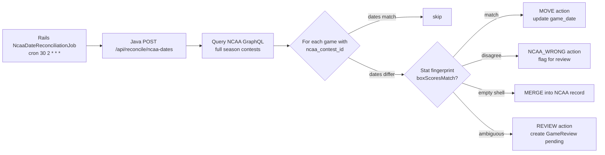
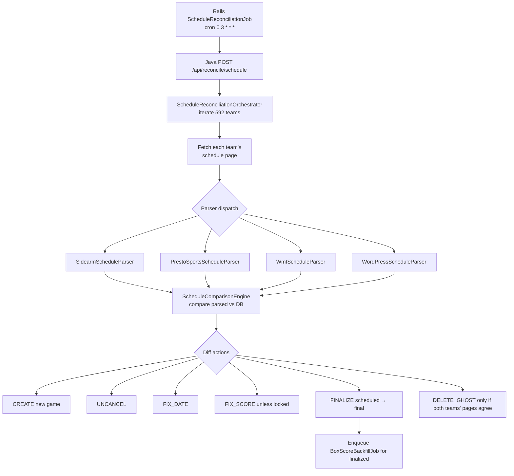
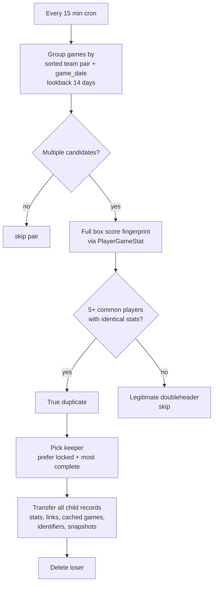

# Reconciliation & Deduplication Pipeline

The "nightly safety net." Three independent mechanisms keep the `games` table honest.

---

## Four reconciliation paths

| Path | Who runs it | Cron | Source of truth |
|------|-------------|------|-----------------|
| NCAA contest-id enrichment | Rails `NcaaGameDiscoveryJob` (re-enabled 2026-04-19 per mondok/riseballs#82) | `*/20 * * * *` + nightly season sweep | NCAA GraphQL API (same persisted-query hash as Java scraper + `riseballs-live`) |
| NCAA date reconciliation | Rails `NcaaDateReconciliationJob` → Java `/api/reconcile/ncaa-dates` | `30 2 * * *` (2:30 AM) | NCAA GraphQL API |
| Schedule reconciliation | Rails `ScheduleReconciliationJob` → Java `/api/reconcile/schedule` | `0 3 * * *` (3 AM) | Each team's schedule page |
| Game deduplication | Rails `GameDedupJob` | `*/15 * * * *` (every 15 min) | Full box score fingerprint |

---

## NCAA contest-id enrichment (`NcaaGameDiscoveryJob`)

Silently broken from 2026-04-12 to 2026-04-19; re-enabled as part of the `riseballs-live` rollout (mondok/riseballs#82). During the outage, `games.ncaa_contest_id` coverage dropped to ~0% on new rows; the live-overlay reconciler in `riseballs-live` primarily matches on `ncaaContestId`, so the drop caused overlay matches to fall through to slug+gameNumber pairing everywhere — tolerable short-term but fragile for doubleheaders with incomplete slug resolution.

- **Flow:** call NCAA GraphQL for today/yesterday (`mode: "today"`, the `*/20` cadence) or for the full season (`mode: "season"`, nightly). For each contest returned, upsert `ncaa_contest_id` and `start_time_epoch` on the matching Game via a 6-strategy matcher (direct contest id, date + sorted slugs, swapped orientation, resolved-slug map, partial one-side match, date+teams fallback ordered by `game_number`).
- **Schedule:** `*/20 * * * *` + daily season sweep (in the 02:00 slot).
- **Does not create games by default.** Contests that have no matching Game in our DB are logged and skipped. Game creation is still the Java scraper's responsibility via `GameCreationService` / `JavaScraperClient.find_or_create_game`.
- After re-enable, contest-id coverage recovered to ~92% within a few hours.

Historically this job lived inside the deleted Ruby `NcaaScoreboardService`; the job now calls the NCAA API directly using the same persisted-query hash as `riseballs-scraper` and `riseballs-live` to keep all three consumers aligned.

---

## NCAA date reconciliation

### Flow

### Decision logic

Java `NcaaDateReconciliationService` — for every `(game.ncaa_contest_id, game.game_date)` pair in our DB:

1. Fetch the NCAA-reported date for that contest.
2. If they match → no action.
3. If they differ → run `boxScoresMatch` fingerprint comparison:
   - Compare player-level stats (at least 5 common players with identical numbers).
   - If NCAA's version matches our player stats closely → `MOVE` our game_date to NCAA's.
   - If the two versions diverge sharply → `NCAA_WRONG` (we're right, NCAA's wrong — flag).
   - If our record is an empty shell (no player stats) → `MERGE` (delete our shell, keep the NCAA-aligned row).
   - Otherwise → `REVIEW` (create `GameReview` with `status: pending`).

### Output

Writes:
- Updates to `games.game_date`
- `GameReview` audit rows for every action (always — whether auto-applied or pending)

See [scraper/04-reconciliation.md](../scraper/04-reconciliation.md) `NcaaDateReconciliationService`.

---

## Schedule reconciliation

### Flow

### Action priority

`ReconciliationExecutor` applies actions in a priority order:

1. `FINALIZE` (scheduled → final flip — triggers downstream jobs)
2. `FIX_SCORE` (if not locked)
3. `FIX_DATE`
4. `UNCANCEL`
5. `CREATE`
6. `DELETE_GHOST` (**only if both teams' schedule pages agree the game doesn't exist**)

The DELETE_GHOST guard is critical. A single team's schedule page missing a game isn't enough — both teams must agree. Prevents deletion from transient scrape failures.

### Trigger chain

- Any `FINALIZE` action → enqueues `BoxScoreBackfillJob.perform_later(game_id)`.
- `BoxScoreBackfillJob` then runs [pipelines/03-boxscore-pipeline.md](03-boxscore-pipeline.md) for that game.
- Any game transitioning to `final` → `Game#enqueue_pbp_refresh_if_finalized` callback fires → enqueues `PbpOnFinalJob`.

### Output

Writes:
- Direct updates to `games` / `team_games` / `game_team_links`
- `GameReview` audit rows for every action
- Triggers downstream Sidekiq jobs for box score + PBP

See [scraper/04-reconciliation.md](../scraper/04-reconciliation.md) for the full action table.

---

## Game deduplication (`GameDedupJob`)

### Flow

### Key behaviors

- **Team-pair grouping** sorts slug pair so `(Alabama, Florida)` and `(Florida, Alabama)` are the same key — catches home/away swaps.
- **Lookback window** is 14 days. Previously used Postgres `CURRENT_DATE` (UTC) — caused silent shifts after ~8 PM ET. Now uses Ruby `Date.current` passed as bind parameter (fixed 2026-04-18).
- **Fingerprint threshold:** 5+ common players with identical stats. Below threshold → assumed legitimate doubleheader.
- **Child-record transfer:** moves `player_game_stats`, `game_team_links`, `cached_games`, `game_identifiers`, `game_snapshots`, `game_reviews` to the keeper before deleting loser.
- **Dry-run:** `DEDUP_DRY_RUN=1` env var prints actions without executing. Available from `bin/rails runner`; NOT available via admin UI.

### Output

Writes:
- `games` deletes (losers)
- Reassigned FKs across 6+ tables
- `GameReview` audit rows

See [rails/12-jobs.md](../rails/12-jobs.md) `GameDedupJob`.

---

## Ghost game detection (`GhostGameDetectionJob`)

Runs manually (no cron) to detect games that exist in our DB but not on any source page. Conservative — just flags, doesn't delete. Operator reviews and triggers deletion via admin UI.

See [rails/12-jobs.md](../rails/12-jobs.md) `GhostGameDetectionJob`.

---

## Score audit (`ScoreValidationJob`)

Runs daily at 8:30 AM (post-reconciliation). Cross-checks `Game.home_score`/`away_score` against player stat sums:

- **Internally consistent** → auto-correct Game, set `locked = true`, create `GameReview` with `status: approved`.
- **Inconsistent** (player sums don't match team totals) → create `GameReview` with `status: pending` for human review.
- **Contradictory state** (cancelled but has scores) → flag.

See [rails/12-jobs.md](../rails/12-jobs.md) `ScoreValidationJob`.

---

## WMT cancelled-game reconciliation (Java only)

A third, narrower reconciliation path handles WMT schools where a game gets marked cancelled on the WMT side but not on our DB (or vice versa). Minnesota/Ohio State in April 2026 triggered this as a bug that motivated the code. See [scraper/04-reconciliation.md](../scraper/04-reconciliation.md) for details.

---

## Slug audit

`rake slugs:audit` — reports:
- Unresolved `opponent_slug` values (NULL in `team_games`)
- Slugs not matching any `Team`
- Ambiguous names (same name → different slugs)
- Duplicate aliases

`rake slugs:suggest` — proposes aliases using fuzzy matching with division/conference context.

See [rails/13-rake-tasks.md](../rails/13-rake-tasks.md) `slugs.rake`.

---

## Reconciliation audit trail (`game_reviews`)

Every reconciliation or validation action writes a `GameReview` row. Approve/dismiss whitelist of 9 review types:

| `review_type` | Source |
|---------------|--------|
| `score_mismatch` | `ScoreValidationJob` |
| `boxscore_wrong` | admin |
| `ncaa_date_move` | NCAA reconciliation |
| `ncaa_wrong` | NCAA reconciliation |
| `schedule_create` | schedule reconciliation |
| `schedule_uncancel` | schedule reconciliation |
| `schedule_fix_date` | schedule reconciliation |
| `schedule_fix_score` | schedule reconciliation |
| `schedule_finalize` | schedule reconciliation |

See [rails/01-models.md](../rails/01-models.md) `GameReview` and the admin UI at `/admin/reviews`.

---

## Related docs

- [scraper/04-reconciliation.md](../scraper/04-reconciliation.md) — full Java reconciliation reference
- [rails/12-jobs.md](../rails/12-jobs.md) — `NcaaDateReconciliationJob`, `ScheduleReconciliationJob`, `GameDedupJob`, `ScoreValidationJob`, `GhostGameDetectionJob`
- [pipelines/01-game-pipeline.md](01-game-pipeline.md) — the every-15-min pipeline (vs. this daily deep pipeline)
- [pipelines/03-boxscore-pipeline.md](03-boxscore-pipeline.md) — triggered by FINALIZE actions
- [operations/runbook.md](../operations/runbook.md) — "game duplicated" and "score wrong" playbooks
