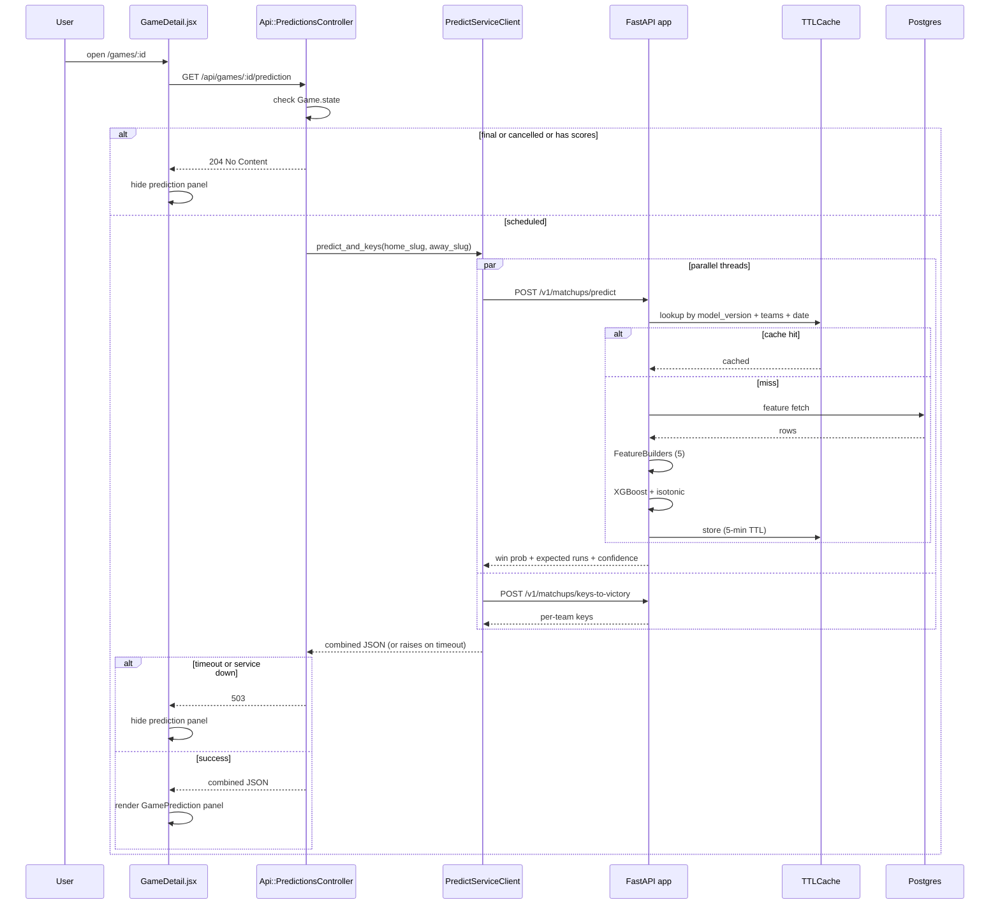

# Prediction Pipeline

How a win-probability appears above the Box Score / PBP / Team Stats tabs on `GameDetail`.

---

## End-to-end



---

## The Rails side

### `Api::PredictionsController#show`

- **File:** `app/controllers/api/predictions_controller.rb`
- **Route:** `GET /api/games/:id/prediction` (nested under `/api/games/:id/`)

Early-exit rules:

| Condition | Response |
|-----------|----------|
| Game not found | 404 |
| `state` in `{final, cancelled}` OR any score recorded | 204 No Content |
| Missing home/away team slugs | 422 |
| `PredictServiceClient::TimeoutError` | 503 |
| `PredictServiceClient::ServiceUnavailable` | 503 |
| Success | 200 with combined JSON |

204 is deliberate: the frontend uses a custom axios `validateStatus` that lets 204 through without error, and renders nothing when the response body is empty.

### `PredictServiceClient`

- **File:** `app/services/predict_service_client.rb`
- **Env:**
  - `PREDICT_SERVICE_URL` (default `http://localhost:8080`; prod: `http://riseballs-predict.web:8080`)
  - `PREDICT_SERVICE_TIMEOUT_SECONDS` (default `5`)

Public methods:

| Method | Calls | Parallel? |
|--------|-------|-----------|
| `predict_only(home:, away:, game_date:)` | `/v1/matchups/predict` | no |
| `bundle_for(home:, away:, game_date:)` | `/v1/matchups/predict` + `/v1/matchups/keys-to-victory` | yes, via `Thread.new` fanout; 15s joint timeout |
| `scoreboard(...)` | batched for scoreboard use | yes, `Concurrent::FixedThreadPool` with POOL_SIZE=10 |

Error hierarchy:

```
PredictServiceClient::Error
  ├─ PredictServiceClient::TimeoutError
  └─ PredictServiceClient::ServiceUnavailable
```

See [rails/11-external-clients.md](../rails/11-external-clients.md).

---

## The Predict side

### Endpoints (see [predict/01-endpoints.md](../predict/01-endpoints.md))

| Method | Path | Role | Rails caller |
|--------|------|------|--------------|
| POST | `/v1/matchups/predict` | Win probability + expected runs + confidence | `PredictServiceClient#predict_only` / `#bundle_for` |
| POST | `/v1/matchups/keys-to-victory` | Per-team keys (top 5 features per team, delta ≥ 0.003) | `PredictServiceClient#bundle_for` |
| POST | `/v1/games/explain-loss` | Postgame "why did X lose" — **not yet wired from Rails** | (future) |
| GET | `/v1/health` | Liveness | Dokku healthcheck (router mounted with `/v1` prefix) |

### Feature engineering

Five builders in `app/features/builders/`:

| Builder | Output |
|---------|--------|
| `team_strength_features.py` | Team-level strength metrics (W-L, run differential, RPI-like) |
| `offense_features.py` | Batting — AVG/OBP/SLG/wOBA/wRC+ per team, per window |
| `pitching_features.py` | ERA/FIP/xFIP/K%/BB% per team, per window |
| `defense_features.py` | Fielding pct, DER, stolen base allowed |
| `matchup_features.py` | Head-to-head deltas (home − away for each team feature) |

Four rolling windows (L7, L14, L30, season). Total: ~168 team features + 15 matchup deltas.

**Point-in-time safety:** features fetched with a strict-before filter on `game_date`. Training mirror-pairs (home + flipped away) must stay in the same train/val/test partition to prevent leakage.

See [predict/02-feature-engineering.md](../predict/02-feature-engineering.md).

### ML model

- **Algorithm:** XGBoost binary:logistic + isotonic calibration.
- **Hyperparams (defaults):** `max_depth=5, eta=0.05, num_boost_round=400, early_stopping_rounds=30`.
- **Artifacts:** `models/current/` (active) + `models/archive/<model_version>/` (all versions).
- **Versioning:** `model_version` is part of the cache key, so retraining invalidates cache cleanly without a separate purge.

See [predict/03-ml-and-artifacts.md](../predict/03-ml-and-artifacts.md).

### Keys-to-victory

`key_to_victory_engine.py` computes per-team feature importance by perturbation:

1. Start with baseline prediction.
2. For each feature, perturb it modestly and observe win-probability delta.
3. Normalize per-team importance.
4. Filter: min |delta| = 0.003.
5. Return top 5 per team.

Output is a list of `{feature, direction, delta}` tuples. Frontend renders as a short bullet list beside the win-probability bar.

See [predict/04-explain-engine.md](../predict/04-explain-engine.md).

### Caching

In-process TTL cache (`TTLCache` in `app/observability/cache.py`):

- **Implementation:** OrderedDict with LRU eviction + asyncio lock for concurrency.
- **TTL:** 300 seconds (5 minutes).
- **Max size:** 512 entries.
- **Key:** `(model_version, home_slug, away_slug, game_date)`.
- **Scope:** per-process — no shared cache across Predict replicas (today, only 1 replica runs).
- **No Rails-side cache.** Rails requests every time; the service's internal cache absorbs the load.

---

## The frontend side

### `GamePrediction.jsx`

Component placement: above the Box Score / Play-by-Play / Team Stats tabs on `GameDetail`.

Renders:

- **Win probability bar** (home vs away, percentage).
- **Expected runs** (home − away).
- **Confidence band** (low / medium / high based on model variance).
- **Per-team keys-to-victory** (2 columns, 5 bullets each).

Conditional hiding:

- **204 / null response** → component unmounts / renders nothing.
- **503 response** → component unmounts / renders nothing.
- **Axios default would throw on 503** — `lib/api.js` has a custom `validateStatus` that treats 204 and 503 as acceptable.

See [rails/16-frontend-pages.md](../rails/16-frontend-pages.md) `GameDetail` and [rails/17-frontend-components.md](../rails/17-frontend-components.md) `GamePrediction`.

---

## Not yet wired

- **Post-game explanations.** `POST /v1/games/explain-loss` exists in the predict service but no Rails controller calls it yet. See [predict/04-explain-engine.md](../predict/04-explain-engine.md) for the explain-loss contract.
- **Scoreboard prediction badges.** Predict returns a scoreboard-batched endpoint (`PredictServiceClient#scoreboard`) but the scoreboard UI does not yet render prediction badges per game. V2 surface.
- **Historical prediction archive.** Predictions are not persisted anywhere. Cache is per-process and 5-minute. If a past-game prediction is needed for UI review, it must be recomputed.

---

## Known hazards

1. **Predict is a single-point-of-failure for the prediction panel.** If the service is down, the panel silently disappears. No user-visible error.
2. **Cache key includes `model_version`, not `feature_schema_version`.** If features change but `model_version` doesn't bump, cache can serve stale predictions. Convention: bump `model_version` when features change.
3. **Cache is per-process.** With multiple Predict replicas, cache hit rate drops; re-running features is the safe default and load-testable.
4. **Active-model env vars are unused in V1.** `ACTIVE_WIN_MODEL_VERSION`, `WAREHOUSE_URL`, `active_run_model_version` exist in `app/config.py` but V1 code unconditionally uses `models/current/`. Don't be misled.

---

## Related docs

- [predict/](../predict/) — full predict service reference
- [rails/04-api-endpoints.md](../rails/04-api-endpoints.md) — `Api::PredictionsController`
- [rails/11-external-clients.md](../rails/11-external-clients.md) — `PredictServiceClient`
- [rails/16-frontend-pages.md](../rails/16-frontend-pages.md) — `GameDetail` prediction integration
- [rails/17-frontend-components.md](../rails/17-frontend-components.md) — `GamePrediction`
