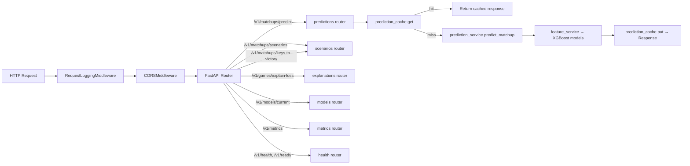

# 01 — Endpoints

All routes are mounted under the `/v1` prefix by `create_app()` (`app/main.py:88-93`). The middleware stack applies to every route: `RequestLoggingMiddleware` → `CORSMiddleware` → FastAPI routing.



---

## GET `/v1/health`

Router: `app/api/routers/health.py:20`

**Response** (`HealthResponse`):

```json
{ "status": "ok" }
```

Always 200. No dependencies checked.

## GET `/v1/ready`

Router: `app/api/routers/health.py:24`

**Response** (`ReadyResponse`):

```json
{
  "status": "ok",
  "ready": true,
  "warehouse_ready": true,
  "models_ready": true
}
```

Returns 200 when `app.state.ready` is true, otherwise 503. `warehouse_ready` and `models_ready` are independent signals — the process stays "up" even if warehouse/models degrade.

---

## POST `/v1/matchups/predict`

Router: `app/api/routers/predictions.py:12`
Service: `app/services/prediction_service.py:50`
**Called by Rails:** `PredictServiceClient#predict_only` and `#bundle_for` (`riseballs/app/services/predict_service_client.rb`).

### Request (`PredictRequest`, `app/schemas/prediction.py:26`)

| Field | Type | Required | Notes |
|---|---|---|---|
| `team_a_id` | string | yes | Team slug |
| `team_b_id` | string | yes | Team slug |
| `game_date` | `date` (YYYY-MM-DD) | yes | Features use games strictly before this date |
| `context.home_team_id` | string \| null | no | Defaults to `team_a_id` |
| `context.neutral_site` | bool | no | V1 accepts it but the feature set doesn't use it yet |
| `context.division` | string \| null | no | `d1` / `d2`; metadata only |

### Response (`PredictResponse`, `app/schemas/prediction.py:49`)

```json
{
  "model_version": "win-prob-2026-04-17-xgb-2026-04-18-201427",
  "feature_schema_version": "features-v1",
  "prediction": {
    "team_a_win_probability": 0.6412,
    "team_b_win_probability": 0.3588,
    "team_a_expected_runs": 5.42,
    "team_b_expected_runs": 3.88,
    "confidence_band": "high"
  },
  "swing_factors": [
    { "code": "run_diff_gap", "title": "Run Diff Gap",
      "advantage_team_id": "texas", "importance": 1.0,
      "summary": "texas holds the recent edge on run diff gap." }
  ]
}
```

- `team_a_win_probability` = `(p(a as team_a) + (1 - p(b as team_a))) / 2` for orientation symmetry (`prediction_service.py:73`).
- `team_b_win_probability = 1 - team_a_win_probability`.
- Run model called twice (once per orientation) so each team gets its own expected-run prediction.
- `confidence_band`: `low` if `min_games_played < 10`, `medium` if `< 20` or `|p-0.5| < 0.05`, else `high` (`prediction_service.py:122`).
- `swing_factors`: top 5 `matchup__*` features by `|value| × feature_importance`, excluding `_games_played` / `_min_games_played` meta columns. Advantage team is A if value ≥ 0 else B.

### Errors

| Status | Cause |
|---|---|
| 503 | `app.state.model_artifacts is None` — models not loaded (`predictions.py:14`) |
| 422 | Pydantic validation failure on request body |

### Caching

Cache is `app.state.prediction_cache` — a `TTLCache` (ttl=300s, max=512). Key (`predictions.py:22-25`):

```
predict|<model_version>|<team_a_id>|<team_b_id>|<game_date>|<home_id>
```

Cache is **scoped on `model_version`** so a retrain invalidates automatically. Cache implementation lives in `app/observability/cache.py`.

---

## POST `/v1/matchups/scenarios`

Router: `app/api/routers/scenarios.py:30`
Service: `app/services/scenario_service.py:39`

Returns every (team × scenario) combination so the UI can slice whichever way it wants. **Not currently called by Rails** — the Rails app uses `/v1/matchups/keys-to-victory` instead, but the two share one underlying bundle.

### Request (`ScenariosRequest`, `app/schemas/scenario.py:12`)

Same shape as `PredictRequest` (reuses `MatchupContext`).

### Response (`ScenariosResponse`, `app/schemas/scenario.py:29`)

```json
{
  "taxonomy_version": "scenarios-v1",
  "model_version": "win-prob-2026-04-17-xgb-2026-04-18-201427",
  "feature_schema_version": "features-v1",
  "baseline_team_a_win_probability": 0.6412,
  "baseline_team_b_win_probability": 0.3588,
  "scenarios": [
    {
      "code": "avoid_free_bases",
      "title": "Avoid giving away free bases",
      "team_id": "duke",
      "baseline_win_probability": 0.3588,
      "scenario_win_probability": 0.4547,
      "win_probability_delta": 0.0959,
      "summary": "Pitchers hold walks and HBP below their season baseline — duke's win probability increases by 10 points."
    }
  ]
}
```

14 scenarios are returned (7 scenarios × 2 teams). Sorted by `|win_probability_delta|` DESC.

### Errors

- 503 if models not loaded.
- 422 on schema violation.

## POST `/v1/matchups/keys-to-victory`

Router: `app/api/routers/scenarios.py:64`
Engine: `app/explain/key_to_victory_engine.py:49`
**Called by Rails:** `PredictServiceClient#bundle_for` (parallel thread alongside `/predict`).

### Request

Same as `/scenarios`.

### Response (`KeysToVictoryResponse`, `app/schemas/scenario.py:51`)

```json
{
  "taxonomy_version": "keys-v1",
  "model_version": "win-prob-2026-04-17-xgb-2026-04-18-201427",
  "feature_schema_version": "features-v1",
  "team_a": {
    "team_id": "texas",
    "keys_to_victory": []
  },
  "team_b": {
    "team_id": "duke",
    "keys_to_victory": [
      {
        "code": "avoid_free_bases",
        "title": "Avoid giving away free bases",
        "importance": 1.0,
        "win_probability_delta": 0.0959,
        "summary": "..."
      }
    ]
  }
}
```

Filters the scenarios bundle to **positive deltas ≥ 0.003**, ranks per team, caps at top 5, normalizes `importance` to `[0, 1]` within each team (`key_to_victory_engine.py:67-86`).

When a team is already heavily favored, it can have an empty `keys_to_victory` list — no scenario moves their probability meaningfully. This is the intended behavior (per `how_things_work.md` §Phase 6 note).

### Errors

- 503 if models not loaded.
- 422 on schema violation.

### Caching

The scenarios router does **not** hit `prediction_cache` — keys are rebuilt on every call. (The underlying `matchup_features_for_inference` is called twice per request, once per orientation.)

---

## POST `/v1/games/explain-loss`

Router: `app/api/routers/explanations.py:17`
Service: `app/services/explanation_service.py:34`
**Called by Rails:** not currently wired through any controller; endpoint is live and tested but not consumed.

### Request (`ExplainLossRequest`, `app/schemas/explanation.py:8`)

```json
{ "game_id": 123456 }
```

### Response (`ExplainLossResponse`, `app/schemas/explanation.py:28`)

```json
{
  "game_id": 123456,
  "losing_team_id": "duke",
  "winning_team_id": "texas",
  "losing_score": 2,
  "winning_score": 9,
  "taxonomy_version": "explain-v1",
  "summary": "duke lost to texas 2-9 in a 7-run loss. Top contributors: missed scoring chances and gave away free bases.",
  "reasons": [
    {
      "code": "missed_scoring_chances",
      "title": "Missed scoring chances",
      "importance": 1.0,
      "score": 0.78,
      "summary": "Reached base 10 times, scored only 2.",
      "evidence": {
        "baserunners_proxy": 10,
        "runs_scored": 2,
        "stranded_proxy": 8,
        "conversion_rate": 0.2
      }
    }
  ]
}
```

Up to 5 reasons. Empty `reasons: []` when no category scored above the inclusion threshold (genuinely undecisive game).

### Errors (`app/api/routers/explanations.py:20-25`)

| Status | Service exception | Condition |
|---|---|---|
| 404 | `GameNotFoundError` | `games_repository.get_game(game_id)` returns None |
| 422 | `GameNotExplainableError` | Game not completed, ended in tie, missing slugs, or no per-team `player_game_stats` rows |

### Caching

Not cached in-process. Explanations are cheap (all work is box-derived) and the endpoint is low-volume.

---

## GET `/v1/models/current`

Router: `app/api/routers/models.py:12`
Service: `app/services/model_registry_service.py:9`

### Response (`CurrentModelsResponse`, `app/schemas/model.py:33`)

Active:

```json
{
  "status": "active",
  "win_probability": {
    "model_version": "win-prob-2026-04-17-xgb-2026-04-18-201427",
    "feature_schema_version": "features-v1",
    "trained_through_date": "2026-04-17",
    "train_rows": 17228,
    "validation_rows": 3692,
    "test_rows": 3692,
    "metrics": { "validation": {...}, "test": {...}, "test_slices": {...} },
    "git_sha": "abc123...",
    "artifact_created_at": "2026-04-18T20:14:27+00:00"
  },
  "run_expectancy": { "model_version": "run-exp-...", ... }
}
```

Inactive (no artifacts loaded):

```json
{ "status": "no_active_model", "win_probability": null, "run_expectancy": null }
```

The `metrics` field is typed `dict[str, object]` so adding new slice families doesn't require a schema revision.

---

## GET `/v1/metrics`

Router: `app/api/routers/metrics.py:10`

Returns the in-process `MetricsRegistry` snapshot:

```json
{
  "requests": [
    { "route": "/v1/matchups/predict", "status": 200, "count": 142 }
  ],
  "latency": [
    { "route": "/v1/matchups/predict", "sample_size": 142,
      "p50_ms": 85.2, "p95_ms": 220.5, "p99_ms": 340.1 }
  ]
}
```

Per-process only (each uvicorn worker has its own counters). Not auth-gated in V1 — treat as internal. See `05-observability.md` for the registry internals.

---

## Middleware

### `RequestLoggingMiddleware` (`app/observability/middleware.py`)

Runs on every request:

1. Reads or generates `x-request-id` header, stashes on `request.state.request_id`.
2. Times the request with `time.perf_counter()`.
3. On completion, records `(route_template, status, duration_ms)` into `metrics_registry()`.
4. Emits a structured log line with method/path/route/status/duration/request_id.
5. Echoes `x-request-id` back on the response.

`route_template` is the FastAPI path template (e.g. `/v1/matchups/predict`) so metrics don't explode across dynamic path params.

### `CORSMiddleware` (`app/main.py:80-86`)

- `allow_origins` = `settings.cors_allow_origins`
- `allow_methods` = `["GET", "POST", "OPTIONS"]`
- `allow_headers` = `["*"]`
- `allow_credentials` = `False`

---

## Rails integration map

| Rails call | Predict endpoint | Purpose |
|---|---|---|
| `PredictServiceClient#predict_only` | `POST /v1/matchups/predict` | Scoreboard (win prob only) |
| `PredictServiceClient#bundle_for` | `POST /v1/matchups/predict` AND `POST /v1/matchups/keys-to-victory` in parallel threads | Full matchup view |
| _(not wired)_ | `POST /v1/games/explain-loss` | Loss explanations |
| _(not wired)_ | `POST /v1/matchups/scenarios` | Raw scenario table |
| _(not wired)_ | `GET /v1/models/current` | Model metadata probe |
| _(not wired)_ | `GET /v1/metrics` | Ops |

Rails controller behavior (per caller's brief): returns **204** for any played game (never calls predict), **503** if predict times out or errors. Predict timeout is 5s (`PREDICT_SERVICE_TIMEOUT_SECONDS`). Rails adds no caching — the service owns the 5-minute TTL.

## Related docs

- [../pipelines/07-prediction-pipeline.md](../pipelines/07-prediction-pipeline.md) — Rails call sites and end-to-end flow
- [../rails/11-external-clients.md](../rails/11-external-clients.md) — `PredictServiceClient` implementation
- [06-schemas.md](06-schemas.md) — pydantic request/response schema definitions
- [04-explain-engine.md](04-explain-engine.md) — explain-loss, scenarios, keys internals
- [05-observability.md](05-observability.md) — middleware, metrics registry, cache internals
- [00-overview.md](00-overview.md) — service overview and app state fields
