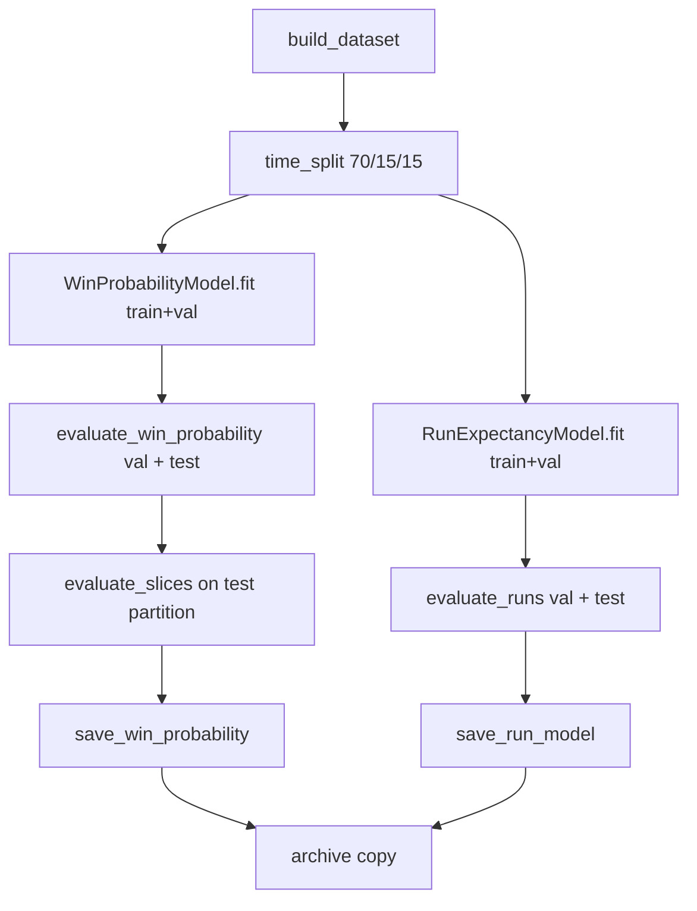
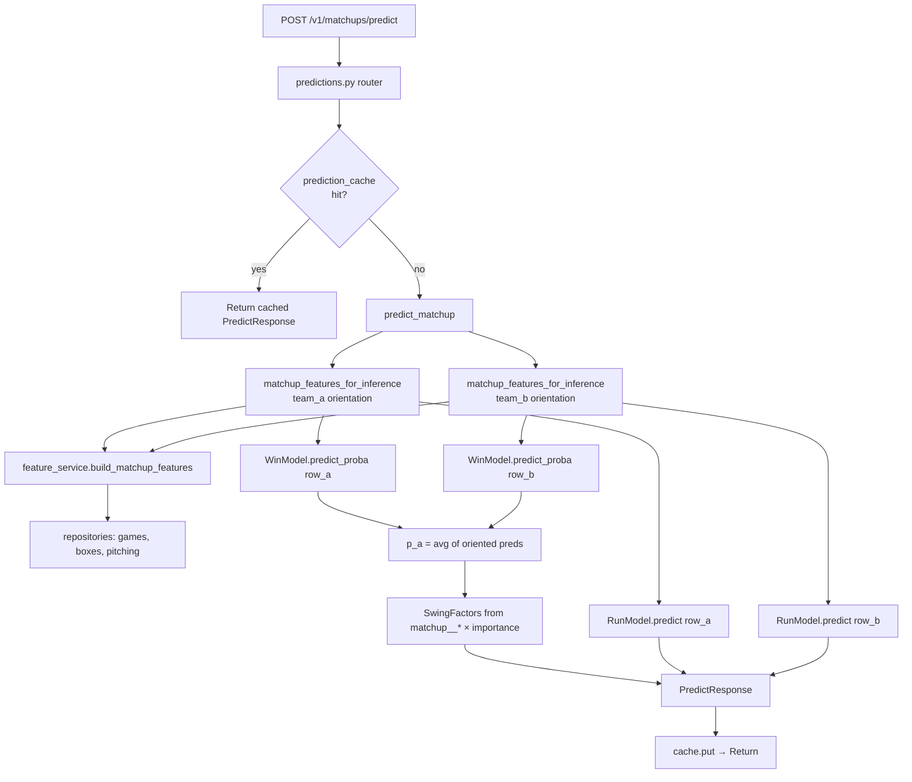

# 03 — ML Models and Artifacts

Two XGBoost models work in tandem. All ML code lives under `app/ml/`.

## The two models

### Win probability (`app/ml/models/win_probability_model.py`)

- `XGBClassifier`-style wrapper around `xgb.Booster` with `binary:logistic` objective.
- Calibrated on the validation set via `sklearn.isotonic.IsotonicRegression(out_of_bounds="clip")`.
- `predict_proba(x)` returns **calibrated** probabilities (or raw if calibrator is None).
- `feature_importance()` returns gain-based importances sorted DESC — fed into the swing-factor ranker.

Default hyperparams (`win_probability_model.py:114`):

```python
objective: binary:logistic
eval_metric: [logloss, auc]
max_depth: 5
min_child_weight: 5
eta: 0.05
subsample: 0.8
colsample_bytree: 0.8
lambda: 1.0
alpha: 0.0
tree_method: hist
num_boost_round: 400
early_stopping_rounds: 30
```

Saved artifacts per model version:

| File | Purpose |
|---|---|
| `model.json` | XGBoost native JSON dump (`booster.save_model`) |
| `features.json` | Pinned ordered column list from training |
| `calibration.joblib` | Fitted `IsotonicRegression` (joblib dump) |
| `metadata.json` | TrainingRunMetadata — version, metrics, rows, git_sha, etc. |

### Run expectancy (`app/ml/models/run_expectancy_model.py`)

- `XGBRegressor`-style wrapper with `reg:squarederror`.
- Same hyperparams as win-prob.
- `predict(x)` clips output to ≥ 0 (runs are non-negative).
- **Single offense-side model**, called twice at inference (once per orientation) to get both teams' expected runs.

Saved artifacts:

| File | Purpose |
|---|---|
| `model.json` | XGBoost dump |
| `features.json` | Pinned column order |
| `metadata.json` | Same schema as win-prob, no calibration |

## Artifact tree (`models/`)

Layout defined in `app/ml/artifacts/paths.py`:

```
models/
  current/
    win_probability/
      model.json
      features.json
      calibration.joblib
      metadata.json
    run_expectancy/
      model.json
      features.json
      metadata.json
  archive/
    <model_version>/          # e.g. win-prob-2026-04-17-xgb-2026-04-18-201427
      ... same layout ...
```

Actual contents (verified in `models/` now):

- `models/current/win_probability/` — active win model (version `win-prob-2026-04-17-xgb-2026-04-18-201427`)
- `models/current/run_expectancy/` — active run model (version `run-exp-2026-04-17-xgb-2026-04-18-201427`)
- `models/archive/` — 3 prior training runs (`..-184950`, `..-185258`, `..-201427`)

Archive is a full copy (not a symlink) of each saved run, keyed on `model_version` (see `saver.py:119`).

## Model versioning

`model_version` strings are built in `app/ml/training/pipeline.py:115`:

```python
timestamp = datetime.utcnow().strftime("%Y-%m-%d-%H%M%S")
win_version = f"win-prob-{through_date.isoformat()}-xgb-{timestamp}"
run_version = f"run-exp-{through_date.isoformat()}-xgb-{timestamp}"
```

This version is:

- Stamped into `metadata.json`
- Returned in every API response (`PredictResponse.model_version`, etc.)
- **Used as a cache-key scope** in `/v1/matchups/predict` — a retrain invalidates cleanly.
- Surfaced by `GET /v1/models/current`.

The `ACTIVE_WIN_MODEL_VERSION` / `ACTIVE_RUN_MODEL_VERSION` env vars exist in `config.py` but are not consumed in V1 — the loader always reads `current/` unconditionally.

## Loader (`app/ml/artifacts/loader.py`)

`load_current(model_root)` returns a `LoadedArtifacts` dataclass:

```python
@dataclass(frozen=True)
class LoadedArtifacts:
    win_probability: WinProbabilityModel
    win_probability_metadata: dict
    run_expectancy: RunExpectancyModel
    run_expectancy_metadata: dict
```

Raises `ArtifactsNotFoundError` if either `current/*/model.json` is missing. The lifespan handler in `app/main.py` catches this and starts in degraded mode — the predict / scenarios / keys endpoints then return 503.

`_maybe_metadata(dir)` tolerates missing or malformed `metadata.json` (returns `{}`).

## Saver (`app/ml/artifacts/saver.py`)

`save_win_probability(...)` and `save_run_model(...)`:

1. `_replace_dir(target)` — rmtree + mkdir (atomic swap is out of scope for V1).
2. `model.save(target)` — XGBoost + features.json + (for win-prob) calibration.joblib.
3. Write `metadata.json` (see `TrainingRunMetadata` dataclass).
4. If `archive=True` (default), `_archive_copy(target, model_root, model_version)` → deep copy into `archive/<version>/`.

`_git_sha()` shells out to `git rev-parse HEAD` with a 5s timeout; returns `None` on failure.

## Dataset construction (`app/ml/datasets/`)

### Mirror encoding (`dataset_builder.py:126`)

Every completed game emits **two rows** — once with the home team in the team_a slot, once with the away team there:

```
(team_a=home, team_b=away)  → win_label = 1 if home won
(team_a=away, team_b=home)  → win_label = 1 if away won
```

This forces the model to learn an order-symmetric representation. Constants:

```python
TEAM_A_PREFIX = "team_a__"
TEAM_B_PREFIX = "team_b__"
MATCHUP_PREFIX = "matchup__"
META_COLUMNS = ("game_id", "game_date", "division", "team_a_slug",
                "team_b_slug", "team_a_is_home", "season",
                "win_label", "runs_scored_label", "runs_allowed_label")
```

### Point-in-time safety

`build_dataset(season_min, through_date, ...)`:

- Pulls `list_completed_games(start_date=date(season_min, 1, 1), end_date=through_date)`.
- For each game, calls `feature_service.build_matchup_features(...)` twice (once per orientation) — the service uses `list_games_for_team_before(slug, game.game_date)` with a **strict `<`** cutoff, so a game's features never see itself or any later games.
- Labels: `win_label` from `home_win_label(game)` (None → skip), `runs_scored_label` = the team_a side's actual runs.

### Time split (`train_val_test_split.py`)

`time_split(df, fractions)`:

1. Sort by `(game_date, game_id)`.
2. Deduplicate by `game_id` → list of distinct games in chronological order.
3. Partition by percentile (default 70/15/15).
4. Assign both mirror twins of a game to the **same partition** (lines 65-71). Splitting them would let the validation set see the answer for its mirror twin in training.

## Training pipeline (`app/ml/training/pipeline.py`)

`train_all(season_min, through_date, model_root, ...)`:



Returns a `TrainingResult` with both versions, validation + test metrics, and `win_test_slice_metrics`.

### Metrics (`app/ml/evaluation/metrics.py`)

Win-prob:

- `log_loss`, `brier_score`, `roc_auc`, `accuracy_at_0_5`, `expected_calibration_error` (10-bin equal-width), `n_rows`.

Run:

- `rmse`, `mae`, `n_rows`.

### Slice metrics (`app/ml/evaluation/slices.py`)

Slices scored on the test partition (skipping slices with <20 rows or single-class labels):

- `division=d1`, `division=d2`
- `team_a_home`, `team_a_away`
- `team_a_favorite` (matchup__win_pct_diff > 0), `team_a_underdog` (< 0)
- `month=MM` for each month present in the window

Baseline local run (per `how_things_work.md`, full 2025+2026 data through 2026-04-17, **24,612 mirrored rows**):

- Win-prob val: log_loss 0.588, brier 0.202, AUC 0.749, ECE 0.000
- Win-prob test: log_loss 0.607, brier 0.209, AUC 0.733, ECE 0.024
- Run val: RMSE 3.60, MAE 2.86
- Run test: RMSE 3.55, MAE 2.85

Spec §13 calibration target is ECE < 0.05 — well under.

## CLI scripts

### `scripts/train_all.py`

```bash
DB_URL="postgresql+psycopg://mattmondok@localhost:5432/riseballs_local" \
  python scripts/train_all.py --through-date 2026-04-17 --season-min 2025
```

Args: `--through-date` (required), `--season-min` (default 2025), `--division`, `--limit` (debug), `--log-level`. Writes to `settings.model_root`.

### `scripts/evaluate_latest.py`

```bash
DB_URL=... python scripts/evaluate_latest.py \
  --through-date 2026-04-27 --holdout-from 2026-04-18
```

Loads `current/`, builds a dataset through `--through-date`, filters to `game_date >= --holdout-from`, runs both models, prints a JSON report with overall + slice metrics. Does **not** retrain.

## Prediction flow (HTTP → model → response)



Key details at each step:

1. **Cache key:** `predict|<win_model_version>|<team_a>|<team_b>|<game_date>|<home_id>`.
2. **Row alignment:** before predicting, the row is reindexed to `model.feature_columns` and NaNs filled with 0.0 (`prediction_service.py:103-112`). This is the contract that keeps older artifacts compatible with newer feature builders that add columns.
3. **Swing-factor ranking:** filter to `matchup__*` columns excluding `_games_played` / `_min_games_played`; sort by `|raw_value| × gain_importance`; take top 5.

## Tests

- `tests/test_ml.py` — labels, time split, model wrappers (synthetic data).
- `tests/integration/test_predict_endpoint.py` — end-to-end via live DB (skipped if no models loaded).
- `tests/integration/test_phase6_phase7_endpoints.py` — scenarios + keys + models-current + metrics + cache smoke.
