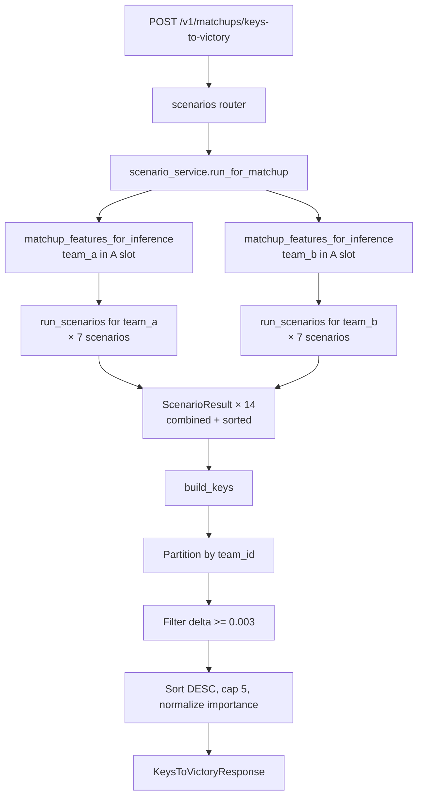
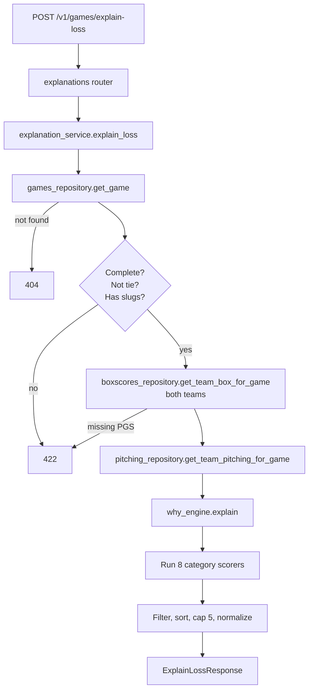

# 04 — Explain Engine

Three engines live under `app/explain/`, each with its own taxonomy version:

| Engine | Taxonomy version | Purpose | Entry service |
|---|---|---|---|
| `why_engine` | `explain-v1` | Rank reasons a team lost a completed game | `explanation_service.explain_loss` |
| `scenario_analysis` | `scenarios-v1` | Perturb an inference row, measure Δ win prob | `scenario_service.run_for_matchup` |
| `key_to_victory_engine` | `keys-v1` | Filter scenario results to per-team actionable keys | `scenarios.py` router directly |

All three are **deterministic** — no LLM. Same inputs produce identical outputs (per spec §16).

---

## `categories.py` — Explain category catalog

Every category is a pure function `(Inputs) -> ScoreEnvelope`:

```python
@dataclass(frozen=True)
class Inputs:
    losing_box: TeamBox
    losing_pitch: TeamPitching | None
    winning_box: TeamBox
    winning_pitch: TeamPitching | None
    losing_team_id: str
    winning_team_id: str
    losing_score: int
    winning_score: int

@dataclass(frozen=True)
class ScoreEnvelope:
    score: float                     # 0..1
    evidence: dict[str, float | int] # surfaced in API response
    summary: str                     # human sentence
```

A `Category` wraps the scorer with a code, title, and weight:

```python
Category("missed_scoring_chances", "Missed scoring chances", 1.0, _missed_scoring_chances)
```

### V1 catalog (8 categories, `categories.py:273-282`)

| Code | Title | Weight | Scorer logic |
|---|---|---|---|
| `missed_scoring_chances` | Missed scoring chances | 1.00 | Baserunners proxy = `H + BB + HBP`; `stranded_proxy = baserunners - runs`. Score = `(stranded/8) * (1 - conversion_rate)`, 0 if `baserunners < 4`. |
| `lost_extra_base_hit_battle` | Lost the extra-base hit battle | 0.95 | `deficit = winning_xbh - losing_xbh`; score = `deficit / 4` clipped. |
| `gave_up_homer_damage` | Gave up home-run damage | 0.95 | `margin = HR allowed - HR hit`; score = `margin / 3` clipped. |
| `gave_away_free_bases` | Gave away free bases | 0.85 | `deficit = (BB+HBP issued) - (BB+HBP drawn)`; score = `deficit / 5` clipped. |
| `opponent_pitched_better` | Opponent pitching dominated | 0.85 | `k_rate = opp_K / losing_PA_proxy`; score = `(k_rate - 0.18) / 0.20` clipped. (18% is league avg, 30%+ → 1.0.) |
| `excessive_strikeouts` | Too many strikeouts | 0.70 | `deficit = losing_K - winning_K`; score = `deficit / 5` clipped. |
| `defensive_miscues_amplified` | Defensive miscues amplified damage | 0.80 | `0.5 * (errors/3) + 0.5 * (unearned/4)` clipped. |
| `decisive_run_margin` | Got beat decisively on the scoreboard | 0.50 | `margin = winning_score - losing_score`; score = `margin / 6` clipped. |

**Adding a category** = define a scorer function and append to `CATEGORIES`. The engine picks it up automatically.

### Deferred until Phase 5b (need PBP)

`missed_scoring_chances` and `decisive_run_margin` are box-derived **proxies**. Real inning-by-inning runs + runner-state reconstruction will replace them:

- Real "crooked inning" detection
- Stranded-runners count from runner state
- Leadoff-runner scoring rate
- Two-out RBI failure
- Failed-to-answer pattern

---

## `why_engine.py` — Rank and summarize

`explain(inputs) -> GameExplanation`:

```python
_MIN_SCORE_FOR_INCLUSION = 0.20   # fraction of max weight
_MAX_REASONS = 5
```

Flow (`why_engine.py:48-70`):

1. For every `Category`: compute `envelope = category.scorer(inputs)`; `weighted = envelope.score * category.weight`.
2. Filter: keep only `weighted >= 0.20 * max_weight`.
3. Sort DESC by `weighted`, cap at 5.
4. Normalize importance: `importance = round(weighted / max_weighted, 3)` across the surfaced reasons.
5. Summary line: "<loser> lost to <winner> 2-9 in a 7-run loss. Top contributors: <title1> and <title2>." When no reasons survive the filter: "no single factor stood out."

### Example (synthetic)

**Input** — Duke (losing) 2, Texas (winning) 9:

```python
losing_box:  hits=5, walks=3, hbp=2, runs_scored=2, strikeouts=11, errors=2, home_runs=0, extra_base_hits=1
losing_pitch: runs_allowed=9, earned_runs=6, walks_allowed=5, hbp_allowed=1, home_runs_allowed=2, strikeouts_recorded=6
winning_box:  strikeouts=6, home_runs=2, extra_base_hits=5
winning_pitch: strikeouts_recorded=11
```

**Output** (top reasons, reordered by weighted score):

```json
{
  "taxonomy_version": "explain-v1",
  "summary": "duke lost to texas 2-9 in a 7-run loss. Top contributors: missed scoring chances and excessive strikeouts.",
  "reasons": [
    { "code": "missed_scoring_chances", "importance": 1.0, "score": 0.78,
      "evidence": {"baserunners_proxy": 10, "runs_scored": 2, "stranded_proxy": 8, "conversion_rate": 0.2}},
    { "code": "excessive_strikeouts", "importance": 0.7, "score": 1.0,
      "evidence": {"losing_team_strikeouts": 11, "winning_team_strikeouts": 6, "strikeout_deficit": 5}}
  ]
}
```

---

## `scenario_analysis.py` — Perturbation engine

### Scenario catalog (`SCENARIOS`, 7 entries, lines 137-180)

Each scenario has a `code`, `title`, `description`, and an `apply(row, team_prefix)` function that mutates feature columns in place. All nudges target the **season window** — last-N windows are too noisy for forward-looking what-ifs.

| Code | Nudges |
|---|---|
| `avoid_free_bases` | Pitching: walks_allowed_per_game −1.5, hbp_allowed_per_game −0.5 (clamped ≥0) |
| `suppress_opponent_power` | Pitching: home_runs_allowed_per_game −0.5, hits_allowed_per_game × 0.85 |
| `create_free_traffic` | Offense: walks_per_game +1.5, bb_rate +0.03, hbp_rate +0.005 |
| `win_damage_battle` | Offense: home_runs_per_game +0.5, extra_base_hits_per_game +1.0, slg_proxy × 1.10, iso_proxy × 1.15 |
| `cash_in_chances` | Offense: runs_per_game × 1.15, obp_proxy × 1.05, ops_proxy × 1.07 |
| `clean_defense` | Defense: errors_per_game × 0.5, unearned_runs_per_game × 0.4 |
| `dominant_k_rate` | Pitching: k_per_7 +2.0, whip × 0.90, strikeouts_per_game +2.0 |

Magnitudes are intentionally capped so the perturbed row stays near the training distribution.

### Engine (`run_scenarios`, line 188)

```python
def run_scenarios(*, baseline_row, artifacts, team_id, team_prefix) -> list[ScenarioResult]:
    columns = artifacts.win_probability.feature_columns
    baseline_aligned = _aligned(baseline_row, columns)
    baseline_p = float(artifacts.win_probability.predict_proba(baseline_aligned)[0])

    for spec in SCENARIOS:
        perturbed = baseline_row.copy(deep=True)
        spec.apply(perturbed, team_prefix)       # mutates
        scenario_p = model.predict_proba(_aligned(perturbed, columns))[0]
        delta = scenario_p - baseline_p
```

Returns a `ScenarioResult` per scenario:

```python
ScenarioResult(code, title, team_id,
               baseline_win_probability, scenario_win_probability,
               win_probability_delta, summary)
```

`team_prefix_for(team_is_in_a_slot: bool)` returns `"team_a__"` or `"team_b__"` — the nudges target whichever slot the team currently occupies.

### Orchestration (`scenario_service.py`)

`run_for_matchup` builds **two** inference rows:

1. `row_team_a_slot`: team A in the team_a slot.
2. `row_team_b_slot`: team B in the team_a slot (orientation flipped).

Both calls to `run_scenarios` use `team_prefix_for(True) = "team_a__"` because each row has the target team in the A slot. Results are concatenated and sorted by `|delta|` DESC via `bounded_probabilities`.

---

## `key_to_victory_engine.py` — Keys to victory

```python
KEYS_TAXONOMY_VERSION = "keys-v1"
_MAX_KEYS_PER_TEAM = 5
_MIN_POSITIVE_DELTA = 0.003
```

`build_keys(scenarios, team_a_id, team_b_id) -> KeysBundle`:

1. Partition `scenarios` by `team_id` into `team_a` / `team_b` buckets.
2. Per team: filter to `delta >= 0.003`, sort DESC, cap at 5.
3. Normalize importance to `[0, 1]` using per-team `max_delta`.
4. Return `KeysBundle(team_a=TeamKeys(...), team_b=TeamKeys(...))`.

When a team is already heavily favored, their key list can be empty — nothing nudges their probability meaningfully. Verified example from `how_things_work.md`: Texas (heavy favorite) vs Duke → Texas `[]`, Duke top key `avoid_free_bases` at +9.6 ppts.

### Example (Duke underdog vs Texas)

After running all 14 scenario trials:

```python
scenarios = [
  ScenarioResult("avoid_free_bases",        "Avoid giving away free bases", "duke", 0.3588, 0.4547, 0.0959, "..."),
  ScenarioResult("create_free_traffic",     "Create free traffic",          "duke", 0.3588, 0.4123, 0.0535, "..."),
  ScenarioResult("dominant_k_rate",         "Pitching dominates",           "duke", 0.3588, 0.3961, 0.0373, "..."),
  ScenarioResult("suppress_opponent_power", "Suppress opponent slugging",   "duke", 0.3588, 0.3612, 0.0024, "..."),  # below 0.003 → dropped
  ...
  ScenarioResult("avoid_free_bases",        "Avoid giving away free bases", "texas", 0.6412, 0.6385, -0.0027, "..."),  # negative → dropped
  ...
]
```

After `build_keys`:

```json
{
  "team_a": { "team_id": "texas", "keys_to_victory": [] },
  "team_b": {
    "team_id": "duke",
    "keys_to_victory": [
      { "code": "avoid_free_bases",    "title": "Avoid giving away free bases", "importance": 1.000, "win_probability_delta": 0.0959, "summary": "..." },
      { "code": "create_free_traffic", "title": "Create free traffic",          "importance": 0.558, "win_probability_delta": 0.0535, "summary": "..." },
      { "code": "dominant_k_rate",     "title": "Pitching dominates",           "importance": 0.389, "win_probability_delta": 0.0373, "summary": "..." }
    ]
  }
}
```

---

## End-to-end flow: `/v1/matchups/keys-to-victory`



---

## Explain-loss flow


