# Entity Relationships

Core entities and their cardinality. See `01-models.md` for model-level details and `02-database-schema.md` for column-level detail.

## Table of Contents

1. [ER Diagram](#er-diagram)
2. [Game Creation Cardinality](#game-creation-cardinality)
3. [Caching Layer](#caching-layer)
4. [Audit Layer](#audit-layer)
5. [PBP Layer](#pbp-layer)

---

## ER Diagram

```mermaid
erDiagram
    TEAM ||--o{ PLAYER : "has roster"
    TEAM ||--o{ COACH : "has staff"
    TEAM ||--o| TEAM_PITCHING_STAT : "has totals"
    TEAM ||--o{ TEAM_ALIAS : "known as"
    TEAM ||--o{ CONFERENCE_STANDING : "ranked in"
    TEAM ||--o{ SCRAPED_PAGE : "roster HTML"
    TEAM ||--o{ FOLLOW : "followed by"
    TEAM ||--o{ TEAM_GAME : "per-team schedule"

    PLAYER ||--o{ PLAYER_FAVORITE : "favorited by"

    USER ||--o{ FOLLOW : "follows"
    USER ||--o{ PLAYER_FAVORITE : "favorites"

    GAME ||--o{ GAME_TEAM_LINK : "team-side URLs"
    GAME ||--o{ GAME_IDENTIFIER : "sidearm IDs"
    GAME ||--o{ TEAM_GAME : "2 per-team views"
    GAME ||--o{ CACHED_GAME : "payloads by type"
    GAME ||--o{ GAME_SNAPSHOT : "live history"
    GAME ||--o{ GAME_REVIEW : "audit queue"
    GAME ||--o{ PLAYER_GAME_STAT : "stat lines"

    CONFERENCE_SOURCE ||--o{ STANDINGS_SCRAPE_LOG : "scrape history"

    TEAM {
        string slug PK
        string name
        string long_name
        string division
        string conference_seo
        decimal rpi
    }

    PLAYER {
        bigint id PK
        string name
        string slug UK
        bigint team_id FK
    }

    USER {
        bigint id PK
        string email UK
        string jti UK
        bool admin
    }

    COACH {
        bigint id PK
        bigint team_id FK
        string name
        string title
    }

    GAME {
        bigint id PK
        date game_date
        string home_team_slug
        string away_team_slug
        int game_number
        string state
        string ncaa_game_id UK
        bigint ncaa_contest_id UK
        string sb_event_id UK
        bool locked
        string data_freshness
    }

    TEAM_GAME {
        bigint id PK
        string team_slug
        date game_date
        int game_number
        string opponent_slug
        bigint game_id FK
        string boxscore_id
    }

    GAME_TEAM_LINK {
        bigint id PK
        bigint game_id FK
        string team_slug
        string sidearm_game_id
        string sb_event_id
        string box_score_url
    }

    GAME_IDENTIFIER {
        bigint id PK
        bigint game_id FK
        string team_slug
        string sidearm_id
    }

    CACHED_GAME {
        bigint id PK
        string ncaa_game_id
        string data_type
        string team_slug
        bigint game_id FK
        bool locked
        jsonb payload
    }

    GAME_SNAPSHOT {
        bigint id PK
        string ncaa_game_id
        bigint game_id FK
        string game_state
        jsonb linescore
    }

    GAME_REVIEW {
        bigint id PK
        bigint game_id FK
        string review_type
        string status
        jsonb proposed_changes
    }

    PLAYER_GAME_STAT {
        bigint id PK
        string ncaa_game_id
        string player_name
        string team_seo_slug
        string opponent_seo_slug
        bigint game_id FK
        date game_date
    }

    PLATE_APPEARANCE {
        bigint id PK
        string team_slug
        string game_source_id
        int inning
        string batter_name
        string result
    }

    PITCH_EVENT {
        bigint id PK
        string team_slug
        string game_source_id
        int inning
        string event_type
    }

    CONFERENCE_SOURCE {
        bigint id PK
        int season
        string division
        string conference
        string parser_type
        bool active
    }

    CONFERENCE_STANDING {
        bigint id PK
        int season
        string conference
        string team_name
        string team_slug FK
        int conf_wins
        int conf_losses
    }

    STANDINGS_SCRAPE_LOG {
        bigint id PK
        bigint conference_source_id FK
        int season
        int parsed_count
        datetime scraped_at
    }

    TEAM_ALIAS {
        bigint id PK
        string team_slug
        string alias_name UK
    }

    TEAM_PITCHING_STAT {
        bigint id PK
        bigint team_id FK
    }

    SCRAPED_PAGE {
        bigint id PK
        bigint team_id FK
        string url
        string page_type
    }

    FOLLOW {
        bigint id PK
        bigint user_id FK
        bigint team_id FK
    }

    PLAYER_FAVORITE {
        bigint id PK
        bigint user_id FK
        bigint player_id FK
    }
```



---

## Game Creation Cardinality

The game graph is the core of the data model. A single game between two teams is stored as exactly **one** `Game` row (the "canonical" record) plus per-team views and link tables. This design exists because every team's schedule page scrapes the same game independently, and without a shared canonical record we would double-count games.

### The Shape

```
Team A schedule scrape ─┐
                         ├──> 1 Game (canonical)
Team B schedule scrape ─┘
                              │
                              ├── 2 TeamGame rows (one per team, doubleheader-aware)
                              ├── 2 GameTeamLink rows (team-specific URLs/IDs)
                              ├── N GameIdentifier rows (tracks which sidearm ids map here)
                              ├── N CachedGame rows (payloads by data_type, some team-scoped)
                              ├── N GameSnapshot rows (live history)
                              ├── N PlayerGameStat rows (batting/pitching lines)
                              └── N GameReview rows (audit queue)
```

Cardinality summary:

- `Game 1 : N TeamGame` — typically `1:2` (home + away), but a given team can have its own row and the other team's row may not yet exist if only one team has scraped.
- `Game 1 : N GameTeamLink` — typically `1:2`.
- `Game 1 : N GameIdentifier` — one per `(team_slug, sidearm_id)` pair. A given team may link multiple sidearm ids if the source scraper reports different ids across runs.
- `TeamGame` has no guaranteed `Game` link (`game_id` is nullable) — legacy team-only rows can exist without a canonical match.

### The Creation Gate

`Game.find_or_create_from_schedule(team, game_hash)` at `app/models/game.rb:118` is the only documented entry point for schedule-driven game creation. It performs three lookups before creating anything:

1. **Fast path:** `GameIdentifier.find_by(team_slug, sidearm_id)` — if this team has already linked this sidearm id, use it.
2. **Cross-team match:** find any existing `Game` on the same date between the same slug pair that this team hasn't claimed yet (via `!GameIdentifier.exists?(game_id, team_slug)`). This is what merges the other team's prior creation.
3. **Create:** call `JavaScraperClient.find_or_create_game(...)` — **the Java scraper is the single writer of new `games` rows**. Rails then re-loads and links via `GameIdentifier`.

Doubleheader handling falls out of step 2: if two games exist on the same date between the same teams and this team has already linked the first via `GameIdentifier`, the second match attempt finds the second game. The `idx_games_natural_key` unique index on `(game_date, home_team_slug, away_team_slug, game_number)` prevents direct duplicate creation; `game_number > 1` disambiguates doubleheader rows.

### The Freshness Locks

Two overlapping "don't overwrite me" mechanisms protect already-known-good data:

- `Game.locked` (bool) — set on finals. When `final? && locked?`, score updates from schedule scrapes are skipped.
- `Game.data_freshness` — values `ncaa_corrected` and `reconciled` freeze the `game_date` column so stale schedule scrapes can't move a corrected game back to the wrong date.

See `Game.update_game_from_schedule` at `game.rb:181-223` for the guard logic.

---

## Caching Layer

Three cache tables, each with a distinct role:

### `cached_games` — per-game payloads

Polymorphic cache keyed on a composite identity. A single logical game can accumulate up to 7 `data_type` rows: `game`, `boxscore`, `play_by_play`, `team_stats`, `sb_pitchers`, `athl_boxscore`, `athl_play_by_play`. Box scores are further partitioned by `team_slug`.

Three layered unique indexes give the cache its behavior:

1. `(ncaa_game_id, data_type)` — legacy dedupe (works when the Game isn't resolvable).
2. `(game_id, data_type) WHERE game_id IS NOT NULL` — primary FK-based dedupe for everything except team box scores.
3. `(game_id, data_type, team_slug) WHERE team_slug IS NOT NULL` — lets both teams' `athl_boxscore` rows coexist.

Writes go through `CachedGame.store` or `CachedGame.store_for_game`. PBP data types pass through `CachedGame.pbp_quality_ok?` (private class method at `cached_game.rb:165`) which rejects known parser-failure patterns — bad PBP never reaches the cache.

The lock lifecycle: `CachedGame.try_lock!(game)` at `cached_game.rb:120` is the finalization gate. It requires the game to be final AND to have both `REQUIRED_FOR_LOCK` types (`game`, `boxscore`) AND at least one `REQUIRED_PBP` type (`play_by_play` or `athl_play_by_play`). Once locked, payloads are frozen.

### `cached_schedules` — per-team schedule blobs

One row per `team_slug`. Contains the team's full schedule JSON. Hardened by `CachedSchedule.store` (`cached_schedule.rb:28`) against the 2026-03-27 pattern where a transient scrape failure returned `[]` and overwrote 226 teams' known-good cached schedules with empty data. The guard refuses to overwrite a non-empty cache with empty unless `allow_empty: true` is passed.

### `cached_api_responses` — generic key/value with TTL

Catch-all JSON cache for external API responses that don't deserve their own table. `fetch(key, ttl:)` does TTL checks against `updated_at`; `store(key, payload, ttl:)` writes `expires_at`. `cleanup_expired` is the bulk-purge path.

---

## Audit Layer

`game_reviews` is the admin queue for any anomaly the pipeline can't automatically resolve. Each review row describes a single problem on a single `Game`, with a machine-readable `proposed_changes` jsonb that can be applied with one click via `GameReview#approve!` (`game_review.rb:25`).

Nine review types (`GameReview::REVIEW_TYPES` at `game_review.rb:3`):

| Type | What triggers it |
|---|---|
| `date_mismatch` | Scheduled date conflicts with NCAA API or authoritative source |
| `score_mismatch` | Game scores disagree with summed stat totals |
| `duplicate` | Two `Game` rows look like the same real-world contest |
| `missing_from_schedule` | Game exists in stats but not in any team's schedule |
| `merge_conflict` | Can't auto-merge two games that look duplicate |
| `stale_scheduled` | Game still `"scheduled"` well after its date |
| `cancelled_with_scores` | State=cancelled but scores present (violates model validation — indicates legacy data) |
| `boxscore_misassignment` | Box score linked to wrong team |
| `team_mismatch` | Slug lookups resolve to a different team than expected |

`GameReview#approve!` applies a whitelisted set of attributes to the associated game: `game_date`, `start_time_epoch`, `home_score`, `away_score`, `state`, plus `stat_totals.{home,away}` remapped into scores. Anything else in `proposed_changes` is ignored.

`GameSnapshot` provides a complementary read-only audit trail for live games — an append-only history of state transitions, linescores, and batting/pitching summaries keyed on `ncaa_game_id` and optionally `game_id`.

See also [../pipelines/06-reconciliation-pipeline.md](../pipelines/06-reconciliation-pipeline.md) for the detectors (`ScoreValidationJob`, `NcaaDateReconciliationJob`, schedule reconciliation) that enqueue review rows.

---

## PBP Layer

PBP data has two independent storage paths that serve different consumers:

### Raw payloads: `cached_games` (`play_by_play` / `athl_play_by_play`)

Blob-storage for the entire scraped PBP JSON. Used by the live-game frontend for the raw play-by-play feed. Every write passes through `CachedGame.pbp_quality_ok?`.

### Normalized rows: `plate_appearances` and `pitch_events`

The Java scraper writes per-PA and per-event rows directly to these tables. Both are keyed by `(team_slug, game_source_id)` — note `game_source_id` is a **string**, not a FK to `games.id`, because the Java scraper often writes PBP rows before a canonical `Game` record has been reconciled.

- `plate_appearances` — one row per PA, with first-pitch outcome (`first_pitch`, `first_pitch_result`), pitch sequence, balls/strikes/pitches_seen counts, result category, RBI count, hit location/type.
- `pitch_events` — one row per ancillary event (steal, caught stealing, wild pitch, passed ball, pickoff, error). The `after_pa_number` column sequences events relative to the preceding PA.

These normalized tables power analytical scopes like `PlateAppearance.first_pitch_swing` and `PitchEvent.steals`.

See [../pipelines/02-pbp-pipeline.md](../pipelines/02-pbp-pipeline.md) for the full write path from scraper to these tables.
