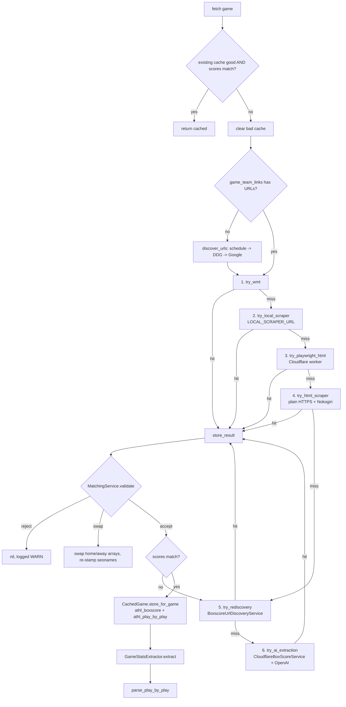

# Rails Ingestion Services

Technical reference for all Rails data-ingestion services — box scores, play-by-play,
schedules, rosters, and live stats. These services scrape external sites, call
third-party APIs, and hand structured JSON off to `GameStatsExtractor` /
`CachedGame.store` for persistence.

> Note: the user preference (per project memory) is to prefer the **local Java
> scraper** over Cloudflare Playwright and AI where possible. Cloudflare + AI
> paths are retained for backwards compatibility and as last-resort fallbacks.

## Table of Contents

- [Box Score Fetch Pipeline](#box-score-fetch-pipeline)
  - [BoxscoreFetchService](#boxscorefetchservice)
  - [Fallback Order (Mermaid)](#fallback-order-mermaid)
  - [Score Verification Gate](#score-verification-gate)
  - [PBP Quality Gate](#pbp-quality-gate)
- [Athletics / Sidearm Sources](#athletics--sidearm-sources)
  - [AthleticsBoxScoreService](#athleticsboxscoreservice)
  - [SidearmHelper (concern)](#sidearmhelper-concern)
  - [SidearmStatsService](#sidearmstatsservice)
- [WMT / Learfield Source](#wmt--learfield-source)
- [Cloudflare Playwright (Legacy Fallback)](#cloudflare-playwright-legacy-fallback)
- [AI Extraction](#ai-extraction)
  - [AiClient](#aiclient)
  - [AiBoxScoreService](#aiboxscoreservice)
  - [AiWebSearchBoxScoreService — DEPRECATED](#aiwebsearchboxscoreservice--deprecated)
  - [AiScheduleService](#aischeduleservice)
- [Schedule Services](#schedule-services)
  - [ScheduleService](#scheduleservice)
  - [NcaaScheduleService](#ncaascheduleservice)
  - [NcaaScoreboardService](#ncaascoreboardservice)
  - [EspnScoreboardService — DEAD CODE](#espnscoreboardservice--dead-code-tests-only)
  - [CloudflareScheduleService (Legacy Fallback)](#cloudflarescheduleservice-legacy-fallback)
- [URL Discovery](#url-discovery)
- [Roster Ingestion](#roster-ingestion)
  - [RosterService](#rosterservice)
  - [RosterParsers](#rosterparsers)
- [PBP Parsing and Repair](#pbp-parsing-and-repair)
  - [PitchByPitchParser](#pitchbypitchparser)
  - [PbpTeamSplitter](#pbpteamsplitter)
- [Shared Helpers](#shared-helpers)
  - [Shared::NameNormalizer](#sharednamenormalizer)
  - [PlayerNameMatcher (concern)](#playernamematcher-concern)

---

## Box Score Fetch Pipeline

### BoxscoreFetchService

**File:** `app/services/boxscore_fetch_service.rb`

Orchestrator for fetching one game's box score. Tries all sources in order,
returning the first payload that passes validation and score verification.
Stores successful results in `CachedGame` (`athl_boxscore` and
`athl_play_by_play` data types) and delegates downstream extraction to
`GameStatsExtractor`.

#### Public methods

- `BoxscoreFetchService.fetch(game)` → full boxscore hash, or `nil`.
  Runs the fallback chain. Short-circuits if an existing cached boxscore's run
  totals already match `game.home_score` / `game.away_score`.
- `BoxscoreFetchService.best_from_db(game_or_id)` → hash or `nil`.
  Looks up cached data under both `athl_boxscore` and `boxscore` (legacy).
- `BoxscoreFetchService.good_boxscore?(data)` → Bool.
  A box score is "good" when `teamBoxscore.size >= 2` and each team has at
  least one player stat row.
- `BoxscoreFetchService.scores_match?(data, game)` → Bool.
  Compares run totals in the payload's `batterStats.runsScored` against
  `game.home_score` / `game.away_score`. Used both for cache-hit validation
  and to reject wrong-doubleheader pulls.

#### Fallback Order (Mermaid)

#### URL Discovery Chain (inside `.fetch`)

When `game.game_team_links` has no box score URLs:

1. `discover_from_schedule` — scrape both teams' Sidearm schedule pages via the
   Playwright worker, then match anchor href/label to the opponent slug.
2. `discover_from_search` — hit the Playwright worker's `/search` endpoint
   (DuckDuckGo under the hood), look in `boxscoreLinks` and `topResults`.
3. `discover_from_google` — Google Custom Search API (paid, 250 free/mo).
   Enabled via `GOOGLE_SEARCH_API_KEY` + `GOOGLE_SEARCH_CX`.

Each winner writes a `GameTeamLink` row keyed by `game_id` + `team_slug`.

#### Score Verification Gate

After validation (`store_result`, lines 551-573), if the payload's
`batterStats.runsScored` totals do not equal the game's recorded scores
AND both sides scored more than 0, `store_result` aborts and recursively
calls `try_rediscovery`. This catches wrong-doubleheader pulls where
the schedule page linked to the wrong game.

`try_rediscovery` pulls ALL candidate URLs from `BoxscoreUrlDiscoveryService`,
parses each, assigns seonames, and accepts the first whose runs match exactly.

#### PBP Quality Gate

`parse_play_by_play` (lines 586-613) runs after the boxscore is stored.
It treats PBP as **incomplete** unless `pbp_is_complete?` returns true:

- `count_real_plays(pbp_data) >= 40`
- `pbp_quality_ok?(pbp_data)` — delegates to `CachedGame.send(:pbp_quality_ok?, pbp_data)`

**`CachedGame.pbp_quality_ok?` is the single source of truth for PBP quality.**
Called from both `CachedGame.store` (lines 32, 56 of `app/models/cached_game.rb`)
and here. It rejects PBP where:

- non-last innings have a single stat group with >3 plays (teams unsplit);
- non-last innings have multiple stat groups all sharing the same `teamId`
  (parser failed to distinguish teams);
- `teams` array is empty for multi-period games;
- >50% of plays are garbage (bare names without a play verb).

Fallback chain inside `parse_play_by_play`:

1. Initial PBP (from whichever source produced the boxscore).
2. `WmtBoxScoreService.fetch_for_game(game)` — try the WMT API.
3. `fetch_sidearm_pbp(game)` — scrape each team's box score URL again
   (local scraper, then plain HTTP) and re-parse with
   `AthleticsBoxScoreService.parse`.
4. Whatever has real plays, even if incomplete.

Winner is passed to `PitchByPitchParser.parse_from_cached_pbp!`.

#### ENV / constants

- `LOCAL_SCRAPER_URL` — default `http://localscraper.mondokhealth.com/scrape`.
- `PLAYWRIGHT_WORKER` — hardcoded `https://cloudflare-game-scraper.matt-mondok.workers.dev/scrape`.
- `GOOGLE_SEARCH_API_KEY`, `GOOGLE_SEARCH_CX` — optional Google CSE.

---

## Athletics / Sidearm Sources

### AthleticsBoxScoreService

**File:** `app/services/athletics_box_score_service.rb`

Scrapes full box score data (batting, pitching, linescore, PBP) from a team's
Sidearm-powered athletics site and returns JSON shaped to match the NCAA API
response. Includes `SidearmHelper`.

#### Public methods

- `.fetch(game_id, seo_slugs)` → `{ boxscore:, play_by_play: }` or `nil`.
  Iterates both teams' slugs, auto-discovers `athletics_url` via
  `RosterService.discover_athletics_url` then `discover_athletics_url_via_ai`,
  locates all matching box score URLs via `sidearm_find_all_box_score_urls`,
  and avoids URLs already used by OTHER games for the same teams (doubleheader
  guard, lines 18-23).
- `.fetch_all_boxscore_urls(team)` → `[{ url:, date:, opponent_slug: }]`.
  Scans a team's Sidearm schedule page for every `a[href*='boxscore']`.
  Tries both `/sports/softball/schedule/2026` and `/sports/softball/schedule`.
- `.fetch_from_url(url, home_team, seo_slugs)` → same shape as `.fetch`.
  Fetch a single URL directly; used by rake tasks and rediscovery.
- `.discover_athletics_url_via_ai(team)` — OpenAI `/v1/responses` with
  `web_search_preview` tool; persists verified URLs back to the Team record.
- `.sidearm_fetch_html(url)` — from `SidearmHelper`, plain `HTTParty.get` with
  a browser UA. 15s timeout, `verify: false`, follows redirects.
- Private `.parse(html, home_team, seo_slugs, expected_score: nil)`
  — tries `BoxScoreParsers::PrestoSportsParser` first (more specific), then
  falls back to `BoxScoreParsers::SidearmParser`.

#### Input / Output

- **In:** HTML from a Sidearm boxscore page.
- **Out:** hash with `boxscore` (teams, teamBoxscore, linescores) and
  `play_by_play` (periods, teams). Source tagged `"_source" => "athletics"`.

#### Gotchas

- `teams_match?` requires BOTH scraped team names to match a known slug/name;
  prevents wrong-game pulls.
- `used_urls` query strips other games' `payload->>'source_url'` out of the
  candidate pool so doubleheaders can't reuse a URL.
- A `clean_play_names` helper lives here too (private, line 157) — identical
  to `BoxScoreParsers::Base#clean_play_names` and `WmtParser#wmt_clean_names`.
  These three live in separate files and must stay in sync.
- `parse_legacy` (lines 200-324) is retained for reference but NOT called;
  `parse` delegates to the parser classes.

### SidearmHelper (concern)

**File:** `app/services/concerns/sidearm_helper.rb`

Module-level concern (`extend ActiveSupport::Concern`) used by
`AthleticsBoxScoreService`, `AiBoxScoreService`, `AiScheduleService`,
`PitchByPitchParser`, `ScheduleService`.

Class methods:

- `sidearm_fetch_html(url, timeout: 15)` — `HTTParty.get` with browser UA,
  `verify: false`, follows redirects. Returns body string or `nil`.
- `sidearm_find_all_box_score_urls(team, opponent_slugs)` — the workhorse.
  Tries `/sports/softball/schedule/2026` then `/sports/softball/schedule`.
  For each page:
  - **Strategy 1 (URL slug match):** for each anchor whose href contains
    `boxscore`, match against `opponent_slug` or any alias from `TeamAlias`.
    The alias value is slugified (`gsub(/[^a-z0-9]+/, "-")`).
  - **Strategy 2 (context match):** if no URL slug match found, look at the
    container text (<=1500 chars) around each anchor for any full team name.
- `sidearm_find_box_score_url(team, opponent_slugs)` — returns the first URL
  from Strategy 1 or 2.

### SidearmStatsService

**File:** `app/services/sidearm_stats_service.rb`

Consumes the `sidearmstats.com` live feed JSON (also known as `livestats`) to
drive real-time game views.

- `.fetch_live(feed_url)` → normalized hash with `home_name`, `visitor_name`,
  `home_score`, `visitor_score`, `inning`, `top_bottom`, `outs`, `balls`,
  `strikes`, `linescore`, `at_bat`, `on_mound`. Returns `nil` on failure.
- `.fetch_live_batch(feed_urls)` — parallel (Thread per URL), caps at 12.
- `.fetch_and_merge(feeds, home_name:)` — given `{ "home" => url, "away" => url }`,
  fetches both in parallel and merges the away team's own perspective
  (their `HomeTeam` is our visitor) into the home feed. Also merges linescores.

Context parser `parse_context` extracts balls/strikes/outs from the
`"1 Ball 2 Strike 1 Out"` string Sidearm emits in `Context`.

---

## WMT / Learfield Source

**File:** `app/services/wmt_box_score_service.rb`
**Parser:** `app/services/box_score_parsers/wmt_parser.rb`

Sidearm-sibling platform used by Learfield-powered schools (Virginia, Clemson,
Purdue, Nebraska, LSU, Tennessee, Vanderbilt, USC, Texas A&M, Arkansas,
Auburn, Notre Dame, Stanford, etc.). Pure JSON API — no HTML scraping.

### API

- **Base URL:** `https://api.wmt.games/api/statistics/games`
- **Search:** `?school_id=...&season_academic_year=2026&sport_code=WSB&per_page=200`
- **Detail:** `/{contest_id}?with[0]=actions&with[1]=players&with[2]=plays&with[3]=drives&with[4]=penalties`
- **Headers:** browser UA + `Origin: https://wmt.games`, `Referer: https://wmt.games/`.

### WmtBoxScoreService methods

- `.wmt_site?(url)` — checks URL host against the `WMT_DOMAINS` constant
  (lines 12-60, ~45 domains including the ones listed above).
- `.fetch_for_game(game)` — top-level entrypoint.
  1. Reads `home.wmt_school_id` / `away.wmt_school_id` from the Team model.
  2. Falls back to `SCHOOL_IDS` map (lines 178-194) keyed on domain.
  3. Hits the WMT schedule endpoint with that school_id + season + WSB.
  4. Filters results by `game_date`, requires the **other** team to be in the
     competitors list (by `wmt_school_id` or fuzzy name match, lines 113-131).
  5. For doubleheaders, picks the competitor whose scores match `game.home_score`
     / `game.away_score`.
  6. Auto-backfills the opponent's `wmt_school_id` onto the Team record.
  7. Calls `.fetch(contest_id)`.
- `.fetch(contest_id)` — one HTTP GET, parses via `BoxScoreParsers::WmtParser`.

### WmtParser internals

- `data["competitors"]` — array of two entries. `homeContest: true` identifies
  the home team. Neutral-site games with both `homeContest: false` default to
  `competitors[0] = away, competitors[1] = home`.
- `data["players"]["data"]` — all players, each with a `team_id`, an
  `xml_name` (in `"Last,First"` form), `xml_uni` (jersey), `xml_position`, and
  `statistic` array. Per-game line stats live at `statistic.find { |s| s["period"] == 0 }`.
- `add_batting_stats` only emits `batterStats` if the player had any activity
  (AB, BB, HBP, R > 0) or is non-PR/PH.
- `add_pitching_stats` only emits `pitcherStats` if `sInningsPitched > 0`
  OR `sPitchingAppearances > 0`. Decision is derived from `sIndWon` / `sIndLost`
  / `sSaves` flags on the player stat row.
- `build_linescores` emits one row per inning plus `R`, `H`, `E`.
- PBP uses `actions` when available (richer), falls back to `plays`. Both
  contain `play_by_play_text` / `narrative`, `member_org_id` (team ID),
  `home_score`, `visitor_score`. A strict `WMT_PLAY_VERB` regex filters
  garbage "bare name" entries.
- `wmt_split_by_team` groups consecutive plays with the same `member_org_id`
  into separate stat groups so the frontend can render correct team headers.
- `wmt_clean_names` — the same `"Last,First" -> "First Last"` transform as
  the Base parser.

### Output tagging

Both payloads carry `"_source" => "wmt_api"`.

### Gotchas

- School ID discovery happens lazily — Team records can be persisted without
  `wmt_school_id` until they appear in a WMT game fetch.
- If a team's Athletics URL domain doesn't match any `WMT_DOMAINS` entry,
  the service bails immediately. The `SCHOOL_IDS` fallback map is for teams
  whose Team.wmt_school_id wasn't backfilled yet.

---

## Cloudflare Playwright (Legacy Fallback)

> **Flag:** per user preference (memory: `feedback_localscraper`),
> avoid Cloudflare Playwright in favor of the local scraper.
> These services are retained but are considered legacy / fallback.

### CloudflareBoxScoreService

**File:** `app/services/cloudflare_box_score_service.rb`

Uses Cloudflare's Browser Rendering API (`/browser-rendering/scrape`) to
retrieve rendered page text, then hands the text to OpenAI via `AiClient` to
extract structured box score + PBP JSON.

- `.fetch(url, seo_slugs: [])` — main entrypoint. Scrapes the page body, splits
  out PBP sections (`Top/Bottom ... Play Description`), runs two AI prompts
  (`EXTRACTION_PROMPT`, `PBP_PROMPT`), then calls the private helper
  `assign_seonames` to stamp team slugs onto the output.
- `assign_seonames(boxscore, seo_slugs)` — convention: `teams[0]` is away,
  `teams[1]` is home. Stamps slugs on both the `teams` and `teamBoxscore`
  arrays. Called from `BoxscoreFetchService.store_result` too
  (via `CloudflareBoxScoreService.send(:assign_seonames, ...)`).

ENV: `CLOUDFLARE_ACCOUNT_ID`, `CLOUDFLARE_BROWSER_TOKEN`, `OPENAI_API_KEY`.

Output tagged `"_source" => "cloudflare_ai"`.

### CloudflareScheduleService

**File:** `app/services/cloudflare_schedule_service.rb`

Same Cloudflare + AI combination, but for schedule pages:

- Step 1: scrape `li.sidearm-schedule-game` blocks (falls back to body).
- Step 2: `extract_ids_from_blocks` — deterministic, pulls `data-game-id`,
  boxscore URLs, and `statbroadcast` / `sidearmstats` live stats URLs from HTML.
- Step 3: `extract_with_ai` — AI fills in dates, scores, opponents.
- Step 4: `merge_ai_with_ids` — block IDs take priority for structural fields
  (`sidearm_game_id`, `is_home`, `box_score_url`), AI values fill everything else.

Only used as a last-resort fallback inside `ScheduleService` and direct admin
rake tasks.

---

## AI Extraction

### AiClient

**File:** `app/services/ai_client.rb`

Thin wrapper picking between OpenAI and Ollama based on the
`AI_PROVIDER` env var.

- `AiClient.chat(messages, model: nil, temperature: 0, timeout: 90)`
- `AiClient.prompt(text, ...)` — convenience single-user-message wrapper.

OpenAI path: `POST ${OPENAI_BASE_URL:-https://api.openai.com/v1}/chat/completions`
using `OPENAI_API_KEY`. Default model `gpt-5.4-nano` (override via
`OPENAI_MODEL`).

Ollama path: `POST ${OLLAMA_HOST}/api/chat`. Default model from
`OLLAMA_MODEL` (fallback `nemotron-cascade-2`). Optional `OLLAMA_API_KEY`.

### AiBoxScoreService

**File:** `app/services/ai_box_score_service.rb`

Pre-`CloudflareBoxScoreService` AI extractor. Scrapes a team's athletics box
score page with `sidearm_fetch_html`, strips tables to tab-separated text, and
asks OpenAI for ONLY **pitching** data. Used by `PitcherEnrichmentService`
(owned by another agent) to backfill pitcher decisions/IP when the primary
sources don't include them.

- `.fetch_pitchers(game_id, seo_slugs)` → normalized hash compatible with
  `StatBroadcastService.fetch_pitchers` output:
  `{ home_name:, visitor_name:, home: [...], visitor: [...] }`.

Model: `gpt-5.4-nano`. Prompts: system message with strict rules (decision must
be single-letter W/L/S, not a season record like "3-1").

### AiWebSearchBoxScoreService — DEPRECATED

**File:** `app/services/ai_web_search_box_score_service.rb`

> **DEPRECATED.** Per user preference (memory: `feedback_no_ai_boxscore_fallback`),
> this service is dead and must not be proposed as a recovery path. It is NOT
> wired into `BoxscoreFetchService`. The file is retained for historical
> reference only.

Original design: last-resort fallback using OpenAI's Responses API with the
`web_search` tool to answer "what was the box score for {team1} vs {team2} on
{date}?". Results are hallucinogenic in practice and were removed from the
pipeline.

### AiScheduleService

**File:** `app/services/ai_schedule_service.rb`

Called from `ScheduleService#build_schedule` when athletics scraping and
stale cache both yield nothing. Behavior:

1. Checks `CachedApiResponse` for `ai_schedule:<slug>` (7-day TTL).
2. Gets rendered text from Cloudflare Browser Rendering (falls back to plain
   HTTP + regex HTML stripping).
3. Sends to OpenAI with a strict JSON schema prompt (date in `MM/DD/YYYY`,
   `is_home`, result, scores, `state = final | pre`).
4. Stores the result in `CachedApiResponse`.

ENV: `OPENAI_API_KEY`, `CLOUDFLARE_BROWSER_TOKEN`, `CLOUDFLARE_ACCOUNT_ID`.

Model: `gpt-5.4-nano`. Max input: 40,000 chars.

> Bug note: `call_openai` on line 104 logs `response.parsed_response` which is
> not in scope — this branch will raise `NameError` before the rescue block.
> Flagged for cleanup.

---

## Schedule Services

### ScheduleService

**File:** `app/services/schedule_service.rb`

Per-team schedule builder. Combines Sidearm Nuxt payload parsing, JSON-LD
ld+json fallback, HTML `<li>` block parsing, NCAA scoreboard enrichment, and
AI fallback. Includes a thread-safe background refresh mechanism guarded by a
class-level `Mutex`.

#### Public class methods

- `.games_for_team(team)` → `{ games:, record: }`.
  Cache-first with 30-min TTL (`SCHEDULE_TTL`). If any game is `live`, treats
  cache as stale. Background refreshes stale data and returns cached copy
  immediately. Falls through to synchronous `build_schedule` only on first-ever
  load.
- `.games_for_team_cached(team)` — non-blocking variant; triggers a refresh
  but returns whatever is in `CachedSchedule`, `nil` if empty.
- `.trigger_background_refresh(team)` — spins up a `Thread` guarded by
  `@refreshing` set so concurrent requests for the same team don't pile up.

#### Private `build_schedule(team)` pipeline

1. `collect_from_athletics_site(team)` — Sidearm Nuxt payload first, JSON-LD
   second.
2. Stale `CachedSchedule` fallback.
3. `AiScheduleService.extract_schedule(team)` fallback.
4. `backfill_opponent_seos(games, team.slug)` — pure DB lookup against
   `Team.name / long_name / nickname / abbreviation` (never fuzzy).
5. `upsert_game_records(team, games)` — only *updates* existing Game records,
   never creates. Creation is the NCAA / Java scraper's job.
6. `compute_record(games)` — W/L/T counts.

#### `collect_from_athletics_site`

- Fetches `{athletics_url}/sports/softball/schedule` via `sidearm_fetch_html`.
- Scans `<script>` blocks >10KB looking for arrays / JSON-LD `@graph` wrappers.
  Then:
  - `parse_nuxt_schedule` — Sidearm Nuxt-style payloads (NC State etc).
    Data is a flat array where nested values are **integer references** into
    the same array. `resolve = ->(v) { v.is_a?(Integer) ? data[v] : v }`.
  - `parse_json_ld_schedule` — HTML `<li class="sidearm-schedule-game">`
    blocks. Uses `data-game-id` as the deterministic identity, CSS class
    `sidearm-schedule-home-game` for home/away, opponent logo `alt` attr
    for team name, `sidearm-schedule-game-result` for "W, 5-2" parsing.
- Output shape per game:
  `{ game_id:, sidearm_game_id:, date: "MM/DD/YYYY", start_time:,
    opponent_name:, opponent_seo:, is_home:, team_score:, opponent_score:,
    result: 'W'|'L'|'T'|nil, state: 'pre'|'final', current_period:,
    final_message:, live_stats_url:, live_stats_feed_url: }`

#### Helper methods (private)

- `extract_live_stats_from_html(html)` — returns `[map, sidearmstats_game_ids]`
  keyed by a normalized `"feb 17|opponent"` string.
- `extract_scores_from_html(html)` — same key format, returns per-game
  `{ result:, team_score:, opponent_score: }`.
- `backfill_opponent_seos(games, own_slug)` — builds a `name -> slug` lookup
  from all Team rows, strips ranking prefixes (`#5`), parenthetical suffixes,
  and "University of" / "The" prefixes. No fuzzy matching.
- `overlay_live_scores(team, games)` — checks today's NCAA scoreboard for
  live games and overlays `game_id`, `state`, `current_period`, `result`,
  scores. Matches by opponent name vs known Team names/nickname/slug words.

### NcaaScheduleService

**File:** `app/services/ncaa_schedule_service.rb`

GraphQL client for NCAA.com's game feed. Enriches existing Game records with
contest IDs, epoch times, scores, and state. **Does not create new games** by
default — but will call `JavaScraperClient.find_or_create_game` as a creation
gate for contests not yet in the DB.

- `.games_for_date(date, division: "d1")` → array of contest hashes.
- `.sync_date(date, division: "d1")` → `{ created:, enriched: }`.
- `.sync_season(division: "d1")` — iterate `Feb 6` → `May 31` for D1,
  `Jan 30` onward for D2.

Key endpoints / constants:

- `GRAPHQL_URL = "https://sdataprod.ncaa.com"`
- `CONTESTS_HASH = "6b26e...779c2"` — persisted query SHA.
- `SEASON_YEAR = 2025` — note: NCAA's academic year encoding.
- `SEONAME_MAP` — known mismatches between NCAA seonames and `Team.slug`
  (`mcneese` → `mcneese-st`, `uiw` → `incarnate-word`,
  `tex-am-commerce` → `east-tex-am`).

#### `find_existing_game` matcher

Runs 6 strategies in order:

1. Exact match by `ncaa_contest_id`.
2. Date + slugs (both orders) where `ncaa_contest_id IS NULL OR ==`.
3. Swapped home/away orientation.
4. Resolved slugs via `SEONAME_MAP`.
5. Partial match — one slug on either side.
6. Fallback — date + teams ignoring contest_id, order by `game_number`
   (first game of a doubleheader takes the contest ID).

#### `deduplicate_contests`

NCAA sometimes returns both old and new contest IDs for the same game. The
dedupe:

- Groups by `(startDate, sorted slug pair)`.
- If only one startTime bucket, keeps the top 2 by contest ID.
- If multiple time slots, keeps the highest contest ID per slot.

### NcaaScoreboardService

**File:** `app/services/ncaa_scoreboard_service.rb`

Similar API to `NcaaScheduleService` but geared at score syncing rather than
creation. Called by `GameSyncJob` for live scores.

- `.contests_for_date(date, division:)` → raw contest array.
- `.sync_date(date)` → iterates D1 + D2. `{ created:, updated:, skipped: }`.
  Creation is disabled — `skipped` is incremented when a contest has no
  matching Game record.
- `.sync_today` — alias for `sync_date(Date.current)`.
- `.sync_season` — day-by-day backfill.

Key behaviors:

- Score-write guard (lines 122-126): never overwrite scores on
  `final?` + `locked?` games, never on `cancelled`.
- State escalation only: `scheduled -> live -> final`, never backwards, never
  past `cancelled`.
- Home/away swap: if NCAA flipped which team is home relative to the DB,
  rewrite `home_team_slug` / `away_team_slug` AND reassign scores.
- `verify_contest_assignment` (lines 175-221): for doubleheaders, when an
  incoming contest_id's NCAA scores don't match the target game's
  `PlayerGameStat` totals (runs/hits/walks/strikeouts/AB), check sibling games
  on the same date. If a sibling's stats match exactly, atomically swap the
  contest_id over. Has an early-out if `game.ncaa_contest_id == contest_id.to_s`
  to prevent swap loops between runs.

### EspnScoreboardService — **DEAD CODE (tests-only)**

**File:** `app/services/espn_scoreboard_service.rb`

> **⚠️ This service has zero production callers.** Verified 2026-04-19: the only references to `EspnScoreboardService` or `sync_scores` anywhere in the app, jobs, rake tasks, lib, config, or initializers are the service file itself plus its own test file (`test/services/espn_scoreboard_service_test.rb`). The Java scraper also contains zero ESPN references. The scoreboard fetch path production uses `NcaaScoreboardService` exclusively.
>
> The code is kept because (a) the tests still pass, and (b) if NCAA's API ever goes down we'd want ESPN as a fallback. But as of this writing **it is not called from any runtime path** — do not cite it in pipeline docs without that caveat.

If ever re-introduced, the shape is:

- Base URL: `https://site.api.espn.com/apis/site/v2/sports/baseball/college-softball/scoreboard?dates=YYYYMMDD&limit=200`
- `ESPN_SLUG_OVERRIDES` — static map of ESPN team location strings to our `Team` slugs (lines 5-166). Also covers `State` → `St.` normalization and slugify-with-`state`-to-`st` variants.
- `espn_status_to_state`: `STATUS_FINAL` → `final`, `STATUS_IN_PROGRESS` → `live`, anything else → `scheduled`. Only `final` / `live` events would update scores.
- Only UPDATES existing games (home/away scores + state) — never creates. Skips ambiguous doubleheaders where multiple eligible games exist between the same teams on the same date.

---

## URL Discovery

### BoxscoreUrlDiscoveryService

**File:** `app/services/boxscore_url_discovery_service.rb`

Rediscovery helper used by `BoxscoreFetchService.try_rediscovery` when
existing URLs produce mismatched scores (wrong doubleheader). **Never writes
to the DB** — caller decides what to do.

Public methods:

- `.discover(game)` → `{ team_slug => url }` — best guess per team.
- `.discover_all_candidates(game)` → `{ team_slug => [url1, url2, ...] }` —
  full list per team for DH disambiguation.

#### `find_opponent_boxscore_urls(doc, base, opp_team)`

- Requires `opp_team`'s name/long_name/nickname split into words, filtered to
  length >=3 and not in `GENERIC_WORDS` (`university college state institute
  technology national`).
- Matches anchors by:
  - **Slug match:** href path contains `/opp_slug/`, `/opp_slug_without_dashes/`,
    or the opponent's parameterized `long_name`. Also supports prefix match
    (`/florida-am-university/` starts with `/florida-am-`).
  - **URL word match:** 2+ opponent words appear in URL path (catches typos
    like `incarnate-ward`).
  - **Context match:** `aria-label` or a 20–1500 char ancestor's text
    contains any opponent word.
- Walks up ancestors to find a row containing `W, 5-2` / `L, 1-9` text for
  `parse_schedule_score` → `{ wl:, team_score:, opp_score: }`.

#### `pick_correct_url`

For multiple candidates:

1. **Score-based:** find the candidate whose parsed score matches
   `game.home_score` / `game.away_score` for this team.
2. **Position-based:** exclude URLs already used by other games
   (`GameTeamLink.where.not(game_id: game.id)`), then pick by the game's
   chronological `game_number` position on the date.

In-memory cache `@schedule_cache` holds scraped schedule HTML for one hour
per team slug to avoid re-scraping in the same process.

---

## Roster Ingestion

### RosterService

**File:** `app/services/roster_service.rb` (1,079 LOC — one of the largest
services).

> **Scope note:** per project memory (`feedback_java_scraper_logic`), new
> roster/sync logic goes in the Java scraper, not here. Most of this file
> predates the Java scraper and remains in use for Rails-triggered flows
> (admin buttons, rake tasks). Treat as legacy for new features.

Top-level:

- `.sync_roster(team, force: false)` — skip if `roster_updated_at < 1 day`
  ago and players already have stats. Chain:
  1. `discover_athletics_url(team)` if blank — scrape `ncaa.com/schools/:slug`.
  2. `sync_roster_from_athletics_site(team)` — tries `ROSTER_PATHS` (7 paths
     like `/sports/softball/roster`, `/sports/sball/2025-26/roster`, etc.).
  3. Garbage-name validation — if >50% of players have names like `infield`,
     `pitcher`, `catcher`, wipe and fall back to `sync_roster_from_boxscore`.
  4. `sync_player_batting(team)` — scrape `/sports/softball/stats`.
  5. Pitching stats — try Nuxt payload, fall back to HTML table.
  6. `sync_team_pitching(team, team_boxscore)` from the most recent cached
     boxscore's `teamStats.pitcherTotals`.
  7. `create_players_from_game_stats` + `aggregate_player_stats_from_game_stats`
     when the roster scrape produced no usable stats.
- `.sync_rankings` → `.sync_nfca_rankings(url, division)` — NFCA Top 25 HTML
  scrape. URL template:
  `https://nfca.org/component/com_nfca/list,1/pdiv,div1/top25,1/year,%{year}/`.
- `.find_team_by_name(name, division)` — delegates to `TeamMatcher.find_by_name`
  (owned by another agent).

Parse branching (`sync_roster_from_html`):

- **PrestoSports:** `RosterParsers::PrestoSportsParser.can_parse?(html)` — table
  with `no.` / `name` / `pos.` headers.
- **Sidearm card:** HTML contains `s-person-card-list__root` or any
  `aria-label="... jersey number ..."`. Goes through `parse_card_roster`.
- **Sidearm table:** everything else. `parse_table_roster` + photo map from
  `images.sidearmdev.com/crop?url=...`.

Photo backfill (`backfill_player_photos`) handles four strategies: `data-bg`
attrs on links (Kentucky), `thumb-image` + `sr-only` (LSU), `img[alt]`
(South Carolina), `span[title][style]` (Notre Dame).

Coaches (`parse_staff_coaches`) has four discovery paths: Nuxt
`roster-staff-members-card-item` blocks, WordPress `/roster/coach/` +
`title="..."`, `/roster/coach/` with text as name, and `/season/YYYY/coach/`
with nearby `title=`.

### RosterParsers

#### `RosterParsers::PrestoSportsParser`

**File:** `app/services/roster_parsers/presto_sports_parser.rb`

- `can_parse?(html)` — table has `no.` + `name` + (`pos.` or `cl.`) headers AND
  is not a card-list roster.
- `parse(team, html, photo_map = {})`:
  - Columns: `No. | Name | Pos. | Cl. | Ht. | B/T | Hometown/Previous School`.
  - `dedupe_name` — PrestoSports often emits names doubled
    (`"Daci Sarver Daci Sarver"`). Detects when the first half equals the
    second half and keeps one copy.
  - Strips `"Pos.: "`, `"Cl.: "`, `"Ht.: "`, `"Hometown/Previous School: "`
    label prefixes.
  - Uses `HometownSplitter#split_hometown_and_school` + `transfer?` to flag
    college-to-college transfers.

#### `RosterParsers::HometownSplitter`

**File:** `app/services/roster_parsers/hometown_splitter.rb`

Included into `RosterService` and the Presto parser.

- `split_hometown_and_school(raw)` — splits on `/`. Returns `[raw, nil]` if no
  slash.
- `transfer?(school_name)` — true when `known_college?` matches a DB Team name
  or `long_name` (case-insensitive bidirectional contains). Short names
  (<=3 chars) never match to avoid false positives.
- `HIGH_SCHOOL_PATTERNS` — regex hint for later heuristics; currently unused
  but kept for future work.
- Caches `known_college_names` in an instance var per service.

---

## PBP Parsing and Repair

### PitchByPitchParser

**File:** `app/services/pitch_by_pitch_parser.rb`

Parses PBP into `PlateAppearance` + `PitchEvent` rows for analytics. Two
entrypoints:

1. **Scrape entrypoint** — `parse_and_store!(team_slug:, game_source_id:, boxscore_url:, ...)`.
   Fetches the HTML, finds `<table>` elements whose header contains
   `Play Description`, deduplicates (Sidearm renders some tables twice), walks
   the DOM for `"Top of 1st"` / `"Bottom of 1st"` headers to assign
   `inning` / `half` / `team_batting`.
2. **Cached PBP entrypoint** — `parse_from_cached_pbp!(game:, pbp_data:)`.
   Consumes the normalized JSON produced by `AthleticsBoxScoreService` or
   `WmtBoxScoreService`. Matches batters to rosters via `PlayerNameMatcher`
   to attribute each PA to the correct team. Creates a PA row for each team
   so both teams' views render correctly.

#### Play categorization

- `SWING_CODES` — Sidearm pitch codes that count as swings (`S F X T L M`).
  `B/K/H/P` are takes.
- `RESULT_PATTERNS` — maps verbs to `result` + `category`. Ordered: strikeouts
  before "struck", `homered` before `doubled`, etc.
- `EVENT_PATTERNS` — `stole`, `caught_stealing`, `pickoff`, `wild_pitch`,
  `passed_ball`. Non-PA events that advance/end innings.
- `non_pa_event?` — excludes these from PA counting. Matches substitutions
  (`"E. Ross to p for H. Culie"`), pinch runs, pinch hits.
- `RESULT_VERBS` — strips verb tokens that accidentally get captured as the
  last name (e.g., `"Christensen, grounded"` → `"Christensen"`).
- Garbage filter in `parse_from_cached_pbp!` (lines 237-238):
  - Must match play-verb regex
    `(singled|doubled|...|hit by|sacrifice|bunted|error|out)`.
  - Reject lineup entries like `"0 LF Sturgis, Makenna"`.

#### Pitch sequence parsing

Regex `\((\d+)-(\d+)\s+([A-Z]+)\)` matches strings like `"(3-2 BKBFBB)"`.
Emits `balls`, `strikes`, `pitch_sequence`, `pitches_seen`, `first_pitch`,
`first_pitch_result`.

#### Hit location extraction

Two passes:

1. `DIRECTIONAL_PATTERNS` — phrases like `"through the left side"` →
   `shortstop`, `"up the middle"` → `center field`.
2. `LOCATION_REGEX` — `"to (shortstop|second baseman|...)"` with
   `LOCATION_NORMALIZE` mapping `ss` → `shortstop`, `1b` → `first base`, etc.
   Rejects matches preceded by `advanced\s*\z` to avoid capturing runner
   advancement as hit location.

#### Resolve initial names

`resolve_initial_names(team_slug)` — after all rows are inserted, rewrites
any `"T. Rogers"` → `"Taylor Rogers"` where there's exactly one full-name
match ending `" Rogers"` and starting with `"T"`.

### PbpTeamSplitter

**File:** `app/services/pbp_team_splitter.rb`

Fixes cached PBP data where each inning has a single stat group (teams unsplit).
Non-destructive — returns a modified copy of the input.

#### Strategy 1: boxscore rosters

`build_name_lookup(boxscore_data, away_id, home_id)` — iterates
`teamBoxscore[*].playerStats[]`, maps each `lastName.downcase` → PBP team ID.
Team boxscore's `isHome` flag determines which PBP team ID to assign.

#### Strategy 2: Player table fallback

`build_name_lookup_from_players(game, away_id, home_id)` — used by rake tasks
when no boxscore is available. Pulls all `Player.name` from both Team records
and uses the last word of each name as the key.

#### Split logic

`split_plays_by_roster(plays, name_to_team, ...)` walks plays in order; when
the batter's last name resolves to a different `teamId` than the current
group, starts a new stat group. Plays where no roster match is found flow
into whichever group is currently active.

`extract_last_name(play_text)` handles three formats:

- `"Last,First verb..."` → `last`
- `"First Last verb..."` → last word before the verb
- `"F. LAST verb..."` → last word before the verb

---

## Shared Helpers

### Shared::NameNormalizer

**File:** `app/services/shared/name_normalizer.rb`

Tiny module included into multiple parsers.

- `split_name(name_raw)` returns `[first, last]`:
  - `"Last, First"` → `["First", "Last"]` (comma form).
  - `"First Last"` → `["First", "Last"]`.
  - `"Last"` → `[nil, "Last"]` (single word treated as last name).
  - Blank → `[nil, nil]`.

### PlayerNameMatcher (concern)

**File:** `app/services/concerns/player_name_matcher.rb`

Module used by `PitchByPitchParser` to attribute plays to teams; also used
elsewhere in the app. Combines trigram similarity with prefix guards.

- `.match(bs_first, bs_last, team)` → `{ player:, first:, last:, full:, trigrams: }` or `nil`.
- `.match_with_roster(bs_first, bs_last, roster_data)` — pre-built roster
  avoids per-call DB hits.
- `.roster_data_for(team)` → array of roster entries including precomputed
  trigrams.

Algorithm:

- **Initials case** (1–2 char first name): prefix match alone is sufficient.
  If multiple matches, break ties with trigrams.
- **Full name case:** require `tri_score >= 0.6` (Jaccard over 3-grams, using
  the smaller set as the denominator) AND `name_prefix_match?` on first+last.
- Prefix guard `name_prefix_match?` supports: normal order, swapped
  first/last, single-word (last-only), and an 80%-char-intersection
  fallback for edge cases like Unicode or punctuation variants.
