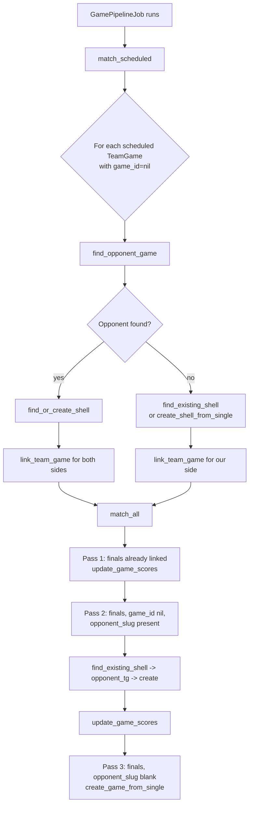

# Matching & Linking Services

Rails-side services that resolve *which* `team_games`, boxscores, schedules, and
free-text team names map onto *which* canonical `Game` / `Team` records. These
are the glue between raw ingestion output and the shared scoreboard.

## Table of Contents

- [Overview](#overview)
- [TeamGameMatcher (`app/services/team_game_matcher.rb`)](#teamgamematcher)
  - [Why it exists: the shell model](#why-it-exists-the-shell-model)
  - [Two-phase flow](#two-phase-flow)
  - [`match_scheduled` pass](#match_scheduled-pass)
  - [`match_all` pass](#match_all-pass)
  - [`find_opponent_game` priority ladder](#find_opponent_game-priority-ladder)
  - [Shell link preservation across Java rewrites](#shell-link-preservation-across-java-rewrites)
  - [Score protection via `game.locked?`](#score-protection-via-gamelocked)
  - [Doubleheaders & `game_number`](#doubleheaders--game_number)
  - [Single-team fallback (non-NCAA opponents)](#single-team-fallback-non-ncaa-opponents)
  - [`ensure_game_team_link`](#ensure_game_team_link)
- [MatchingService (`app/services/matching_service.rb`)](#matchingservice)
- [TeamMatcher (`app/services/team_matcher.rb`)](#teammatcher)
- [~~GameIdentityService~~ — DELETED 2026-04-19](#gameidentityservice)
- [ScheduleRecoveryService — **DELETED 2026-04-20**](#schedulerecoveryservice--deleted)
- [SeriesGuardService (`app/services/series_guard_service.rb`)](#seriesguardservice)
- [Read-path services](#read-path-services)
  - [GameShowService](#gameshowservice)
  - [TodayGamesService](#todaygamesservice)
- [Quick reference: who calls whom](#quick-reference-who-calls-whom)

---

## Overview

Four different "matcher" concepts live side by side. They do NOT do the same job:

| Service              | Answers the question                                              | Input               | Output                    |
| -------------------- | ----------------------------------------------------------------- | ------------------- | ------------------------- |
| `TeamGameMatcher`    | Which shared `Game` does this team's `TeamGame` row belong to?    | `TeamGame` rows     | `Game` rows, linked       |
| `MatchingService`    | Does this boxscore's player list actually belong to this Game?    | Game + boxscore     | `{valid:, swapped:, ...}` |
| `TeamMatcher`        | Which `Team` corresponds to this free-text school name?           | Raw name string     | `Team` or `nil`           |

A fourth entry, `GameIdentityService` ("attach a StatBroadcast event id to a Game"), used to live here. It was deleted 2026-04-19 along with the StatBroadcast / SidearmStats live-stats machinery. See the stub below.

---

## TeamGameMatcher

**File:** `app/services/team_game_matcher.rb` (402 LOC)
**Called from:** `GamePipelineJob` (`app/jobs/game_pipeline_job.rb:23,26`),
`lib/tasks/cleanup.rake`, `lib/tasks/fix_doubleheaders.rake`.

### Why it exists: the shell model

Every team in our DB has its own `team_games` rows (one per game from that
team's perspective). The scoreboard is driven by the shared `games` table,
where each Game is ONE row representing the matchup (home/away/score/state).
`TeamGameMatcher` is what reconciles those two shapes.

The service runs under a **shell model**:

1. When a game is still scheduled, we create an empty `Game` "shell": state
   `scheduled`, no scores, home/away slugs filled, linked to both teams'
   `team_games` via `game_id`.
2. As each team goes `final`, we *update the existing shell in place* with
   scores instead of creating a new Game. This preserves `ncaa_contest_id`,
   `ncaa_game_id`, and every other external identity attached to the shell.
   (Historically `sb_event_id` was also in this list; that column was
   dropped 2026-04-19 along with the StatBroadcast machinery.)
3. Only in one narrow case do we create a NEW Game in `match_all`: when a
   final has `opponent_slug` blank (opponent not in our DB, e.g. exhibitions
   vs. D3 or junior-college teams).

Invariant the service enforces: **every team_game MUST have a Game on the
scoreboard** (line 31).

### Two-phase flow



Phase 1 (`match_scheduled`) is always called before Phase 2 (`match_all`).
Reason: Java may rewrite team_games delete-then-insert for a team, which
temporarily leaves `game_id=nil` on unfinalized rows. Running shells first
relinks both sides before finals look for shells to update.

### `match_scheduled` pass

Entry: line 86-122.

For every `TeamGame` with `state: "scheduled"`, `game_id: nil`, and a non-blank
`opponent_slug`:

1. Reload the row (line 92). If `game_id` became non-nil in the meantime,
   verify the `Game` still exists; clear the pointer if it was deleted.
2. `find_opponent_game(tg)` — find the mirror `TeamGame` from the opponent
   (line 105).
3. If opponent found: `find_or_create_shell(tg, opponent_tg)` (line 108).
   This is `Game.find_or_initialize_by(game_date:, home_team_slug:,
   away_team_slug:, game_number:)` — the 4-tuple is the shell's natural key.
4. If opponent missing: `find_existing_shell(tg)` first (maybe an Admin or
   a prior run created one from the opposing side), falling back to
   `create_shell_from_single(tg)`.
5. `link_team_game` writes `tg.game_id`, then `ensure_game_team_link`
   upserts the `GameTeamLink` row tying the team to the Game (with
   boxscore_id/url if available).
6. If the opponent row isn't yet linked (`opponent_tg.reload.game_id.nil?`),
   link it to the same Game — this is the step that fuses the two
   perspectives under a single shell.

### `match_all` pass

Entry: line 12-84. Three sequential passes:

**Pass 1 (lines 16-28): Already-linked finals.**
`state="final"`, `game_id IS NOT NULL`, `team_score IS NOT NULL`. For each,
look up the `Game`:

- If the `Game` was deleted (`Game.find_by(id: tg.game_id)` returns nil),
  `update_columns(game_id: nil)` on the team_game so Pass 2 picks it up.
- Otherwise: `update_game_scores(game, tg)` writes scores in home/away
  orientation, flips `state` to `"final"`, saves if changed. Then
  `ensure_game_team_link` pins the boxscore URL to the team link row.

**Pass 2 (lines 30-63): Unlinked finals with a known opponent.**
For each `tg`:

1. Reload + clear stale `game_id` (same safety as Pass 1).
2. `find_existing_shell(tg)` — was there already a shell from `match_scheduled`
   or the other team's earlier `match_all` run? If yes, reuse it.
3. Else `find_opponent_game(tg)` and either follow the opponent's existing
   shell or `find_or_create_shell` a new one from the pair.
4. As a last resort (`opponent_tg` nil and no existing shell),
   `create_shell_from_single(tg)` — a shell with opponent slug only, no
   opposing team_game to pair with.
5. `update_game_scores` + `link_team_game`. If the opponent team_game is
   still dangling (`opponent_tg.reload.game_id.nil?`), link it too.

**Pass 3 (lines 65-81): Finals with blank `opponent_slug`.**
Opponent is not in our `teams` table (non-NCAA exhibition, JUCO, etc.). This
is the *only* pass that creates a fresh Game from scores via
`create_game_from_single` (line 77). Without this, these games never appear
on the scoreboard.

### `find_opponent_game` priority ladder

**File:** `app/services/team_game_matcher.rb:131-169`

For a given `tg`, we're looking for the mirror row — the opposing team's
`team_game` for the same game_date & teams.

Candidates: `TeamGame.where(team_slug: tg.opponent_slug, game_date: tg.game_date)`.

The ladder depends on whether both scores are present:

**If both scores are present (finals):**

1. Filter to rows where `team_score == tg.opponent_score` AND
   `opponent_score == tg.team_score` (score match).
2. If exactly one → return it.
3. If more than one (same-score DH), apply this ladder:
   - unclaimed (`game_id.nil?`) + matching `game_number` → return
   - any unclaimed → return
   - claimed + matching `game_number` → return (lets us *link* to an
     existing Game rather than create a duplicate)
   - first claimed → return

**If scores are absent (scheduled):**

1. Filter to candidates whose `opponent_slug == tg.team_slug` (cross-check —
   i.e. the opposing row points back at us).
2. If exactly one → return it.
3. If multiple (DH with two games scheduled same day):
   - unclaimed + matching `game_number` → return
   - any unclaimed → return
   - claimed + matching `game_number` → return

The "prefer unclaimed" rule is load-bearing for doubleheaders. Without it,
both games of a DH can collapse onto a single Game row because the first
scheduled match claims the only shell and the second has nothing unclaimed
to find.

### Shell link preservation across Java rewrites

When the Java scraper re-syncs a team's schedule, it does
*delete-then-insert* on non-final `team_games` for that team. That deletion
would normally wipe the `game_id` link to each shell.

The Java side prevents this by:

1. Before delete, snapshot each non-final row's natural key +
   `game_id` to an in-memory map.
2. After the insert (with the fresh payload), re-apply `game_id` by
   looking up rows via the natural key `(team_slug, game_date,
   opponent_slug, game_number)`.

Rails-side `TeamGameMatcher` then runs `match_scheduled` again on the next
pipeline tick. Any rows the Java snapshot missed (e.g. opponent_slug
changed) get re-linked via `find_existing_shell` + `find_opponent_game`.

Relevant Rails tests: `test/services/team_game_matcher_test.rb` doubleheader
and re-link cases around lines 140-200.

### Score protection via `game.locked?`

**File:** `app/services/team_game_matcher.rb:245-268`

`update_game_scores(game, tg)` short-circuits on `return if game.locked?`
(line 246). `Game#locked?` is set when a game has a confirmed-final box
score from a trusted source. Any subsequent scrape from a less-trusted
source (a live widget that flipped back to "pre", a mis-parsed athletics
page, a stale CachedGame) can try to overwrite the score, and the lock
bounces the update.

This was added after multiple firefight incidents where StatBroadcast
monitor pages returned stale 0-0 values hours after the final and
overwrote correct NCAA scores.

### Doubleheaders & `game_number`

`game_number` is part of the `Game` natural key (line 180). For a DH on the
same date between the same two teams:

- Upstream in the Java scraper, `normalizeForDedup` de-duplicates
  identical rows scraped from multiple vendors before they hit `team_games`.
- Rails then sees `tg.game_number = 1` and `tg.game_number = 2` on the
  two rows, and the matcher uses it as a tiebreaker everywhere (`find_opponent_game`, `find_existing_shell`, `find_or_create_shell`).
- Without the "prefer unclaimed" rule in `find_opponent_game`, a DH
  collapses to a single shell. See `find_opponent_game` above.

### Single-team fallback (non-NCAA opponents)

`create_game_from_single` (line 306-351) runs in Pass 3 of `match_all`. The
walk-up loop increments `game_number` when a duplicate with incompatible
scores exists (lines 325-347), bounded at `gn > 5` (line 346). Prevents
runaway DH fabrication when multiple scrapes disagree on opponent name.

### `ensure_game_team_link`

**File:** `app/services/team_game_matcher.rb:380-399`

A `GameTeamLink` row pins `(game_id, team_slug)` to the boxscore URL +
sidearm ID used to fetch stats. Idempotent: if the row exists and the URL
was previously blank, backfill; otherwise no-op.

The `box_score_url` on `GameTeamLink` is the source of truth for
`BoxscoreFetchService` downstream. Missing link = no box score fetch.

---

## MatchingService

**File:** `app/services/matching_service.rb`
**Called from:** `BoxscoreFetchService` (lines 491, 532 — before and after
fetching a box score) to reject obviously wrong pairings and detect
home/away swap.

```ruby
MatchingService.validate(game, boxscore)
# => { valid: true/false, swapped: bool, confidence: 0.0-1.0,
#      reason: "matched" | "low_match" | "no_teams" | "no_players" | "no_rosters",
#      details: {...} }
```

**Algorithm:**

1. Pull the two `teamBoxscore` entries. Fewer than 2 → `{valid:false,
   reason:"no_teams"}`.
2. Fetch `home_team` and `away_team` rosters via
   `PlayerNameMatcher.roster_data_for` (fuzzy-ready name tokens).
3. If both rosters empty → accept with `reason:"no_rosters"` (can't
   validate, don't block).
4. For each entry, extract `[firstName, lastName]` pairs, count matches
   against each roster (`count_matches` → `PlayerNameMatcher.match_with_roster`).
5. Score the two orientations:
   - `correct_score = e0_away + e1_home` (entry 0 is away, entry 1 is home — NCAA convention)
   - `swapped_score = e0_home + e1_away`
6. `confidence = best_score / total_players`.
7. Require `best_score >= 3` AND `confidence >= 0.2`. If satisfied, return
   `valid: true, swapped: (swapped > correct)`. Otherwise `low_match`.

The `swapped` flag is what `GameStatsExtractor.verify_team_assignment!`
(analytics doc) uses to flip `seoname`/`nameShort`/`isHome` in the boxscore
*before* extracting PlayerGameStat rows.

---

## TeamMatcher

**File:** `app/services/team_matcher.rb`
**Purpose:** Resolve a free-text school name (from rankings tables, RPI
imports, scraped schedules, anywhere the source string doesn't match our
canonical `Team#name`) to a `Team` record.

### The one-and-only-matcher rule

Comment block at lines 1-8: **all** name-to-team logic MUST go through
`TeamMatcher.find_by_name`. Adding a parallel matcher "for just my case"
reliably rebuilds the same bugs a third time. Anything that resolves names
calls this service.

### Strategy (in order)

1. **Normalize input** (lines 47-50): strip leading rank prefixes
   (`RANK_PREFIX = /\A(?:#\d+(?:\/#?\d+)?\s+)+/` — handles `"#6 Auburn"`
   and `"#6/#4 Auburn"`) and trailing parenthetical state qualifiers
   (`PARENS_SUFFIX = /\s*\([^)]*\)\s*\z/` — handles `"Auburn (Ala.)"`).
2. **Manual aliases** (`RANKING_ALIASES`, lines 22-36): a hard-coded hash
   for abbreviations the rankings vendors use (`"AUM" → "Auburn-Montgomery"`,
   etc.). Maintained inline; new aliases prefer the `team_aliases` table.
3. **Step 0: `team_aliases` table** (lines 55-60). Authoritative; if a
   downcased candidate name matches an `alias_name`, return that Team.
4. **Step 1: exact name/long_name** within the given division
   (line 66).
5. **Step 2: bidirectional substring** within division (lines 77-85):
   - `team.name ILIKE '%input%'` OR `team.long_name ILIKE '%input%'`
   - OR `input ILIKE '%team.name%'` OR `input ILIKE '%team.long_name%'`
   The vice-versa direction was missing from the original RosterService
   comment but never in the SQL; adding it fixed
   Ga-Southwestern/Emmanuel resolution.
6. **Step 3: slug substring** within division (line 88).
7. **Step 4: slug "state → st" variant** (line 89) — a lot of our slugs
   use the short form.
8. **Step 5: multi-word slug match** (lines 92-100) — all significant
   words (≥3 chars) of the input must appear in the slug.
9. **Step 6: cross-division fallback** (lines 103-110) — same logic as
   steps 2-3 without the division scope.

### `find_many_by_name`

Lines 118-126. Bulk variant: takes an array of names, returns
`{downcased_input => Team}`. Used by the schedule controller to avoid
O(N) queries for an N-game schedule.

**Note:** still O(N) internally — it just batches the loop. Cross-call
caching is on the caller.

---

## GameIdentityService — **DELETED**

**File:** `app/services/game_identity_service.rb` — **removed** 2026-04-19 (mondok/riseballs#85 part 1). Its one job was attaching `sb_event_id` to Game rows safely during StatBroadcast event discovery. With `StatBroadcastService` deleted and the `sb_event_id` column dropped from `games` and `game_team_links`, there is no remaining caller for this service.

---

## ScheduleRecoveryService — **DELETED**

**File:** `app/services/schedule_recovery_service.rb` — **removed** 2026-04-20 (mondok/riseballs-scraper#16).

The service existed as a "silent wiped schedule" recovery path:
when a Sidearm schedule scrape returned empty, it mirrored rows from
the `games` table into `team_games` tagged `source: "schedule-recovery"`
so the team page wouldn't look broken. By construction this could
never include games vs opponents Rise doesn't track (non-D1/D2
midweek games, exhibitions), so every affected team silently ran with
a missing-wins record — Tampa showed 24-10 on 2026-04-19 when the
actual record was 27-10.

Root cause was upstream in the scraper: `SidearmScheduleParser` only
tried `/sports/softball/schedule/{year}` and didn't handle the
event-row card layout, so it returned 0 entries for ~20 teams. Fixed
in issue #16 (new URL patterns, new `parseEventRowCards` strategy,
new legacy selector variant, localscraper fallback). Once the primary
path worked, the recovery workaround became redundant and dangerous
(its game-table-mirroring logic regressed `east-texas-am` during the
one-shot cleanup when the safeguard misread "any non-recovery row
exists").

`StuckScheduleRecoveryJob`, its hourly sidekiq cron entry, and the
`schedules:recover_stuck` rake task were removed alongside the
service. Replacement: `schedules:resync_recovery_teams` rake task
(see `rails/13-rake-tasks.md`) exists as a one-shot that re-syncs
each affected slug via the Java scraper and leaves authoritative
data in place; no periodic job runs anymore.

The `schedule-recovery` source tag still appears in `team_games`
rows that existed prior to the fix. Those rows get upserted in place
by subsequent syncs (their data is now correct even though the tag
persists). The tag is historical, not load-bearing.

`CachedSchedule.empty_payload?` and `game_count` — helpers that
were cited as "for `ScheduleRecoveryService`" — stay. They're still
used inside `CachedSchedule.store` to refuse overwriting a populated
cache with an empty scrape payload, which is a standalone guard.

---

## SeriesGuardService

**File:** `app/services/series_guard_service.rb` (27 LOC)
**Purpose:** Prevent cancelling a game that was actually played.

```ruby
SeriesGuardService.safe_to_cancel?(game)  # => true / false
```

- Find sibling games (`series_siblings`): same two teams, within a 4-day
  window (`game.game_date - 2 .. game.game_date + 2`), excluding the game
  itself.
- If any sibling is `state: "final"`, assume this game was also part of
  the series and **refuse** to cancel it (`false`). The scoreboard
  vendors drop lines sometimes but series almost always happen together.

Called from `lib/tasks/fill_missing_boxscores.rake:89` before marking
something cancelled. Does NOT update state itself — pure predicate.

---

## Read-path services

These don't write. They assemble payloads for controllers.

### GameShowService

**File:** `app/services/game_show_service.rb` (385 LOC)
**Called from:** `api/games_controller.rb`, `api/predictions_controller.rb`,
`api/scoreboard_controller.rb`.

Methods:

| Method                                                       | Purpose                                                                                                                                |
| ------------------------------------------------------------ | -------------------------------------------------------------------------------------------------------------------------------------- |
| `resolve_game_id(raw_id)`                                    | Accept any ID form (`rb_<n>`, ncaa_contest_id, ncaa_game_id, internal id) → `[resolved_id, game_record_or_nil]`. Delegates to `Game.find_by_any_id`. |
| `build_game_from_record(game)`                               | Synthesize a contest-shaped hash from an internal Game (used for `rb_` IDs with no NCAA data). Includes home/away, scores, `isWinner`. |
| `build_game_from_scoreboard(game_or_id)`                     | Pull from `CachedGame.fetch(..., "game")`.                                                                                             |
| `enrich_show_data(data)`                                     | Add `conference` for each team; patch scores from `athl_boxscore` when NCAA returns blank/zero; merge athletics linescores when NCAA has none. |
| `extract_last_play(pbp)`                                     | Walk periods → playbyplayStats → plays in reverse, return the last non-blank play text.                                                |
| `patch_from_game_record(data, game_record)`                  | Last-resort score/state patch from our own Game row when all external sources failed.                                                  |
| `patch_scores_from_boxscore_fetch(data, game_id, seo_names)` | If scores still blank and game started, try athletics scraper, then AI web search as last resort.                                      |

Internal helpers (`private_class_method`):

- `patch_show_scores` — merge runs from an `athl_boxscore` or
  `boxscore` cache entry into the `teams` array, with linescore + final-state
  inference from `bs_innings` count and score margin (rule: game is final if
  `innings >= 7` OR `innings >= 5 AND |margin| >= 8` — run-rule).

**Removed 2026-04-19:** `find_live_stats`, `enrich_show_from_sb`, and `patch_linescore_from_sb` — all supported the StatBroadcast live-stats patching path and were deleted with the StatBroadcast / SidearmStats services. Live-score patching on the read path is no longer Rails's job; the overlay is a separate cross-origin browser fetch against `riseballs-live`.

### TodayGamesService

**File:** `app/services/today_games_service.rb` (30 LOC)

Three entrypoints:

- `discover(date: Date.current, division: nil)` — `Game.for_date` filtered
  to non-cancelled, both slugs present.
- `any_today?(division: nil)` — cheap boolean check.
- `refresh_today_teams(division: nil)` — for each not-locked team playing
  today with an `athletics_url`, kick off
  `ScheduleService.trigger_background_refresh(team)` as a pre-step to
  `GameSyncJob`.

---

## Quick reference: who calls whom

| Caller                               | Service                                      |
| ------------------------------------ | -------------------------------------------- |
| `GamePipelineJob` (step 1)           | `TeamGameMatcher.match_scheduled`            |
| `GamePipelineJob` (step 2)           | `TeamGameMatcher.match_all`                  |
| `BoxscoreFetchService` (before/after)| `MatchingService.validate`                   |
| Anywhere resolving a school name     | `TeamMatcher.find_by_name`                   |
| `lib/tasks/fill_missing_boxscores.rake:89` | `SeriesGuardService.safe_to_cancel?`   |
| `api/games_controller.rb`            | `GameShowService.*`                          |
| `TodayGamesService.refresh_today_teams` | `ScheduleService.trigger_background_refresh` |

The former `StatBroadcastService.link_discovered_events` → `GameIdentityService.link_sb_id` edge is gone — both classes were deleted 2026-04-19.

---

## Related docs

- [../pipelines/01-game-pipeline.md](../pipelines/01-game-pipeline.md) — how `TeamGameMatcher` runs inside the pipeline
- [../reference/matching-and-fallbacks.md](../reference/matching-and-fallbacks.md) — full matcher priority ladders and fallback chains
- [../reference/glossary.md](../reference/glossary.md) — shell link preservation, locked, doubleheader, `game_number`
- [../reference/slug-and-alias-resolution.md](../reference/slug-and-alias-resolution.md) — `TeamMatcher` name → team resolution rules
- [12-jobs.md](12-jobs.md) — `GamePipelineJob` and `GameDedupJob` invoke these services
- [../operations/runbook.md](../operations/runbook.md) — operator actions when matches or shells misbehave
