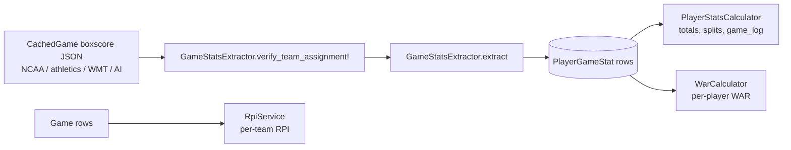

# Analytics & Stats Services

Services that turn cached boxscore JSON into `PlayerGameStat` rows, roll
those rows into per-player totals, and run the league-wide analytics
(WAR, RPI). Also covers the StatBroadcast interop that feeds live scores
and print boxscores into the pipeline.

## Table of Contents

- [Pipeline](#pipeline)
- [GameStatsExtractor (`app/services/game_stats_extractor.rb`)](#gamestatsextractor)
  - [`verify_team_assignment!` — pre-extract safety](#verify_team_assignment--pre-extract-safety)
  - [`correct_team_slugs!` — cross-source slug fixup](#correct_team_slugs--cross-source-slug-fixup)
  - [`extract` — main entrypoint](#extract--main-entrypoint)
  - [`build_player_attrs` — per-player row builder](#build_player_attrs--per-player-row-builder)
  - [`parse_decision` — W/L/S normalization](#parse_decision--wls-normalization)
  - [`upsert_player_stat` — abbreviation-aware merge](#upsert_player_stat--abbreviation-aware-merge)
  - [`distribute_team_batting_breakdowns` — team-level HR/2B/3B/SB/HBP fan-out](#distribute_team_batting_breakdowns--team-level-hr2b3bsbhbp-fan-out)
  - [`enrich_with_sb_pitchers` — pitcher overlay (upstream changed 2026-04-19)](#enrich_with_sb_pitchers--pitcher-overlay)
  - [`snapshot` — progression tracking](#snapshot--progression-tracking)
- [PitcherEnrichmentService (`app/services/pitcher_enrichment_service.rb`)](#pitcherenrichmentservice)
- [PlayerStatsCalculator (`app/services/player_stats_calculator.rb`)](#playerstatscalculator)
- [WarCalculator (`app/services/war_calculator.rb`)](#warcalculator)
- [RpiService (`app/services/rpi_service.rb`)](#rpiservice)
- [~~StatBroadcastService~~ — DELETED 2026-04-19](#statbroadcastservice)

---

## Pipeline



The former `StatBroadcastService` arrow into `CachedGame boxscore JSON` was removed 2026-04-19. That path (live SB fetch → NCAA-shaped hash → GameStatsExtractor) is gone; the overlay job moved to `riseballs-live` (transient, client-side) and no longer writes to `cached_games`.

Everything downstream assumes `PlayerGameStat` rows are the source of
truth. Any bug in `GameStatsExtractor` propagates to totals, splits, WAR,
game logs — so the extractor is the most defensive part of the stack.

---

## GameStatsExtractor

**File:** `app/services/game_stats_extractor.rb` (~720 LOC)
**Called from:** `BoxscoreFetchService` (lines 502, 506, 548, 578),
`lib/tasks/stats.rake`, `lib/tasks/fill_missing_boxscores.rake`,
`lib/tasks/repair_links.rake`, `lib/tasks/backfill_pitch_counts.rake`,
`script/restore_pgs.rb`.

### `verify_team_assignment!` — pre-extract safety

Lines 21-98. Mutates the boxscore hash in place to make sure players end
up on the correct team. Two strategies, tried in order:

1. **Score-based** (when Game has known unequal scores). Sum batting
   `runsScored` per team_boxscore; if the totals match the Game's scores
   with teams *reversed*, `swap_team_assignments!` flips
   `seoname`/`nameShort`/`isHome` in both `teamBoxscore` and `teams`.
   When both scores and runs agree (no swap needed), return false.
2. **Roster-based** (`verify_by_roster!`, lines 67-98). When scores tie
   or are missing, compare parsed player names against each team's roster
   (set intersection on downcased full names). Swap when the "home"
   entry's players match the away roster better AND `swapped >= 3`.

Called from `BoxscoreFetchService` before `extract` so the extract stage
sees a normalized boxscore.

### `correct_team_slugs!` — cross-source slug fixup

Lines 104-153. Handles the case where a box score says `"University of
West Alabama"` but the Game's slug is `"ala-huntsville"` (vendor bug or
slug collision). Walks each team entry, compares `nameShort` against the
DB Team's `name`/`long_name`/`nickname`. On mismatch, resolves the
correct slug via `find_team_by_boxscore_name` (exact → partial → word-all
match across all teams, lines 339-363) and:

- Updates `game.home_team_slug` or `game.away_team_slug` via
  `update_column`.
- Rewrites `team_entry["seoname"]` and every `teamBoxscore[i]["seoname"]`
  so the downstream extract lands under the corrected slug.

### `extract` — main entrypoint

Signature (line 155):

```ruby
GameStatsExtractor.extract(
  game_id, boxscore:, game_data: nil, sb_pitchers: nil,
  division: nil, game_date: nil
)
```

Flow:

1. Resolve `source` (`boxscore["_source"]` or "ncaa"), `game_date` via
   `resolve_game_date` (Game record → NCAA epoch → startDate → CachedGame
   timestamp → `Date.today`), and `game_state` via `resolve_game_state`
   (boxscore status → game_data state → CachedGame state → "unknown").
2. Resolve `game_record_id` from `Game.find_by(ncaa_game_id:)` or
   `(ncaa_contest_id:)`, or strip `rb_` prefix and look up by internal id.
3. **Stash `runs_scored`** (lines 175-186). Some sources omit per-player
   R. Before deleting old PlayerGameStat rows, stash the slug+name →
   runs_scored for any row with `runs_scored > 0`. This prevents a
   subsequent SB-pitchers-only extract from wiping correctly-parsed R
   values from an earlier NCAA extract.
4. **Delete existing rows** for this game (lines 191-194), by both
   `game_id` AND `ncaa_game_id`. Catches cross-contaminated rows that
   have the wrong `game_id` but correct `ncaa_game_id`.
5. Identify `home_team`/`away_team` from boxscore `teams` (fall back to
   `game_data.contests[0].teams`).
6. For each `teamBoxscore` entry: derive `team_slug`, `opp_slug`,
   `is_home`; compute `shared_last_names` (players where multiple share
   a last name — used by the merge guard); loop over playerStats:
   - Skip rows whose name is `"totals"`/`"total"` or blank.
   - Call `build_player_attrs` (see below).
   - `upsert_player_stat` with the built attrs.
7. **Distribute team-level breakdowns** via
   `distribute_team_batting_breakdowns` (see below).
8. If `sb_pitchers` provided, `enrich_with_sb_pitchers` to layer SB
   pitching lines (pitch counts, decisions) over whatever the primary
   boxscore had.
9. **Restore stashed runs** (lines 273-284): for any PGS row still showing
   `runs_scored = 0` where we had a non-zero stash, `update_column` back.

Returns a count of rows written.

### `build_player_attrs` — per-player row builder

Lines 419-508. Takes a raw `player` hash from the boxscore and builds the
attribute hash for `PlayerGameStat`.

**Guards:**

- `full_name.blank?` → return nil (skip).
- No `batterStats` AND no `pitcherStats` → return nil.

**Batting block (lines 450-487):**

- Source prefers `hittingSeason` over `batterStats` for per-game `doubles`,
  `triples`, `homeRuns`, `runsScored`, `runsBattedIn`, `stolenBases`,
  `hitByPitch`, `sacrificeFlies`, `sacrificeBunts`. `batterStats` often
  inflates `runsScored` (team total misattributed) and omits the XBH
  breakdown entirely.
- **XBH sanity check** (lines 463-467): if `doubles + triples + home_runs
  > hits`, zero them out. This usually means the AI parser misattributed
  breakdown stats; `distribute_team_batting_breakdowns` will refill with
  correct values later.
- `strikeouts` clamped to `[batterStats.strikeouts, at_bats].min` — some
  sources store season totals here.

**Pitching block (lines 489-505):**

- `innings_pitched`: `parse_innings` coerces to float (keeps `.1`/`.2`
  partial innings — formatted back by `PlayerStatsCalculator#format_ip`).
- `pitch_count`: from `pitchCount` (this is `np` in downstream totals).
- `decision`: `parse_decision(player["decision"])`.

All counting fields `.to_i` so nil/"" safely become 0.

### `parse_decision` — W/L/S normalization

Lines 712-719:

```ruby
def parse_decision(dec)
  return nil if dec.blank?
  dec = dec.strip
  return "W" if dec.start_with?("W")
  return "L" if dec.start_with?("L")
  return "S" if dec.start_with?("S") || dec.start_with?("SV")
  nil
end
```

Accepts `"W"`, `"Win"`, `"W, 3-1"`, `"SV"`, `"Save"`, `"Save, 2"`. Tests
in `test/services/game_stats_extractor_decision_test.rb:142-150`.
Downstream, `PlayerStatsCalculator#pitching_totals` and `WarCalculator`
both read `decision` directly.

### `upsert_player_stat` — abbreviation-aware merge

Lines 515-581. The natural key for `PlayerGameStat` is
`(ncaa_game_id, team_seo_slug, player_name)`. But the same player
sometimes appears with different name forms across sources
(`"J. Smith"` vs `"Jane Smith"`).

**Strategy:**

1. `find_or_initialize_by` on the natural key. If it's a persisted match,
   jump to the "same player appears twice" branch (below).
2. **New record path** — search for an abbreviated alias in the same
   `(ncaa_game_id, team_seo_slug)` scope:
   - **Jersey number match**: single candidate with the same jersey →
     use it. Jersey is the most reliable cross-source identifier.
   - **Last-name match** with abbreviated first: single candidate with
     the same last name AND one first-name is an abbreviation of the
     other (via `abbreviated_name_match?`, lines 700-710: short name is
     1-2 chars and long name starts with it). Skipped entirely when
     `shared_last_names` contains this last name (e.g. `M. Hool`,
     `Ma. Hool`, `Mi. Hool` — don't merge those).
3. If an alias match is found, `assign_attributes(attrs) + save!` on the
   existing row.
4. Otherwise, if the record is persisted AND both the old and new attrs
   show `has_batting=true`, treat it as "same player appears twice"
   (position change mid-game): **sum** `COUNTING_STATS` (line 9-13),
   don't overwrite.
5. Handle `ActiveRecord::RecordNotUnique` as a concurrent insert —
   re-find and update.

`COUNTING_STATS = %i[at_bats hits runs_scored runs_batted_in walks
strikeouts doubles triples home_runs stolen_bases caught_stealing
hit_by_pitch sacrifice_flies sacrifice_bunts]`.

### `distribute_team_batting_breakdowns` — team-level HR/2B/3B/SB/HBP fan-out

Lines 662-696. Some boxscore formats (especially athletics/print) store
XBH and SB at the team level as `teamStats.battingStats` arrays like:

```json
{"homeRuns":[{"lastName":"Smith","total":"2"}, ...]}
```

Mapped via `BREAKDOWN_MAP` (lines 654-660):

| JSON key     | DB column      |
| ------------ | -------------- |
| homeRuns     | home_runs      |
| doubles      | doubles        |
| triples      | triples        |
| stolenBases  | stolen_bases   |
| hitByPitch   | hit_by_pitch   |

For each entry, find the matching PlayerGameStat by last name +
game + team. Skip (do NOT overwrite) when the current DB column is
non-zero — athletics/SB data wins. For XBH columns, validate that the
new total wouldn't push `(doubles + triples + home_runs) > hits` before
writing.

### `enrich_with_sb_pitchers` — pitcher overlay

Lines 583-649. Takes a pitchers payload (home/visitor arrays with
ip/h/r/er/bb/k/hr/hp/bf/tp/st/dec) and `assign_attributes` onto existing
PlayerGameStat rows (or create new) keyed by `(ncaa_game_id, team_seo_slug,
player_name)`.

The payload format is named `sb_pitchers` for historical reasons. The
original producer was `StatBroadcastService`, which was deleted on
2026-04-19 as part of mondok/riseballs#85. The consumer path
(`GameStatsExtractor#enrich_with_sb_pitchers`, the `sb_pitchers` cache
type on `CachedGame`, and the `Api::GamesController#show` fetch that
merges cached pitchers into the response) is still live. The data now
comes from `AiBoxScoreService.fetch_pitchers`, which normalizes its
LLM output into the same payload shape. Any row enriched this way is
marked `data_source: "sb"` - also historical - treat it as "post-
extraction pitcher overlay" rather than literally StatBroadcast.

### `snapshot` — progression tracking

Lines 290-335. Writes a `GameSnapshot` row every time the score or state
changes, capturing compact batting/pitching summaries per team and the
full linescore array. Used for progression charts / live streams. No-op
if the last snapshot's `(home_score, away_score, game_state)` matches.

---

## PitcherEnrichmentService

**File:** `app/services/pitcher_enrichment_service.rb` (101 LOC)

Three responsibilities:

### `enrich_async(game_id, boxscore_data)`

Lines 3-21. If `sb_pitchers` is already cached, attach it to
`boxscore_data["sbPitchers"]` synchronously. Otherwise, if the game is
`CachedGame.final?`, fire off a background `Thread.new { enrich(...) }`
so the next request has the data but this one doesn't block.

**Caller:** `api/games_controller.rb:101, 137` — after returning a
response to the user.

### `enrich(game_id, seo_slugs)`

Lines 25-51. The slow work. Tries AI scraping (`AiBoxScoreService.fetch_pitchers`
— broader coverage) to fill in pitcher decisions / pitch counts.
Store result to `CachedGame` under key `sb_pitchers` with
`game_state: "final"`, and `try_lock!` the CachedGame to stop further
re-scrapes.

**2026-04-19:** the StatBroadcast fallback (`GameShowService.find_live_stats` + `StatBroadcastService.fetch_pitchers`) was removed from this path along with the rest of the StatBroadcast machinery. AI scraping is the only enrichment route now. The `sb_pitchers` cached blob key stays (historical data still flows through it).

### `merge_athletics_pitchers(ncaa_data, athl_boxscore)`

Lines 54-80. Overlay athletics-scraper pitcher lines onto NCAA boxscore
data by matching lowercased last names. Adds missing pitchers as new
`playerStats` entries; updates `pitcherStats` and `decision` on matches.

### `athletics_box_score(game_id, boxscore_data)`

Lines 83-100. Fetch-or-cache an athletics boxscore + play-by-play.
Returns `{ boxscore:, play_by_play: }`. Caches with
`game_state: "final"`.

---

## PlayerStatsCalculator

**File:** `app/services/player_stats_calculator.rb` (213 LOC)
**Called from:** `api/players_controller.rb:60-65` — every player profile
page.

Pure functional rollups over a `PlayerGameStat` relation (`games` param
is expected to respond to `sum`, `count`, `.where`, and `.pluck`).

### `batting_totals(games)`

Lines 2-41. Returns `{gp, ab, h, r, rbi, bb, k, doubles, triples, hr, sb,
hbp, sf, sac, avg, obp, slg, babip, k_pct, bb_pct}`.

Formulas:

- `avg = h / ab`
- `obp = (h + bb + hbp) / (ab + bb + hbp + sf)`
- `tb = h + 2b + 2*3b + 3*hr` — *NOTE the doubles weight is 1 here, not 2*.
  Look at line 20: `tb = h + doubles + 2 * triples + 3 * hr`. This is
  correct only if `h` already equals `singles + 2b + 3b + hr`, in which
  case total bases = `(h - 2b - 3b - hr) + 2*2b + 3*3b + 4*hr = h + 2b +
  2*3b + 3*hr`. Verified by inspection.
- `slg = tb / ab`
- `babip = (h - hr) / (ab - k - hr + sf)`
- `pa = ab + bb + hbp + sf + sac`; `k_pct` and `bb_pct` are `stat / pa *
  100`.

Averages are formatted via `format_avg` — `0.342` → `".342"`, `1.000` →
`"1.000"` (leading-zero strip when below 1.0).

### `pitching_totals(games)`

Lines 43-65. Returns `{gp, app, ip, h, r, er, bb, k, hr, w, l, sv, np,
era, whip}`.

- `w`/`l`/`sv`: `games.where(decision: "W"/"L"/"S").count`. This is why
  `parse_decision` must normalize; values like `"Win"` would not match.
- `np`: `games.sum(:pitch_count)`. This comes from the `pitchCount` field
  `GameStatsExtractor` wrote; when SB enrichment ran it will have
  overwritten with the canonical `tp`.
- `era = (er * 7) / ip` — 7-inning games for softball.
- `whip = (bb + h) / ip`.

### `game_log_entry(gs)`

Lines 170-199. Flat hash per game for the player page's game log table.
Always includes `game_id, date (MM/DD), opponent, opponent_slug, is_home`.
Conditionally merges batting block (`has_batting`) and pitching block
(`has_pitching`, including formatted `ip` and `decision`).

### `splits(game_stats, batting_games, pitching_games)`

Lines 122-168. Builds home/away, last-7/14/30-days, and vs-conference
splits via `compact_batting`/`compact_pitching` (lines 67-120, a
slimmer variant of the totals methods). `vs_conference_batting` groups
game rows by the opponent's `conference` lookup and runs a compact
rollup per conf.

### Helpers

- `format_avg(val)` (lines 201-204): three-decimal with leading-zero strip.
- `format_ip(ip)` (lines 206-211): `0.0` for nil/zero, else
  `whole.(fraction * 10).round` — e.g. `6.33` → `"6.3"` (meaning six
  and one-third innings).

---

## WarCalculator

**File:** `app/services/war_calculator.rb` (321 LOC)
**Called from:** `CalculateWarJob` / cron; persists to `player_war_values`.

Computes FanGraphs-style WAR per player. Split into batting WAR (linear
weights / wOBA) and pitching WAR (FIP-based).

### Constants (lines 2-30)

| Constant                    | Value                                          | Notes                                                      |
| --------------------------- | ---------------------------------------------- | ---------------------------------------------------------- |
| `WEIGHTS`                   | bb 0.690, hbp 0.720, 1b 0.880, 2b 1.270, 3b 1.620, hr 2.100 | linear weights (wOBA numerator), standard FanGraphs scale |
| `REPLACEMENT_WIN_PCT`       | 0.380                                          | FanGraphs convention                                       |
| `REPLACEMENT_RUNS_PER_600PA`| 20.0                                           | replacement batter, 600 PA                                 |
| `PYTH_EXPONENT`             | 2.0                                            | softball pythagorean                                       |
| `MIN_PA_FOR_BATTING`        | 1                                              | calc threshold (not display)                               |
| `MIN_IP_FOR_PITCHING`       | 0.1                                            | calc threshold                                             |
| `SEASON`                    | 2026                                           | hard-coded                                                 |
| `SEASON_START`              | d1 2026-02-06, d2 2026-01-30                   | cutoff date                                                |

### Entry points

- `calculate_all` — loop `%w[d1 d2]`, delegate to `calculate_division`.
- `calculate_division(division)` — compute division-scoped WAR, then a
  separate conference-scoped WAR for each distinct conference in that
  division. Writes one `PlayerWarValue` row per `(player_name, team_seo_slug,
  scope_type, scope_value, season)` tuple — so a player gets a
  `scope_type: "division"` row AND a `scope_type: "conference"` row for
  their own conference.

### `calculate_scope`

Lines 79-102. For a given scope:

1. Build `base` scope: `PlayerGameStat.final_games` within division and
   date window. If `conference` given, restrict `team_seo_slug` to
   teams in that conference.
2. Compute `rpg` (runs per game) from the `Game` table for the same scope.
3. `rpw = 2 * sqrt(rpg)` (pythagorean RPW).
4. Compute batting results + pitching results, persist.

### Batting WAR (lines 136-201)

1. Aggregate league totals (AB, H, 2B, 3B, HR, BB, HBP, SF) via SQL
   `pick`.
2. `lg_1b = lg_h - lg_2b - lg_3b - lg_hr`; `lg_pa = lg_ab + lg_bb + lg_hbp
   + lg_sf`.
3. `lg_woba = weighted_value(...) / lg_pa`.
4. `lg_obp = (lg_h + lg_bb + lg_hbp) / (lg_ab + lg_bb + lg_hbp + lg_sf)`.
5. `woba_scale = lg_woba / lg_obp` — divisor that puts wOBA on OBP's scale.
6. For each player with `pa >= MIN_PA_FOR_BATTING`:
   - `wraa = ((player_woba - lg_woba) / woba_scale) * pa` (runs above
     average).
   - `replacement_runs = (20.0 / 600) * pa` (runs above replacement,
     just from showing up).
   - `batting_war = (wraa + replacement_runs) / rpw`.

### Pitching WAR (lines 203-263)

1. League: `SUM(innings_pitched, earned_runs, hr, bb, k, hbp)`.
2. `lg_era = lg_er * 7.0 / lg_ip` (softball 7-inning scale).
3. `lg_fip_raw = (13*HR + 3*(BB+HBP) - 2*K) / IP`.
4. `cfip = lg_era - lg_fip_raw` — the league-FIP-to-league-ERA offset
   so FIP is on ERA's scale.
5. `replacement_fip = lg_era * 1.277` (derived from .380 win%, solves
   pythagorean for RA/RS ratio of ~1.277).
6. For each pitcher with `ip >= 0.1`:
   - `fip = fip_raw + cfip`.
   - `pitcher_rar = (replacement_fip - fip) / 7.0 * ip` (runs saved vs.
     replacement, across actual IP).
   - `pitching_war = pitcher_rar / rpw`.

### Persist (lines 274-318)

For each player key `(name, slug)` in union of batting+pitching results:

- `total_war = (batting_war || 0) + (pitching_war || 0)`.
- `PlayerWarValue.find_or_initialize_by(player_name:, team_seo_slug:,
  scope_type:, scope_value:, season:)`, assign, save.

---

## RpiService

**File:** `app/services/rpi_service.rb` (173 LOC)
**Called from:** `CalculateRpiJob` (daily 4am per README).
**Writes to:** `teams.rpi`, `teams.rpi_unweighted`, `teams.rpi_wins`,
`teams.rpi_losses`.

### Constants

- `MIN_GAMES = 5` — below this we skip the team.
- `SEASON_START`: same as WAR.
- `WIN_WEIGHTS`/`LOSS_WEIGHTS`: `{home: 0.6, away: 1.4, neutral: 1.0}`.
  This is the NCAA standard weighted WP formula.

### Flow

1. Read all `Game` rows for `division, state:"final", game_date in
   range, home_score/away_score not null`.
2. Build an in-memory game graph: `results[slug] = [{opponent, win,
   location}]` for every game. Ties are stored as `win: :tie`.
3. For each team with `games.size >= MIN_GAMES`:
   - `wp = weighted_wp(games)` — wins × location_weight / games ×
     location_weight.
   - `wp_raw = unweighted_wp(games)` — ties count 0.5.
   - `owp = compute_owp(slug, results)` — opponents' WP, excluding the
     games they played vs us. **Weighted by games played vs that
     opponent** (lines 137-155) — a team we played 3 times counts 3x in
     OWP, which handles conference series correctly.
   - `oowp = compute_oowp(slug, results)` — mean of opponents' OWP
     (note: NOT weighted here; unique opponent set only).
   - `rpi_weighted = 0.25*wp + 0.50*owp + 0.25*oowp`.
   - `rpi_unweighted = 0.25*wp_raw + 0.50*owp + 0.25*oowp`.
4. `team.update_columns(rpi:, rpi_unweighted:, rpi_wins:, rpi_losses:)`.

The graph is scoped by `division`, so OWP/OOWP never leak across D1 and D2.

---

## StatBroadcastService — **DELETED**

**File:** `app/services/stat_broadcast_service.rb` — **removed** 2026-04-19 (mondok/riseballs#85 part 1). The entire stats.statbroadcast.com interop surface (live event fetches, print-boxscore parsing, pitcher-row parsing, active-event discovery + auto-linking) is gone. So are its downstream integration points: `GameIdentityService`, `Api::LiveStatsController`, the SPA's `LiveView` page, and the Ruby `EspnScoreboardService` (in an adjacent phase).

Replacement: the `riseballs-live` service ([live/00-overview.md](../live/00-overview.md)) handles live-score ingestion via NCAA + ESPN feeds. It does NOT replace the historical StatBroadcast write-path into `cached_games` / `player_game_stats` — live-overlay data is transient and the browser consumes it directly.

The `enrich_with_sb_pitchers` method on `GameStatsExtractor` is still live. Its upstream source changed: `StatBroadcastService.fetch_pitchers` is gone, and `AiBoxScoreService.fetch_pitchers` now emits the same `sb_pitchers` payload shape to drive the same enrichment path. The `sb_pitchers` cache type on `CachedGame` and the `data_source: "sb"` marker on enriched `player_game_stats` rows are historical names - read them as "post-extraction pitcher overlay" rather than literal StatBroadcast data.

---

## Related docs

- [../pipelines/03-boxscore-pipeline.md](../pipelines/03-boxscore-pipeline.md) — boxscore ingest that feeds `GameStatsExtractor`
- [../pipelines/04-standings-pipeline.md](../pipelines/04-standings-pipeline.md) — standings + RPI downstream of `Game` finals
- [07-parsers.md](07-parsers.md) — parsers that produce the boxscore JSON consumed here
- [08-matching-services.md](08-matching-services.md) — `MatchingService` gates extraction; home/away swap detection
- [../reference/glossary.md](../reference/glossary.md) — WAR, RPI, PGS, quality gate definitions
- [12-jobs.md](12-jobs.md) — `CalculateRpiJob`, `BoxScoreBackfillJob`, and PGS reaggregation jobs
