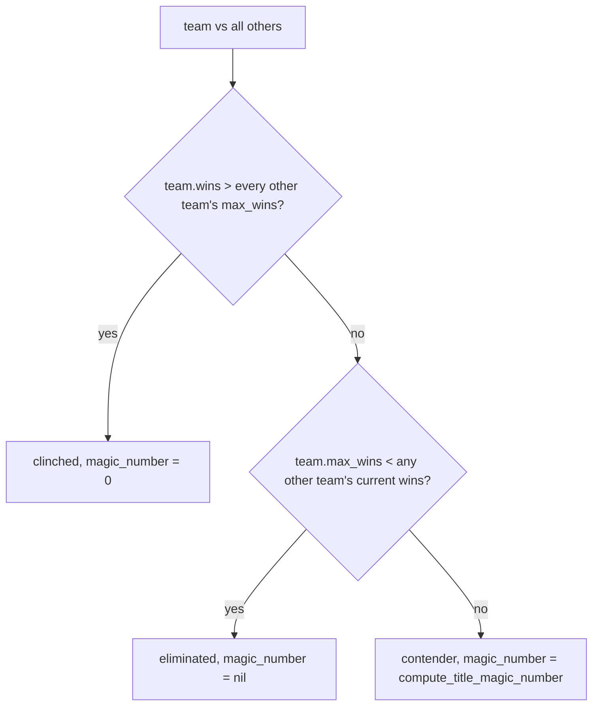
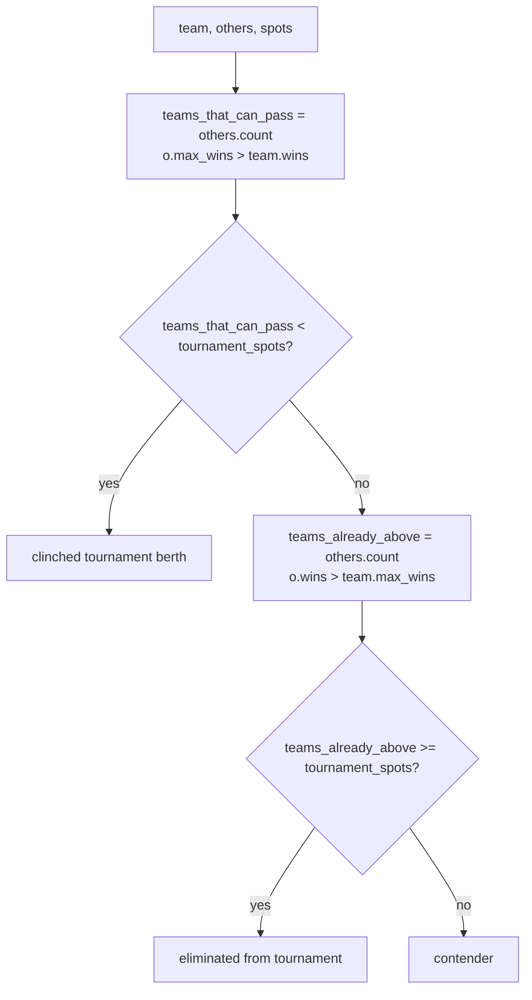

# Conference Scenario Service

`ConferenceScenarioService` answers the "can they still win it?" questions
for every team in a conference:

- **Title clinch / elimination** — who has already won the regular season,
  who has been eliminated from it, and the magic number for everyone in
  between.
- **Tournament clinch / elimination** — who has a locked-in conference
  tournament berth, who has been mathematically eliminated from the
  bracket, and who is still fighting for it.
- **Bracket projection** — the current tournament bracket if the season
  ended today, with the right structure for this conference's tournament
  format.

## Table of Contents

- [File & call site](#file--call-site)
- [Inputs](#inputs)
- [Output shape](#output-shape)
- [Title status](#title-status)
- [Magic number math](#magic-number-math)
- [Tournament status](#tournament-status)
- [Clinch indicators](#clinch-indicators)
- [Scenario summary text](#scenario-summary-text)
- [Bracket builder](#bracket-builder)
- [Tournament formats](#tournament-formats)
- [Data-quality caveat](#data-quality-caveat)

---

## File & call site

**File:** `app/services/conference_scenario_service.rb` (~415 LOC)

Entry point:

```ruby
ConferenceScenarioService.call(
  standings:, division:, season:, conference:
)
```

Called from the standings API (`api/standings_controller.rb`) whenever
the conference detail view is requested. Returns the full scenario
payload alongside the standings rows.

---

## Inputs

1. `standings:` — an array (or scope) of `ConferenceStanding` rows for
   this conference. Must expose `team_slug`, `team_name`, `conf_wins`,
   `conf_losses`.
2. `division:` — `"d1"` / `"d2"`, used to scope remaining games.
3. `season:` — year integer; used together with `division` and
   `conference` to look up `ConferenceSource` (which carries
   `tournament_spots` and `tournament_format`).
4. `conference:` — human name, used for scenario copy ("Clinched SEC
   regular season title"), and to look up the source row.

Additionally queried:

- `Game.where(state: "scheduled", division:, home_team_slug: slugs,
  away_team_slug: slugs)` — all remaining **conference** games (both
  sides must be in the conference). This is the remaining-game supply
  that drives every magic-number calculation.
- `ConferenceSource.find_by(season:, division:, conference:)` — the row
  with `tournament_spots` + `tournament_format`. **If missing or
  `tournament_spots` is nil, the service short-circuits with
  `{available: false, reason: "Tournament format not configured"}`.**

---

## Output shape

```ruby
{
  available: true,
  tournament_spots: 8,
  teams: [
    {
      team_slug: "lsu",
      team_name: "LSU",
      clinch_indicator: "x",    # x (title), y (tournament), e (eliminated), nil
      title_status: "clinched", # clinched | contender | eliminated
      title_magic_number: 0,    # nil if eliminated, 0 if clinched
      title_summary: "Clinched SEC regular season title",
      tournament_status: "clinched",
      tournament_summary: "Clinched SEC tournament berth (top 8)",
      remaining_conf_games: 3
    },
    ...
  ],
  bracket: {
    format: "double_elim",
    format_label: "Double Elimination",
    rounds: [
      { name: "Quarterfinals", matchups: [
        { top: {seed:1, name:"LSU", slug:"lsu"}, bottom: {seed:8, ...}, bye_note: nil },
        ...
      ]},
      ...
    ]
  }
}
```

Early-return shapes:

- `{available: false, reason: "No standings data"}` — empty standings.
- `{available: false, reason: "Team data incomplete for this conference"}`
  — a standings row is missing `team_slug`.
- `{available: false, reason: "Tournament format not configured"}` — no
  `ConferenceSource` or `tournament_spots` nil.

---

## Title status

`compute_title_status(team, others, conference)` at lines 116-130.



where `max_wins = wins + remaining`.

**Clinched**: my current wins exceed what anyone else can possibly
reach. No scenarios exist where I don't finish first.

**Eliminated**: at least one other team already has more wins than I can
ever reach, so I cannot pass them even winning out.

**Contender**: anything in between.

---

## Magic number math

`compute_title_magic_number(team, others)` at lines 132-144.

For any pair `(Y, X)`:

```
magic_number(Y over X) = X_remaining + 1 - (Y_wins - X_wins)
```

When this drops to `<= 0`, Y has clinched over X regardless of what
happens from here. Each "magic number" decrement can come from either a
Y win OR an X loss.

The service computes pairwise, then surfaces the **hardest** (max)
challenger:

- **If this team is the leader (or tied)**: the magic number is
  `max(over every other team)` — the most stubborn trailing team's
  number.
- **If this team is chasing**: show the magic number *against the
  leader* — how many combined (our wins + leader losses) to clinch over
  the leader. Until we do that, our own title race isn't in our hands.

Code (lines 133-144):

```ruby
def compute_title_magic_number(team, others)
  best_other = others.max_by { |o| o[:wins] }
  if team[:wins] >= best_other[:wins]
    others.map { |o| o[:remaining] + 1 - (team[:wins] - o[:wins]) }.max
  else
    best_other[:remaining] + 1 - (team[:wins] - best_other[:wins])
  end
end
```

---

## Tournament status

`compute_tournament_status(team, others, tournament_spots, _)` at lines
147-165.



**Clinched tournament berth**: even if I lose all my remaining games,
fewer than `tournament_spots` teams can finish above me (`o.max_wins >
team.wins`). So a tournament slot is guaranteed.

**Eliminated from tournament**: even winning out (reaching `max_wins`),
at least `tournament_spots` teams already have more wins than I can
reach. I'm mathematically locked out.

**Contender**: anything else.

---

## Clinch indicators

`clinch_indicator(title_status, tournament_status)` at lines 167-173:

| title_status | tournament_status | indicator |
| ------------ | ----------------- | --------- |
| clinched     | (anything)        | `"x"`     |
| anything     | clinched          | `"y"`     |
| otherwise    |                   | `nil`     |

Convention: `x` = clinched #1 seed / regular season title, `y` =
clinched tournament berth. Rendered as `LSU-x` or `Duke-y` next to team
names in the standings table.

(Title elimination has no indicator at present; the UI shows
`title_summary` text directly.)

---

## Scenario summary text

`build_title_summary` (lines 175-184) chooses by status:

- `clinched` → `"Clinched #{conference} regular season title"`
- `eliminated` → `"Eliminated from #{conference} title race"`
- `contender` → `build_contender_title_summary`

### Contender summary

`build_contender_title_summary(team, others)` at lines 189-235 generates
the actionable scenario. Algorithm:

1. For each other team, compute the magic number and
   `losses_needed_from_other = max(mn - team.remaining, 0)` — how many
   losses we need from them *assuming we win out*.
2. `min_wins_needed = max(over others) of (o.remaining + 1 - (team.wins
   - o.wins))`, clamped to `[0, team.remaining]`.

Four cases:

| Condition | Message |
| --------- | ------- |
| `min_wins_needed == team.remaining` and no help needed | `"Wins title by winning out (#{N} games remaining)"` |
| `min_wins_needed <= remaining` and no help needed | `"Wins title by going #{W}-#{L} or better in remaining #{N} games"` |
| Needs help from 1-3 other teams | `"Wins title if they go N-0 and {Duke loses 3+ and Texas loses 2+ and ...}"` |
| Needs help from 4+ other teams | `"Wins title if they go N-0, {top 2}, and #{rest} other teams lose multiple games"` |

The 3-vs-4+ cutoff keeps the string readable in the standings table.
Fallback `"In contention (#{N} conference games remaining)"` should only
happen if our invariants are violated.

### Tournament summary

`build_tournament_summary` (lines 237-246):

- `clinched` → `"Clinched #{conference} tournament berth (top #{spots})"`
- `eliminated` → `"Eliminated from #{conference} tournament"`
- `contender` → `"In contention for #{conference} tournament berth (top #{spots})"`

---

## Bracket builder

`build_bracket(sorted_teams, spots, format)` at lines 257-271.

- Early-out: `{format: "none", format_label: nil, rounds: []}` for
  `format == "none"` or `spots <= 0`.
- Seeds: `sorted_teams.first(spots)` — standings are already sorted by
  `[-wins, losses]` upstream (line 42).
- Round structure comes from `bracket_rounds(seeds, spots)` (lines
  273-283), which dispatches to one of the hand-built shapes.

### Per-size bracket shapes

| Size | Method         | Used by                 | Structure                                                                                   |
| ---- | -------------- | ----------------------- | ------------------------------------------------------------------------------------------- |
| 4    | `bracket_4`    | smaller conferences     | Semifinals `1v4 / 2v3` → Championship.                                                      |
| 6    | `bracket_6`    | mid-size confs          | First Round `3v6 / 4v5` → Semifinals (1 and 2 get byes) → Championship.                     |
| 8    | `bracket_8`    | many conferences        | Quarterfinals `1v8 / 4v5 / 3v6 / 2v7` → Semis → Championship.                               |
| 11   | `bracket_11`   | Big 12                  | Top 5 byes. First Round `6v11 / 7v10 / 8v9`. Second Round, Semis, Championship.             |
| 12   | `bracket_12`   | ACC, Big Ten            | Top 4 byes. First Round `5v12 / 8v9 / 6v11 / 7v10`. Quarterfinals, Semis, Championship.     |
| 15   | `bracket_15`   | SEC                     | 15-team single-elim. Top seed bye to QF. R1 `8v9 / 5v12 / 13v14 / 7v10 / 6v11` (14th seed plays 13/14 winner). |

Fallback `bracket_power_of_2` (lines 402-408) covers any other size as a
single round of `i vs (spots - 1 - i)` pairings. Not aesthetically
correct for non-power-of-two sizes but keeps the API shape valid.

### `matchup` helper

Lines 410-412: `{top:, bottom:, bye_note:}`. `top`/`bottom` are the seed
dicts, or `nil` for "to be determined". `bye_note: "vs. 8/9 winner"`
annotates bye matchups so the frontend can label them.

---

## Tournament formats

`FORMAT_LABELS` (lines 250-255):

```ruby
{
  "double_elim" => "Double Elimination",
  "single_elim" => "Single Elimination",
  "best_of_3"   => "Best-of-3 Series",
  "none"        => nil
}
```

Stored on `ConferenceSource.tournament_format`. Default when missing is
`"double_elim"` (line 72).

Which conferences use which:

| Format         | Conferences                                              |
| -------------- | -------------------------------------------------------- |
| `double_elim`  | Default for most D1 + D2 conferences                     |
| `single_elim`  | SEC (15-team), some smaller D2 brackets                  |
| `best_of_3`    | A handful of conferences run championship series         |
| `none`         | Conferences without a post-season tournament (the title goes straight to the regular-season champion) |

The mapping lives in `conference_sources` rows, not in code. Add a new
conference → insert a source row with the right `tournament_format` and
`tournament_spots`; the service picks it up on the next request.

---

## Data-quality caveat

Scenarios are only as accurate as the `games` table:

- **Missing scheduled games** → undercount `remaining`, which
  undercounts each team's `max_wins`, which can falsely mark teams as
  clinched/eliminated. If a conference series dropped from the schedule
  scrape, the scenarios for everyone involved are wrong.
- **Stale final flags** → a game stuck in `state: "scheduled"` that
  actually happened still counts toward `remaining`, inflating
  `max_wins` and preventing legitimate clinches.
- **Non-conference games** are filtered out by `home_team_slug IN
  slugs AND away_team_slug IN slugs`, but if a team's slug ever drifts
  (see `GameStatsExtractor.correct_team_slugs!` in the analytics doc),
  their remaining-game count can be off until the drift is fixed.

This is why the matcher stabilization project (`MEMORY.md`) matters for
scenarios too: every missed game downstream becomes a bad scenario
upstream.

---

## Related docs

- [../pipelines/04-standings-pipeline.md](../pipelines/04-standings-pipeline.md) — `ConferenceStanding` rows this service reads from
- [../reference/conference-tournaments.md](../reference/conference-tournaments.md) — per-conference bracket shapes and tournament formats
- [../reference/glossary.md](../reference/glossary.md) — clinch indicator, magic number, tournament spots
- [04-api-endpoints.md](04-api-endpoints.md) — `api/standings_controller` surface that returns this payload
- [01-models.md](01-models.md) — `ConferenceSource` and `ConferenceStanding` model definitions
