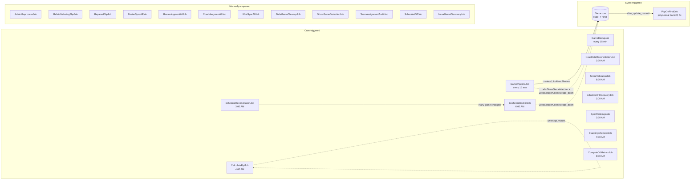

# Job Schedule

All background jobs run on Sidekiq (Redis-backed, `config/sidekiq.yml` -- `:concurrency: 5`, single `default` queue). The worker process is declared in `Procfile`:

```
worker: bundle exec sidekiq -C config/sidekiq.yml
```

Scheduling is handled by **sidekiq-cron**, configured entirely in `config/initializers/sidekiq.rb`. On every Sidekiq server startup:

1. The `desired` array (see below) is loaded via `Sidekiq::Cron::Job.load_from_array!` -- adds new entries and updates existing ones.
2. Anything in Redis but **not** in `desired` is destroyed -- i.e., removing an entry from the array + restarting the worker removes the cron entry. This matters when renaming or deleting jobs; there's no orphaned-cron risk.

All cron expressions are evaluated in the server's timezone. Sidekiq-cron treats them as UTC by default -- confirm the local TZ assumption before reading any specific "AM" label literally. The times below are given *as the cron expression reads* and matched to the project's current operating assumption (local time).

## Table of Contents

- [Cron table](#cron-table)
- [Chain diagram](#chain-diagram)
- [Event-triggered jobs](#event-triggered-jobs)
- [Manually enqueued jobs](#manually-enqueued-jobs)
- [At-a-glance daily timeline](#at-a-glance-daily-timeline)

---

## Cron table

| Cron | Human | Job | Purpose |
| --- | --- | --- | --- |
| `*/15 * * * *` | every 15 min | `GamePipelineJob` | Sync team schedules, match team_games into Games, fetch box scores for today/yesterday, clean orphans. Full sync (all teams) only in the 03:00-03:15 slot; other slots sync just teams with unfinished games today. |
| `*/15 * * * *` | every 15 min | `GameDedupJob` | Detect + merge duplicate Game rows using boxscore fingerprints. 14-day lookback computed via Ruby `Date.current`. `DEDUP_DRY_RUN=1` to preview. |
| `*/20 * * * *` | every 20 min | `NcaaGameDiscoveryJob` | NCAA GraphQL sync for today + yesterday. **Re-enabled 2026-04-19 (mondok/riseballs#82)** — had been silently disabled since 2026-04-12, dropping `ncaa_contest_id` coverage to ~0%. Recovered to ~92% after re-enable. |
| `0 2 * * *` | 2:00 AM daily | `AthleticsUrlDiscoveryJob` | Discover missing `athletics_url` via NCAA school pages. |
| `0 2 * * *` | 2:00 AM daily (within same slot; distinct job) | `NcaaGameDiscoveryJob` | Nightly full-season NCAA sweep (`mode: "season"`). |
| `30 2 * * *` | 2:30 AM daily | `NcaaDateReconciliationJob` | Delegate to Java `POST /api/reconcile/ncaa-dates`. Corrects `game_date` against the NCAA GraphQL API. |
| `0 3 * * *` | 3:00 AM daily | `ScheduleReconciliationJob` | Delegate to Java `POST /api/reconcile/schedule`. Creates / uncancels / corrects / finalizes games. Enqueues `BoxScoreBackfillJob` if anything changed. |
| `30 3 * * *` | 3:30 AM daily | `SyncRankingsJob` | Update `teams.rank` from external ranking sources. |
| `0 4 * * *` | 4:00 AM daily | `CalculateRpiJob` | `RpiService.calculate_all` -> writes `rpi_values`. |
| `0 6 * * *` | 6:00 AM daily | `BoxScoreBackfillJob` | Fill box score gaps (60-day window), normalize PGS names, reaggregate Player totals. |
| `0 7 * * *` | 7:00 AM daily | `StandingsRefreshJob` | Java scrapes conference standings for the current season. |
| `30 8 * * *` | 8:30 AM daily | `ScoreValidationJob` | Auto-correct scores when boxscore internally consistent; flag `GameReview` pending otherwise. |
| `0 9 * * *` | 9:00 AM daily | `ComputeD1MetricsJob` | Java computes D1 metrics. |

> The first 03:00 `GamePipelineJob` tick is the *full sync* of all ~592 teams (15-minute HTTP timeout). It runs concurrently with `NcaaDateReconciliationJob` (02:30) and `ScheduleReconciliationJob` (03:00). The `lock_singleton` TTLs on each job prevent self-overlap but they don't coordinate with each other.

---

## Chain diagram



---

## Event-triggered jobs

| Event | Callback | Job enqueued | Notes |
| --- | --- | --- | --- |
| `Game` row `state` transitions to `"final"` (via `after_update_commit`) | `Game#enqueue_pbp_refresh_if_finalized` | `PbpOnFinalJob.perform_later(id)` | `retry_on PbpNotReadyError, wait: :polynomially_longer, attempts: 5` -- roughly an hour of backoff so the source has time to publish PBP. Idempotent: returns immediately if `athl_play_by_play` already cached. See `app/models/game.rb:241-244`. |
| Admin clicks "reprocess" on `/admin/boxscores/:id` | `Admin::BoxscoresController#reprocess` | `AdminReprocessJob.perform_later(game.id)` | Deletes cached `athl_boxscore` and re-runs `BoxscoreFetchService.fetch(game)`. |
| Admin API `POST /api/admin/recalculate_rpi` or `Admin::ToolsController` button | controller actions | `CalculateRpiJob.perform_later` | Same job as the 4 AM cron, on demand. |
| `ScheduleReconciliationJob` completes with `repaired > 0` | inline after Java response | `BoxScoreBackfillJob.perform_later` | Only when `created + uncancelled + date_corrected + score_corrected + finalized` is nonzero. |

---

## Manually enqueued jobs

Jobs registered in `Admin::JobsController::JOBS` and exposed in `/admin/jobs` (HTTP basic auth, allowed email `matt.mondok@gmail.com`):

| Job | Category | Why click this instead of waiting |
| --- | --- | --- |
| `BoxScoreBackfillJob` | pipeline | Force a gap-fill now (same as 6 AM cron). |
| `NcaaDateReconciliationJob` | java_scraper | Force 2:30 AM reconciliation now. |
| `ComputeD1MetricsJob` | java_scraper | Force D1 metrics recompute. |
| `RosterAugmentAllJob` | java_scraper | One-off full re-augment of rosters (not scheduled). |
| `CoachAugmentAllJob` | java_scraper | One-off full coach augment (not scheduled). |
| `WmtSyncAllJob` | java_scraper | One-off WMT sync for all teams (not scheduled). |
| `RefetchMissingPbpJob` | java_scraper | Re-batch all games missing PBP. |
| `ReparsePbpJob` | java_scraper | Re-run `PitchByPitchParser` on all cached PBP. |
| `StandingsRefreshJob` | java_scraper | Force standings refresh. |
| `SyncRankingsJob` | rankings | Force rankings sync. |
| `CalculateRpiJob` | rankings | Force RPI recompute. |
| `AthleticsUrlDiscoveryJob` | rankings | Force discovery run. |
| `StaleGameCleanupJob` | data_quality | Flag stale scheduled games (no auto-delete). |
| `ScoreValidationJob` | data_quality | Force score validation now. |
| `GameDedupJob` | data_quality | Force dedup (note: `DEDUP_DRY_RUN=1` supported only via env var on a rails runner call). |
| `ScheduleReconciliationJob` | data_quality | Force reconciliation now. |

The admin UI also exposes two job-key-only entries (`TeamScheduleSyncJob`, `LiveGameSyncJob`) whose class names do **not** exist in the codebase -- these are legacy labels kept in the `JOBS` array for display and will error if clicked. The current replacement is the unified `GamePipelineJob`.

Jobs not in the admin UI at all -- enqueue via `bin/rails runner` if you need them:

| Job | Entry point |
| --- | --- |
| `GamePipelineJob` | cron only; manual run is rare (just use `bin/rails runner "GamePipelineJob.perform_now"`). |
| `GhostGameDetectionJob` | not scheduled, not in admin UI -- only via runner. Slow (90-day lookback). |
| `TeamAssignmentAuditJob` | not scheduled, not in admin UI -- only via runner. Walks all final+scheduled games. |
| `ScheduleDiffJob` | not scheduled, not in admin UI -- auditing tool only. |
| `NcaaGameDiscoveryJob` | cron (every 20 min + nightly season sweep). Also runnable via `rake games:discover[today]` / `rake games:discover[season]`. |
| `RosterSyncAllJob` | rake `rosters:sync_all` is the CLI equivalent. |
| `PbpOnFinalJob` | event-only; don't manually enqueue -- use on-demand `Api::GamesController#play_by_play`. |
| `AdminReprocessJob` | admin-UI-only; no standalone runner need. |

---

## At-a-glance daily timeline

```
00:00  .  ..  .  .  .  .  .  .  GamePipelineJob + GameDedupJob every 15 min all day
                                NcaaGameDiscoveryJob every 20 min all day
01:00  .
02:00  AthleticsUrlDiscoveryJob + NcaaGameDiscoveryJob (nightly season sweep)
02:30  NcaaDateReconciliationJob
03:00  ScheduleReconciliationJob + GamePipelineJob (full sync of all teams)
03:30  SyncRankingsJob
04:00  CalculateRpiJob
05:00  .
06:00  BoxScoreBackfillJob (60-day gap fill)
07:00  StandingsRefreshJob
08:00  .
08:30  ScoreValidationJob
09:00  ComputeD1MetricsJob
... rest of the day: GamePipelineJob + GameDedupJob every 15 min;
    NcaaGameDiscoveryJob every 20 min.
```
