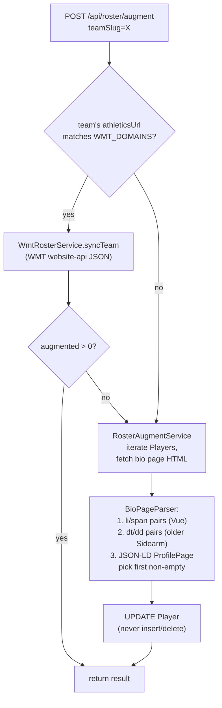

# Services — Core logic

Grouped by responsibility. Every service referenced here lives under `src/main/java/com/riseballs/scraper/service/` or `…/roster/` or `…/reconciliation/` (reconciliation details are in `04-reconciliation.md`).

---

## Scrape orchestration

### `ScrapeOrchestrator` — the box score pipeline

**File:** `service/ScrapeOrchestrator.java` (346 LOC)
**Injected fetchers (ordered list):** `WmtFetcher`, `LocalScraperFetcher`, `PlaywrightFetcher`, `PlainHttpFetcher`. `UrlRediscoveryFetcher` and `AiExtractionFetcher` are injected separately and called conditionally.

Entry points:
- `scrapeGame(Long gameId) → Optional<Map>` — single game.
- `scrapeGames(List<Long>) → Map<Long, Object>` — virtual-thread fanout with `Semaphore(maxConcurrentGames)`.

Flow per game:
1. Load `Game` (returns empty if not found).
2. `loadCachedBoxscore(game)` — skip if a cached `athl_boxscore` exists and its summed runs match `Game.homeScore`/`awayScore`. If cache hit but no cached `athl_play_by_play`, still call `pbpOrchestrator.processPlayByPlay`.
3. Else, for each fetcher in order:
   - `fetcher.fetch(game, seoSlugs)` → `Optional<BoxscoreData>`.
   - `teamAssignmentVerifier.assignSeonames` + `.verifyAndFix` (mutates the boxscore map in-place).
   - `scoreValidator.scoresMatch(box, game)` → if false, immediately `tryRediscovery(game, seoSlugs)` via `UrlRediscoveryFetcher`. If rediscovery succeeds, return; else record failure reason and try next fetcher.
   - On success: `storeCachedBoxscore(game, box, sourceTeamSlug)` → writes JSONB row to `cached_games`, scoped to the specific source team when known (so different teams' source pages don't collide).
   - `gameStatsWriter.write(box, game)` → deletes + reinserts PGS rows.
   - `pbpOrchestrator.processPlayByPlay(game, box)` → see below.
   - Return boxscore.
4. If all fetchers fail, return empty.

### `PbpOrchestrator` — PBP cascade

**File:** `service/PbpOrchestrator.java` (461 LOC)
**Injected:** `PbpWriter`, `PbpParser`, `WmtFetcher`, `SidearmBoxscoreParser`, `CachedGameRepository`, `HttpClient`, `ScraperProperties`.

Sources tried in order:
1. PBP included on the boxscore fetch result (already parsed).
2. WMT API actions endpoint (often richer than Sidearm HTML).
3. Sidearm boxscore re-fetch (local scraper → plain HTTP).
4. Fall back to any incomplete data if nothing else works.

**Completeness threshold:** `COMPLETE_THRESHOLD = 40` real plays. "Real play" means the description matches `REAL_PLAY` regex (`singled|doubled|tripled|homered|grounded|flied|struck out|walked|lined|popped|fouled|reached|hit by pitch`). A second, broader `QUALITY_PLAY_VERB` is used for the quality gate that mirrors the Ruby `PLAY_VERB` constant.

Entry points: `processPlayByPlay(Game, Map box)` — called from the box score path. `reparsePbp(Long gameId)` — called from `/api/scrape/pbp`.

### `GameStatsWriter` — `player_game_stats` persistence

**File:** `service/GameStatsWriter.java` (371 LOC)
**Write contract:** `@Transactional` clean-slate — for a given `gameId`, delete all existing PGS rows under every possible identifier (`gameId`, `ncaaGameId`, prefix `rb_` + `gameId`, and `game.ncaaGameId` if different), `entityManager.flush()`, then bulk insert. This is a hazard because it erases Ruby-written PGS rows without checking if they were higher-quality.

Merging logic: when two rows exist for the same player on the same team (e.g., both batting and pitching lines), they are merged into one PGS row so only one row per (player, team, game) is persisted — mirrors the Ruby `GameStatsExtractor` merge behavior.

### `TeamScheduleSyncService` — team schedule → `team_games`

**File:** `service/TeamScheduleSyncService.java` (341 LOC). The most intricate single service in the codebase. Read the file directly before modifying.

**Purpose:** For one team, fetch the live schedule page, run it through the parser stack, and reconcile the results into the `team_games` table for that team only.

**Cardinal rules (from the file header):**
- Each team's schedule page is the source of truth for THAT team's games.
- `(team_slug, boxscore_id)` is unique for completed games.
- `(team_slug, game_date, game_number)` is unique for all games.
- **No cross-team writes** — this service only touches rows where `team_slug = thisTeam`.
- Non-final games are deleted and re-inserted each run.
- Final games with `boxscore_id` are upserted.

**Five critical steps:**

1. **Parse** — iterate all `SchedulePageParser` beans where `canParse(team)` is true, keep the parser that returns the most entries (multiple parsers may match WMT + Sidearm).

2. **`normalizeForDedup(opponentName)` — collapse alias variations.** For each `ScheduleEntry` with non-null scores, build a dedup key `gameDate|normalized(oppName)|teamScore|oppScore`. `normalizeForDedup` strips ranking prefixes (`No. 5`, `#23`, `(3)`) then routes the cleaned name through `opponentResolver.resolve`. Net effect: "Stanford", "#23 Stanford University", and "Stanford University" all collapse to slug `stanford` → same dedup key → one entry kept. Prefers the entry that has a `boxscoreUrl`. **Scheduled entries are never deduped** — they represent distinct games (doubleheaders) and the DB unique constraint handles true dupes.

3. **Renumber game_numbers with normalized opponents.** Parsers assign `game_number` using raw names, so `#5 Georgia` and `Georgia` both get `gn=1`. After dedup, walk the merged list and re-assign `gn` keyed by `gameDate|normalizedOpp` so true doubleheaders get `gn=1,2` consistently.

4. **Shell link preservation — snapshot then restore.** Before deleting non-final rows, snapshot every non-final `TeamGame.gameId` keyed by `date|opponentSlug|gameNumber` into a map. After re-insert, for each new unplayed row, look up the preserved `gameId` and re-attach it. This is what keeps Rails-side `TeamGameMatcher` shell links stable across syncs — without it, every sync would sever the linkage and the scoreboard would flicker.

5. **Delete non-final, then save.** `deleteByTeamSlugAndStateNot(teamSlug, "final")` + `flush()`. Then per-entry:
   - Skip tournament placeholder entries with `opponentName` containing ` vs ` or ` vs. `.
   - **Final + boxscoreId:** upsert by `(teamSlug, boxscoreId)`. If not found, fallback match by same-date same-score (handles re-sync where a different parser returns a different `boxscoreId`). Multiple same-score matches = same-score doubleheader, leave as-is.
   - **Final without boxscoreId (WMT):** upsert by `(teamSlug, gameDate, gameNumber)`.
   - **Unplayed:** fresh insert; restore `gameId` from snapshot.

`extractBoxscoreId(url)` recognizes three URL shapes:
- `/boxscore/(\d+)` — modern Sidearm (numeric id at a singular path)
- `/boxscores/([^/.?]+)\.xml` — event-row / PrestoSports-on-Sidearm layout (plural path, alphanumeric id like `20260130_5mx5`). Added 2026-04-20 so event-row teams route through the `(team_slug, boxscore_id)` unique-index upsert instead of the ambiguous `(team_slug, gameDate, gameNumber)` fallback, which crashed with `NonUniqueResultException` when prod data had same-day same-gameNumber rows against different opponents.
- `wmt://(\d+)` — WMT scheme.

Package-private (previously `private`) so `TeamScheduleSyncServiceTest` can exercise each branch directly.

### `GameCreationService` — the single creation gate

**File:** `service/GameCreationService.java` (234 LOC)
**Key contract:** Every path that needs a new Game goes through `findOrCreate(GameCreationRequest)`. One matching algorithm, one dedup check, one retry-on-collision.

Match order:
1. Exact `ncaa_contest_id` (if request has one).
2. `(date, sorted teams, gameNumber)`.
3. `(date, sorted teams)` any gn, prefer the one without a contest ID.

When matched, the existing game is **updated** with any new data in the request (scores, state, contest ID, epoch) — making this atomic find-or-create-or-update. `TransactionTemplate`-wrapped; on `DataIntegrityViolationException` (two threads racing), retries once.

Batch variant `findOrCreateBatch` runs each request in its own tx — partial failures don't roll back peers.

---

## Fetchers (service/fetcher/)

All implement `BoxscoreFetcher`:
```java
Optional<BoxscoreData> fetch(Game game, List<String> seoSlugs);
String name();
```

### `WmtFetcher` — Learfield/WMT JSON API
**File:** `service/fetcher/WmtFetcher.java`
**Timeout:** 30s.
**Activation:** Two paths, in order:

1. **Direct-id fast path (scraper#11, shipped 2026-04-19).** `extractWmtGameIdFromLinks(game)` reads `game_team_links.box_score_url` for a `wmt://<id>` entry and, if present, calls `fetchGameDetail(id)` directly. This is the **doubleheader-safe path** — the WMT game ID was captured at schedule-sync time (see `WmtScheduleParser`) and uniquely identifies each half of a DH. If the direct call returns empty or throws, falls through to the legacy path. A short log line marks the fallback.
2. **Legacy schedule-lookup path.** Activated only when no `wmt://` URL is available (first-time scrapes on brand-new schedules) or the direct call failed. Gated by `isWmtTeam(team)` — home or away team's `athleticsUrl` host matches `WMT_DOMAINS` (hardcoded set of ~46 domains) or the team's `wmtSchoolId` is populated. `SCHOOL_IDS` map provides the fallback domain→schoolId lookup. Fetches the season schedule, filters candidates by date, disambiguates doubleheaders by `scoresMatch(candidate, game)` — this step is where the pre-scraper#11 DH bug lived: with `Game.home_score == null`, it fell through to `candidates.get(0)`, which could be either half.

**Endpoint pattern:** `https://api.wmt.games/api/statistics/games/{gameId}?with[0]=actions&with[1]=players&with[2]=plays&with[3]=drives&with[4]=penalties` (direct-id) plus `https://api.wmt.games/api/statistics/games?school_id=X&season_academic_year=Y&sport_code=WSB&per_page=200` (legacy schedule).
**Headers:** Origin/Referer spoof to `wmt.games`, fake UA, `Accept-Encoding: identity`.
**Output:** `BoxscoreData(boxscore, pbp)` via `WmtResponseParser`.
**Dependency:** uses the shared `HttpClient` bean from `HttpClientConfig` — see [07-config-and-deployment.md](07-config-and-deployment.md). That bean is forced to HTTP/1.1 (scraper#14, shipped 2026-04-19) because HTTP/2 + istio-envoy was corrupting large WMT response bodies, surfacing as Jackson `CTRL-CHAR code 31` parse errors. WmtFetcher would fail silently and drop to `LocalScraper` → `Playwright` → `PlainHttp`, all of which no-op on `wmt://` URLs, giving the user a 503.

### `LocalScraperFetcher` — headless browser service
**File:** `service/fetcher/LocalScraperFetcher.java` (143 LOC)
**Timeout:** 120s. Min HTML length: 1000 bytes.
**Mechanism:** POSTs `{"url": boxScoreUrl}` to `scraper.localScraperUrl` (default `http://localscraper.mondokhealth.com/scrape`). Iterates each `GameTeamLink` with a non-null `box_score_url`. Parsed with `SidearmBoxscoreParser`. **This is the preferred scraper — see `feedback_localscraper.md`.**

### `PlaywrightFetcher` — Cloudflare Playwright Worker
**File:** `service/fetcher/PlaywrightFetcher.java` (138 LOC)
**Timeout:** 120s.
**Mechanism:** Sends URL to `scraper.playwrightWorkerUrl` (a Cloudflare Worker). Less preferred than `LocalScraperFetcher`; we've been told to prefer localscraper.

### `PlainHttpFetcher` — direct HTTP GET
**File:** `service/fetcher/PlainHttpFetcher.java` (131 LOC)
**Timeout:** 30s. Min HTML length: 1000.
Simple GET on each `GameTeamLink.boxScoreUrl`. Works for statically-rendered Sidearm pages. Parsed with `SidearmBoxscoreParser`.

### `UrlRediscoveryFetcher` — schedule-page rediscovery (last resort)
**File:** `service/fetcher/UrlRediscoveryFetcher.java` (424 LOC)
Called by `ScrapeOrchestrator.tryRediscovery` when any fetcher returns a score-mismatched boxscore. Scrapes the team's athletics schedule/results page, finds boxscore `href`s near the game date, writes a new `GameTeamLink.boxScoreUrl`, then re-runs the Sidearm parser. Has its own `ScoreValidator` injection so it stops once it finds a boxscore with matching runs.

### `AiExtractionFetcher` — Cloudflare + OpenAI (optional, default OFF)
**File:** `service/fetcher/AiExtractionFetcher.java` (267 LOC)
**Activated only when `scraper.aiExtractionEnabled=true`.** Renders the page via Cloudflare browser render, sends trimmed HTML (≤16 KB) to OpenAI with the `EXTRACTION_PROMPT`, parses the JSON response. **Deprecated per `feedback_no_ai_boxscore_fallback.md`** — do not propose as a recovery path. Kept for historical reasons, should be removed.

---

## Validation (service/validation/)

### `ScoreValidator`
**File:** `service/validation/ScoreValidator.java` (101 LOC)
- `scoresMatch(boxscore, game)` — sums `runsScored` from each team's `playerStats[].batterStats`, compares to `Game.homeScore`/`awayScore`. Finds team entries by `seoname`. Short-circuits true if game scores are null or 0-0 (allows uncored games through, 0-0 is a real tie in softball — rare).
- `isGoodBoxscore(box)` — exactly 2 team entries, each with non-empty `playerStats`.

### `TeamAssignmentVerifier`
**File:** `service/validation/TeamAssignmentVerifier.java`
Fixes home/away swaps in parsed boxscores via two strategies: score-based (match known home/away scores to the 2 teams) and roster-based (cross-reference parsed player names against `PlayerRepository.findNamesByTeamSlug`). Mutates the boxscore map in place. Called from `ScrapeOrchestrator` right after fetcher returns.

---

## Standings (standings/)

### `StandingsOrchestrator`
**File:** `standings/StandingsOrchestrator.java` (310 LOC)
Entry points: `scrapeAll(season)`, `scrapeDivision(season, division)`, `scrapeConference(season, division, conference)`.
Iterates `ConferenceSource` rows filtered by `season + active=true + division?`.
Virtual threads, `Semaphore(MAX_CONCURRENT=3)`, 5-minute per-source timeout.

Flow per source:
1. `fetchContent(source)` — JSON parsers (`boostsport`, `sec`, `mw`) fetch via direct `HttpClient` with gzip handling; HTML parsers fetch via `LocalScraperFetcher`'s same endpoint (`scraper.localScraperUrl` POST).
2. `findParser(parserType)` — picks the bean whose `canParse(parserType)` returns true.
3. `parser.parse(content, conference)` → `List<StandingsEntry>`.
4. `resolveTeamSlugs(entries)` — for each, try `opponentResolver.resolve(teamName)`. Keeps the original `teamSlug` from the parser if the resolver fails.
5. `@Transactional persistStandings` — `deleteBySeasonAndConference` then bulk insert. Also updates `ConferenceSource.lastScrapedAt`/`lastScrapeStatus`.
6. `StandingsScrapeLog` row recorded with raw HTML (first 500 KB).

**Parser-type dispatch:** The `ConferenceSource` row's `parser_type` column drives which `StandingsParser` implementation is used. Seven parsers registered:

| Parser type | Implementation | `@Order` | Input format |
|-------------|---------------|----------|--------------|
| `boostsport` | `BoostsportStandingsParser` | 10 | JSON |
| `sec` | `SecStandingsParser` | 20 | JSON |
| `mw` | `MwStandingsParser` | 30 | JSON |
| `sidearm` | `SidearmStandingsParser` | 50 | HTML (Jsoup) |
| `prestosports` | `PrestoSportsStandingsParser` | 60 | HTML (Jsoup) |

All implement `StandingsParser{name(), canParse(parserType), parse(content, conference) → List<StandingsEntry>}`.

**Ambiguous-name override:** For names that `OpponentResolver` cannot disambiguate globally (e.g., "MC" → could be Mississippi College or McMurry; "Southeastern" → Southeastern Louisiana or others), the fix is to **set `team_slug` directly on the `ConferenceStanding` row via the Rails admin**, not to add a global alias. This is because the alias would affect all parsers and potentially break other contexts. See `reconciliation/schedule/OpponentResolver.java` commentary and `03-parsers.md`.

---

## Roster augmentation (roster/)

**IMPORTANT:** All three services UPDATE existing Player/Coach rows only. They never create, delete, or rename. A Player/Coach row must already exist from the Rails-side roster seeding before these will touch it. `discoverProfileUrls` (WMT's per-player profile URL discovery) is a prerequisite for the bio-page path.

### `WmtRosterService` — WMT website-api JSON sync
**File:** `roster/WmtRosterService.java` (638 LOC)
**Activation:** `isWmtTeam(team)` = true iff team's athletics URL host matches the same `WMT_DOMAINS` constant defined in three places (this file, `WmtFetcher`, `WmtScheduleParser`, `ReconciliationService`). **Extraction candidate** — pull to a single source of truth.

Fetches team roster via the WMT website-api, matches each API player against a DB Player by jersey number (primary) or last name (fallback) within `findByTeamId(team.id)`. Updates: `photo`, `position`, `year`, `height`, `hometown`, `highSchool`, `previousSchool`, `isTransfer`, `profileUrl`. Transfer detection: if `previousSchool` text (case-insensitive, trimmed) matches an entry in the preloaded `knownCollegeNames` set (built from every `Team.name` + `Team.longName` on startup), sets `isTransfer = true`.

Never overwrites: `name`, `firstName`, `id`, `number`, `teamId`.

### `RosterAugmentService` — Sidearm bio + WordPress dispatcher
**File:** `roster/RosterAugmentService.java` (603 LOC)
**Flow for `augmentTeam(teamSlug)`:**
1. If `wmtRosterService.isWmtTeam(team)`, try `wmtRosterService.syncTeam(slug)` first. If it augmented >0 players, return that result.
2. Else (or WMT returned 0): iterate each `Player` in `findByTeamId(team.id)`, discover the bio page URL pattern (`{athleticsUrl}/sports/softball/roster/{firstname-lastname}/{number}` or similar Sidearm patterns), `httpClient.send` GET with 15s timeout.
3. Parse HTML with `BioPageParser` (see `03-parsers.md` for the li/span vs dt/dd vs JSON-LD fallback order).
4. Write only: `previousSchool`, `isTransfer`, `twitterUrl`, `instagramUrl`, `linkedinUrl`, `facebookUrl`, plus `hometown` if empty.

Concurrency: `MAX_CONCURRENT_FETCHES = 5`, `RATE_LIMIT_MS = 200`. Uses virtual threads + semaphore.

### `CoachAugmentService` — coach bios
**File:** `roster/CoachAugmentService.java` (218 LOC)
Equivalent shape for coaches — parses with `CoachBioParser`, writes email/phone/social. `MAX_CONCURRENT_FETCHES = 3`, `RATE_LIMIT_MS = 300` (coaches' sites are more fragile).

### `BioPageParser`, `CoachBioParser`
See `03-parsers.md`.

---

## Roster augment fallback chain



---

## Other services

- **`D1MetricsService`** (`service/D1MetricsService.java`, 1248 LOC) — homepage facts pipeline. Runs 30+ metric queries in parallel on virtual threads and persists one JSON blob per division to `site_metrics.{d1,d2}_facts`. `@Transactional` outer, `computeAll` loops over `[d1, d2]`. Uses `@PersistenceContext EntityManager em` for raw SQL/JPQL `createQuery(...)` access (easier than repos for the analytics-heavy queries). Uses a `volatile String currentDivision` field that private metric methods read — **not thread-safe across different `compute(division)` calls** since computations happen in parallel per division, but since `computeAll` calls them sequentially, this is currently safe. Flag if refactoring.
- **`NcaaApiClient`** (`service/NcaaApiClient.java`, 196 LOC) — wraps the NCAA GraphQL API at `https://sdataprod.ncaa.com`. Uses a hash-encoded persisted query (`6b26e5cda954c1302873c52835bfd223e169e2068b12511e92b3ef29fac779c2`). Has a `SEONAME_MAP` patch table for known slug mismatches (`mcneese` → `mcneese-st`, `uiw` → `incarnate-word`, `tex-am-commerce` → `east-tex-am`). Rate-limited at 200ms between calls. Returns `NcaaContest{contestId, gameDate, homeSlug, awaySlug, homeScore, awayScore, state, startTimeEpoch}`.
- **`ReconciliationService`** (the WMT-based one) — see `04-reconciliation.md`.

---

## Related docs

- [01-controllers.md](01-controllers.md) — REST endpoints that invoke these services
- [03-parsers.md](03-parsers.md) — parser stack consumed by fetchers and schedule sync
- [../pipelines/01-game-pipeline.md](../pipelines/01-game-pipeline.md) — `ScrapeOrchestrator` in the end-to-end game pipeline
- [../pipelines/04-standings-pipeline.md](../pipelines/04-standings-pipeline.md) — `StandingsOrchestrator` caller chain
- [../pipelines/05-roster-pipeline.md](../pipelines/05-roster-pipeline.md) — WMT + Sidearm roster augment flow
- [../reference/slug-and-alias-resolution.md](../reference/slug-and-alias-resolution.md) — `OpponentResolver` rules used by `TeamScheduleSyncService`
- [../reference/glossary.md](../reference/glossary.md) — shell link preservation and other terms
