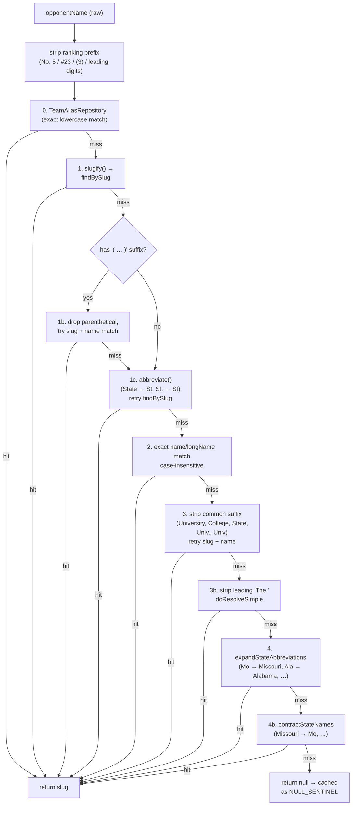

# Parsers — HTML + JSON input shaping

Every parser in `service/parser/` plus the schedule-page parsers in `reconciliation/schedule/`. Parsers are stateless Spring `@Component`s; collection injection (`List<SchedulePageParser>`, `List<StandingsParser>`) lets the orchestrators pick the matching implementation at runtime.

---

## Box score parsers (`service/parser/`)

### `BoxscoreData` (record)
**File:** `service/parser/BoxscoreData.java`
```java
record BoxscoreData(Map<String,Object> boxscore, Map<String,Object> pbp, String sourceTeamSlug)
```
Shape of `boxscore`:
```
teams:       [{seoname, name, score, ...}, {...}]
teamBoxscore:[{seoname, playerStats:[{batterStats:{...}, pitcherStats:{...}}, ...]}, {...}]
```
`sourceTeamSlug` records which team's URL was the source of this scrape (so `CachedGame` can be scoped per source team — two teams' scrapes of the same game are stored separately).

### `SidearmBoxscoreParser`
**File:** `service/parser/SidearmBoxscoreParser.java` (1529 LOC — the biggest parser in the codebase)

Handles Sidearm athletics HTML boxscores. Uses Jsoup. Two internal header maps drive column resolution:

`BATTING_HEADERS`: `position, name, ab, r, h, rbi, bb, so, doubles (2b), triples (3b), hr, sb, cs, hbp, sh, sf`. Each pattern is a case-insensitive regex anchored with `^...$`.

`PITCHING_HEADERS`: `name, ip, h, r, er, bb, so, wp, hp, bf, np`.

Also handles "breakdown" stat lines (the text summary under each table): `HR, 2B, 3B, SB, HBP, SF, SH/SAC, CS`.

**Extended stat headers** flagged separately (team-level totals etc.): not listed here, but visible in the file header near line 80.

Two page variants:
- **Classic Sidearm HTML tables** — `<table>` with `<thead>/<tbody>`, parsed via Jsoup selectors, header-position resolution by regex.
- **Nuxt-rendered Sidearm** — inline JSON in `<script>` tags (Nuxt SSR data). Parser falls back to this when no stats table is found.

Output shape matches `BoxscoreData` contract described above. `seoname` is set to the team's DB slug.

### `WmtResponseParser`
**File:** `service/parser/WmtResponseParser.java` (655 LOC)

Input: the `data` object from a `GET /api/statistics/games/:id?with[]=players&with[]=plays` response.

Structure expected:
```
data:
  competitors: [{homeContest:true/false, score, schoolId, nameTabular, players:[...], ...}]
  plays: [{description, pitches:[...], inning, half, batterId, ...}]
  ...
```

**Key regexes:**
- `PLAY_VERB_PATTERN` — `singled|doubled|tripled|homered|grounded|flied|struck|walked|fouled|lined|popped|reached|sacrifice|stole|advanced|caught|picked|wild|passed|error|hit by|out at|flew out|pinch|to [a-z]+ for` — gates real-play filtering.
- `NAME_NO_SPACE = \b([A-Z][a-zA-Z'-]+),([A-Z][a-zA-Z'-]+)\b` — recovers "Last,First" (no space).
- `NAME_INITIAL = \b([A-Z][a-zA-Z'-]+), ([A-Z]\.)\s` — "Last, I." style.

Builds boxscore + PBP map in one pass. PBP map includes pitch counts extracted from the WMT `sNumberOfPitches` field (WMT's custom PBP field) plus batter/pitcher IDs.

### `PbpParser`
**File:** `service/parser/PbpParser.java` (863 LOC)
Converts the cached PBP JSON map into `PlateAppearance` + `PitchEvent` entities.

**Pitch code vocabulary (`SWING_CODES`):** `S, F, X, T, L, M` — any of these counts as a swing. Contact codes subset tracked for BIP calculations.

**Result pattern table (`RESULT_PATTERNS`, a `LinkedHashMap` — first match wins):**
```
struck out swinging → strikeout_swinging / out
struck out looking  → strikeout_looking  / out
struck out          → strikeout          / out
walked              → walk               / walk
hit by pitch        → hit_by_pitch       / hbp
homered             → home_run           / hit
tripled             → triple             / hit
doubled             → double             / hit
... (file continues)
```

Each entry is `(Pattern regex, ResultInfo(result, category))`. Ordering matters: `struck out swinging` must precede `struck out` because regex matching is first-wins.

**Decision extraction regexes** (for win/loss/save credit from the decisions block) live near the bottom of the file — search for `DECISION_PATTERN`.

**Pitch count extraction:** reads `sNumberOfPitches` from the WMT JSON path, falls back to the `NP` column in the pitcher stat row for Sidearm sources.

### `NameUtils`
**File:** `service/parser/NameUtils.java` (69 LOC)
Two public statics:
- `splitName(raw) → [first, last]` — handles `Last, First`, `First Last`, single-token (returns as last).
- `normalizeName(raw) → "First Last"` — flips comma form to first-last.

---

## Schedule page parsers (`reconciliation/schedule/`)

All implement:
```java
interface SchedulePageParser {
    String name();
    boolean canParse(Team team);
    List<ScheduleEntry> parse(Team team, int seasonYear);
}
```

`ScheduleEntry` record:
```java
ScheduleEntry(LocalDate gameDate, String teamSlug, String opponentName, String opponentSlug,
              boolean isHome, Integer teamScore, Integer opponentScore, String result,
              String state, String boxscoreUrl, int gameNumber, String source)
```

Parsers are registered with `@Order(N)` so both `TeamScheduleSyncService.parseSchedule` and `ScheduleReconciliationOrchestrator.processTeam` iterate them in a deterministic order, **but both services pick the parser with the most entries** rather than first-match — critical, since many schools satisfy multiple `canParse(team)` checks (e.g., a WMT-hosted school may still have a Sidearm schedule mirror).

| Parser | Order | Activation | Notes |
|--------|-------|-----------|-------|
| `WmtScheduleParser` | 1 | `athleticsUrl` host ∈ `WMT_DOMAINS` | Calls WMT schedule API `https://api.wmt.games/api/statistics/games?school_id=X&season_academic_year=Y&sport_code=WSB`; boxscore URL encoded as `wmt://{gameId}`. |
| `SidearmScheduleParser` | 10 | Default fallback for any team with an `athleticsUrl` | Score regex `([WLT]),\s*(\d+)-(\d+)` with optional "(6 inn.)". Date regex `(Jan|Feb|…|Dec)\.?\s+(\d{1,2})`. Iterates schedule HTML blocks, extracts per-game date, opponent link, score, boxscore link. |
| `PrestoSportsScheduleParser` | (default) | URL pattern `{base}/sports/sball/{yr-1}-{yr2}/schedule` | HTML tables with boxscore links. Score regex same shape as Sidearm. |
| `WordPressScheduleParser` | (default) | LSU-style sites with `sport_category_id` + `season_id` in HTML | Prefers the `wp-json` API when available, else parses HTML. |

`SchedulePageParser` (the interface file) is a 12-LOC contract; no dispatcher class — the orchestrator is the dispatcher.

---

## `OpponentResolver` — name → slug resolution

**File:** `reconciliation/schedule/OpponentResolver.java` (385 LOC). This is the heart of schedule-first reconciliation. Every service that resolves a scraped opponent name (schedule sync, reconciliation, standings, roster) depends on it.

**Preloaded state (constructor):**
- `List<Team> allTeams` — entire teams table in memory.
- `Map<String, String> aliasLookup` — every `TeamAlias` row (`aliasName.lowercase().trim()` → `teamSlug`).
- `ConcurrentHashMap<String, String> cache` — per-instance memoization; `NULL_SENTINEL` value for "we looked this up and it failed" to prevent re-querying failed names.

**Resolution chain (order matters — highest priority first):**



**Step details:**

0. **`aliasLookup.get(cleaned.toLowerCase().trim())`** — highest priority. Rails admins add rows to `team_aliases` for known mappings (e.g., "Mississippi State" → `mississippi-st`).

1. **Exact slug** — `slugify()` lowercases, normalizes parenthetical (`King (TN)` → `king-tn`), strips periods, replaces non-alphanumerics with hyphens, trims trailing hyphens. Then `teamRepository.findBySlug(slug)`.

   1b. **Parenthetical suffix dropping** — if name has `(...)`, also try without it. Covers "Lee University (Tenn.)" → try long_name "Lee University" against `Team.longName`.

   1c. **Abbreviation** — `"State"` in name becomes `"St"` (anywhere, not just at end — so "Cal State East Bay" becomes "Cal St East Bay"). `"St."` becomes `"St"`. Retry `findBySlug` on the abbreviated slug.

2. **Exact name match** — walk `allTeams`, compare lowercased `name` or `longName` for exact equality. Nickname match (e.g., "Tigers") is deliberately NOT used — too many teams share nicknames.

3. **Suffix stripping** — `University`, `College`, `State`, `Univ.`, `Univ`. For each, if name ends with that suffix (case-insensitive), strip it and retry slug + name match.

   3b. **Leading "The "** — strip and run `doResolveSimple` (slug → abbreviate → name match).

4. **State abbreviation bidirectional expansion** — `STATE_ABBREVIATIONS` map (17 entries: Mo↔Missouri, Ala↔Alabama, Fla↔Florida, Tenn↔Tennessee, Conn↔Connecticut, Okla↔Oklahoma, Ark↔Arkansas, Neb↔Nebraska, Miss↔Mississippi, Cal↔California, Pa↔Pennsylvania, Ind↔Indiana, Ill↔Illinois, Mich↔Michigan, Minn↔Minnesota, Wis↔Wisconsin, Va↔Virginia). Guard clause: abbreviation is NOT expanded when followed by `State|St|Poly` — preserves "Cal State East Bay" etc. Tries both directions.

**Why `containsMatchScore` / `scoreContainsMatch` exist but are commented out in the main flow:** Past attempts at fuzzy contains matching produced wrong results — "Texas A&M - Corpus Christi" matching "Texas A&M" when both contain "Texas A&M". The current resolver is deliberately exact-match only for name lookups; the scoring functions are kept for potential future use but `findByNameMatch` uses strict `equals` (see file lines 237-249).

**Ambiguous names — "MC", "Southeastern", "Concordia":**
These cannot be resolved globally — any alias would break some call site. The resolution is **NOT** to add a global alias. Instead, the fix is to set `team_slug` directly on the `ConferenceStanding` row (for standings) or the `TeamGame` row (for schedule) in the Rails admin. See CLAUDE.md feedback — this pattern is load-bearing and breaking it breaks standings pages.

**Static helpers (package-private, for testing):**
- `static String slugify(String)` — canonical slug builder.
- `static String abbreviate(String)` — `State → St`, `St. → St`.
- `static String expandStateAbbreviations(String)` — one-way expand.
- `static String contractStateNames(String)` — one-way contract.

---

## Roster bio parsers (`roster/`)

### `BioPageParser`
**File:** `roster/BioPageParser.java` (parses player bios)

**Three HTML structures, tried in order:**

1. **li/span pairs (newer Sidearm/Vue):**
   ```html
   <li><span class="label">Previous School</span><span>Coastal Carolina</span></li>
   ```
   Walks `<li>` elements, reads first `<span>` as label, second as value.

2. **dt/dd pairs (older Sidearm):**
   ```html
   <dt>High School</dt><dd>Lincoln HS</dd>
   ```

3. **JSON-LD ProfilePage (newer Sidearm with schema.org):**
   Extracts `alumniOf.name` via `ALUMNI_OF_PATTERN` regex and `sameAs` array via `SAME_AS_PATTERN` → `URL_IN_ARRAY`.

**Label regexes (case-insensitive, tolerant):**
- `PREV_SCHOOL_LABEL = ^prev(?:ious)?\.?\s+school:?$`
- `HIGH_SCHOOL_LABEL = ^high\s*school(?:/prep)?(?:\s*\(.*\))?:?$` — covers "High School", "Highschool", "High School/Prep (Previous College)".
- `HOMETOWN_LABEL = ^hometown:?$`

**Transfer detection:** `previousSchool` text, case-insensitive trimmed, matched against the preloaded `knownCollegeNames` set (built in `RosterAugmentService` constructor from every `Team.name` + `longName` in the DB). If the previous-school value contains any known college name, `isTransfer = true`.

**Social link extraction patterns:**
- CSS: `a.sidearm-roster-player-social-link[aria-label*="twitter"]` etc.
- CSS: `a.s-btn--social-twitter`, `a.s-btn--social-instagram`, etc.
- JSON-LD `sameAs` array (same URL_IN_ARRAY regex as above).
- `fa-brands` icon parent anchors (rare).

### `CoachBioParser`
**File:** `roster/CoachBioParser.java` (188 LOC)
Same HTML-structure fallback chain, but label set is different:
- Email: `^email:?$` label or `mailto:` anchor.
- Phone: `^phone:?$` label.
- Social: same CSS patterns as players.

No transfer detection (coaches don't transfer in softball world).
