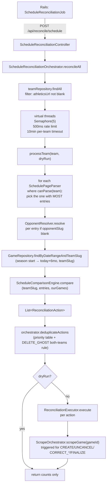

# Reconciliation subsystems

Three independent but overlapping reconciliation pipelines live in `reconciliation/`. They all resolve the core question "does our Games table agree with the source of truth?" but each uses a different source of truth and a different decision tree.

## Table of Contents

- [1. Schedule reconciliation — the 592-team pipeline](#1-schedule-reconciliation-the-592-team-pipeline)
  - [Flow](#flow)
  - [ScheduleComparisonEngine](#schedulecomparisonengine)
  - [Action priority (`deduplicateActions`)](#action-priority-deduplicateactions)
  - [ReconciliationExecutor](#reconciliationexecutor)
  - [FullReconciliationResult + ReconciliationAction](#fullreconciliationresult--reconciliationaction)
- [2. WMT cancelled-game reconciliation](#2-wmt-cancelled-game-reconciliation)
  - [Historical bug this guards against](#historical-bug-this-guards-against)
  - [Candidate selection](#candidate-selection)
  - [prioritizeCandidates](#prioritizecandidates)
  - [Per-candidate flow](#per-candidate-flow)
  - [WMT_DOMAINS hardcoded list](#wmt_domains-hardcoded-list)
- [3. NCAA date reconciliation](#3-ncaa-date-reconciliation)
  - [Why it exists](#why-it-exists)
  - [Decision tree](#decision-tree)
  - [Phase 4 (create-or-assign) in detail](#phase-4-create-or-assign-in-detail)
  - [Create-time enrichment (Phase 3 companion in ScheduleReconciliationOrchestrator)](#create-time-enrichment-phase-3-companion-in-schedulereconciliationorchestrator)
  - [`verifyDateChange` — team schedules are higher-priority than NCAA](#verifydatechange--team-schedules-are-higher-priority-than-ncaa)
  - [Series contest ID mismatch guard](#series-contest-id-mismatch-guard)
  - [`boxScoresMatch` — stat fingerprint](#boxscoresmatch--stat-fingerprint)
  - [`isEmptyDuplicate` — merge target heuristic](#isemptyduplicate--merge-target-heuristic)
  - [`NcaaDateReconciliationWriter`](#ncaadatereconciliationwriter)
  - [Result DTO](#result-dto)
- [Result DTOs summary](#result-dtos-summary)
- [Related docs](#related-docs)

| Subsystem | Source of truth | Trigger | Writes |
|-----------|-----------------|---------|--------|
| **WMT cancelled-game reconciler** | WMT API + optional schedule page | `POST /api/reconcile` | Updates `games.state`/scores, kicks off box score fetch |
| **Per-team schedule reconciler** | Each team's live schedule page | `POST /api/reconcile/schedule` | Full CRUD on `games`, plus `GameReview` flags and `GameTeamLink` upserts |
| **NCAA date reconciler** | NCAA GraphQL API + both teams' schedule pages | `POST /api/reconcile/ncaa-dates` | Moves `game_date`, merges duplicates, flags for review |

---

## 1. Schedule reconciliation — the 592-team pipeline

**Entry:** `POST /api/reconcile/schedule` (full) / `/check` (dry) / `/team` / `/team/check`.
**Top-level orchestrator:** `reconciliation/ScheduleReconciliationOrchestrator.java` (344 LOC).

### Flow



### `ScheduleComparisonEngine`

**File:** `reconciliation/ScheduleComparisonEngine.java` (506 LOC). For one team, compares schedule entries against `ourGames` and emits a list of actions.

The engine makes **the team's schedule the source of truth**. For each `ScheduleEntry`:

1. Resolve opponent (via `OpponentResolver` if slug blank). Skip if unresolved or self-play.
2. Derive `(homeSlug, awaySlug, homeScore, awayScore)` from `isHome` flag.
3. Decide `isTrulyFinal` = entry state is `"final"` AND both scores non-null AND ≥0. **Future games mis-labeled as `"final"` with no scores are demoted to scheduled** — a parser idiosyncrasy guard.

Two branches:

**Final entry → `processFinalEntry`:**
- Try `findMatch(entry, teamSlug, oppSlug, ourGames)` — 3-pass matching:
  1. Exact date + opponent + game_number.
  2. Date ±1 day + same opponent.
  3. Date ±4 days + same opponent + matching scores (either direction).
  4. *(removed)* Pass 4/5 used wrong-opponent matching; deleted because it produced false matches ("Illinois" matching an "ill-chicago" game when both involve the same team + same score).
- If matched and `isAlreadyAnalyzed(game)` (= state `"final"` AND `locked=true`): `evaluateAnalyzedGame` — only fix data errors (`CORRECT_TEAMS` / `CORRECT_DATE` / `CORRECT_SCORES`). Don't re-scrape. Also emits a `NO_CHANGE` to keep the schedule-side link.
- If matched and not yet analyzed: `evaluateMatch` → can emit `CORRECT_TEAMS`, `UNCANCEL`, `CORRECT_DATE`, `CORRECT_SCORES`, or `FINALIZE`. If everything matches but the game lacks a box score, emits `NO_CHANGE` (executor will trigger a scrape anyway).
- If no match: `createIfNotDuplicate` → emits `CREATE` unless a game with same date + teams + game_number already exists.

**Future entry → `processFutureEntry`:**
- Match by `(sameDate AND teamInGame AND (opponentMatches OR not-final))`.
- If found and already final in DB: skip (don't overwrite a scored game with a schedule-page scheduled entry).
- If found and state/date/opponent changed: `REFRESH_FUTURE`.
- If not found and entry date is within `today - 3 days` or later: `CREATE`. Ignores ancient orphan scheduled entries.

**`processUnmatchedGames` — DB games not on schedule:**
- If final + already analyzed (has box score): `DELETE_GHOST` — only if the orchestrator dedup sees this from BOTH teams.
- If final but no box score: `FLAG_FOR_REVIEW` (can't confirm, queue for admin).
- If scheduled/pre/cancelled: `DELETE_GHOST` (safer — non-final orphans can just be deleted).

### Action priority (`deduplicateActions`)

When both teams' schedules produce actions for the same game, we keep the highest-priority one:

```
CORRECT_TEAMS (6) > CORRECT_DATE (5) > UNCANCEL (4) > CORRECT_SCORES (3) > FINALIZE (2) > FLAG_FOR_REVIEW (1) > REFRESH_FUTURE (0) > CREATE (0) > DELETE_GHOST (-1)
```

Dedup key for non-CREATE: `game_<existingGameId>`. For CREATE: `create_<date>_<sortedSlugs>_<homeScore>_<awayScore>`.

**DELETE_GHOST special rule:** A game is only deleted if flagged by ≥2 teams' schedules (i.e., both teams agree the game isn't on their schedule). If only one team flags it, the action is dropped — the other team might just have a missing schedule page.

### `ReconciliationExecutor`

**File:** `reconciliation/ReconciliationExecutor.java` (462 LOC)

Per-action switch dispatching to `executeCreate`, `executeUncancel`, `executeCorrectDate`, `executeCorrectScores`, `executeCorrectTeams`, `executeFinalize`, `executeRefreshFuture`, `executeDeleteGhost`, `executeFlagForReview`, `executeNoChange`.

Key behaviors:
- **`executeCreate`** goes through `GameCreationService.findOrCreate` (the single creation gate). After saving, extracts `sidearmId` from the source boxscore URL via `/boxscore/(\d+)` regex, writes `Game.setBoxScoreIdForTeam(teamSlug, sidearmId)`, upserts `GameTeamLink{gameId, teamSlug, boxScoreUrl, sidearmGameId}`. Then calls `scrapeOrchestrator.scrapeGame(gameId)` to pull the box score.
- **`executeCorrectDate`** has a pre-write safety check: if a game already exists at the new date with the same teams, reject. Prevents creating duplicates.
- **`executeCorrectTeams`** checks if fixing the teams would create a duplicate; if yes, **deletes** the wrong-team game and keeps the existing correct one.
- **`executeDeleteGhost`** is guarded by the orchestrator's both-teams-must-agree dedup — by the time the executor sees it, 2 teams' schedules have already confirmed absence.
- **`setBoxScoreId`** is called from every non-delete path: finds/creates the `GameTeamLink` so the downstream scrape pipeline has a URL to fetch.
- **`triggerBoxscoreFetch(gameId)`** calls `scrapeOrchestrator.scrapeGame(gameId)` synchronously after every structural change. This is why reconciliation runs take so long — each CREATE triggers a full box score + stats + PBP pipeline.

### `FullReconciliationResult` + `ReconciliationAction`

```java
record ReconciliationAction(
    ActionType type,                // CREATE, UNCANCEL, CORRECT_DATE, CORRECT_SCORES, CORRECT_TEAMS,
                                    // FINALIZE, REFRESH_FUTURE, DELETE_GHOST, FLAG_FOR_REVIEW, NO_CHANGE
    Long existingGameId,
    ScheduleEntry source,
    String reason,
    LocalDate proposedDate,
    String proposedHomeSlug, String proposedAwaySlug,
    Integer proposedHomeScore, Integer proposedAwayScore,
    String proposedState
)

record FullReconciliationResult(
    int teamsProcessed, int teamsSucceeded, int teamsFailed,
    int gamesCreated, int gamesUncancelled, int gamesDateCorrected, int gamesScoreCorrected,
    int gamesFinalized, int gamesFlaggedForReview, int gamesNoChange,
    boolean dryRun, List<ReconciliationAction> actions, long elapsedMs
)
```

---

## 2. WMT cancelled-game reconciliation

**Entry:** `POST /api/reconcile` / `/check`.
**File:** `reconciliation/ReconciliationService.java` (727 LOC).

**Purpose:** When the NCAA API incorrectly marks a game as cancelled (but it was actually played), find it via WMT API + team schedule page scraping and update to `final` with real scores.

### Historical bug this guards against

From the file header: "The previous Ruby implementation had a bug where Minnesota vs Ohio State April 4 boxscore was applied to the April 3 game because it matched by teams only, not by date." The Java version **always verifies** `wmtDate.equals(game.getGameDate())` before applying any score — see `findWmtMatch` lines 389-396:

```java
List<Map<String,Object>> dateMatches = wmtGames.stream()
    .filter(wg -> ((String) wg.get("game_date")).startsWith(gameDateStr))
    .toList();
```

### Candidate selection

`findReconciliationCandidates(staleCutoff=today-1d, lookbackStart=today-60d)` returns games that are either:
- `state = 'cancelled'` within the 60-day lookback, OR
- `state = 'pre'` with `gameDate < staleCutoff` AND `homeScore IS NULL AND awayScore IS NULL`.

### `prioritizeCandidates`

Games with final siblings on adjacent dates (±2 days, same teams) are processed first. Rationale: a cancelled game next to a real-scored series is much more likely to have actually been played.

### Per-candidate flow

1. Resolve `wmtSchoolId` for home or away team via `team.wmtSchoolId` or domain-based `SCHOOL_IDS` fallback.
2. **WMT path:** call `https://api.wmt.games/api/statistics/games?school_id=X&season_academic_year=Y&sport_code=WSB&per_page=200`. Filter by exact `game_date` match, verify opponent via `wmtSchoolId` or name match, extract scores from `competitors[].score` keyed by `homeContest` boolean.
3. **Schedule fallback (non-WMT teams):** try patterns like `{athleticsUrl}/sports/softball/schedule/{year}`, `{athleticsUrl}/sports/sball/{yr-1}-{yr2}/schedule`. Parse HTML with regex for `href="…boxscore…"` near date + W/L score pattern `([WL]),?\s*(\d+)\s*-\s*(\d+)`.
4. **Date guard:** if WMT says a different date than our game, REFUSE to update. Log and skip.
5. **Duplicate guard:** `findDuplicateFinals(date, home, away, homeScore, awayScore, gameId)` — if a final already exists with the same matchup + date + score, skip.
6. **Score guard:** WMT `0-0` is treated as "probably not scored yet" and skipped.
7. **Apply:** `state = 'final'`, set scores, `dataFreshness = 'reconciled'`. Trigger `scrapeOrchestrator.scrapeGame(id)` to pull the box score.

Concurrency: virtual threads + `Semaphore(3)` + 500ms rate limit + 5-minute per-task timeout.

### WMT_DOMAINS hardcoded list

Duplicated across three files — `ReconciliationService.java`, `service/fetcher/WmtFetcher.java`, `roster/WmtRosterService.java`, `reconciliation/schedule/WmtScheduleParser.java`. Same 46 entries. **Extract candidate** — pull to `ScraperProperties` or a shared constants class.

---

## 3. NCAA date reconciliation

**Entry:** `POST /api/reconcile/ncaa-dates` / `/check`. Optional `?date=YYYY-MM-DD` switches to a single-date scoped run (Feb 2026+).
**Service:** `reconciliation/NcaaDateReconciliationService.java`.
**Writer:** `reconciliation/NcaaDateReconciliationWriter.java` (143 LOC) — separate bean so `@Transactional` proxies work (self-invocation bypasses Spring AOP).

### Scoped vs. full-season

- `service.reconcile(boolean dryRun)` — full season. Fetches every date Feb 6 → May 31 (D1) and Jan 30 → May 31 (D2) via `NcaaApiClient.contestsForSeason()`. ~5 minutes. Scheduled daily at 02:30 UTC (`NcaaDateReconciliationJob`). Catches cross-date moves.
- `service.reconcile(LocalDate date, boolean dryRun)` — single-date. Fetches only `contestsForDate(date, 1)` + `contestsForDate(date, 2)`, narrows the `gamesByContestId` map to `findByGameDateBetween(date-2, date+2)` so the resolver's ±2-day date-flex still works. ~seconds. Scheduled hourly at `:15` against today + tomorrow (`NcaaDateReconciliationHourlyJob`). Catches NCAA contests that appear mid-day (the scenario behind issue #106).

Both entry points delegate to a shared private `runReconcile(contests, gamesByContestId, dryRun, startMs)` so Phase 3/4/5 logic is identical.

### Why it exists

The NCAA GraphQL API is the authoritative source for game dates via `ncaa_contest_id`. When NCAA moves a game, our Games table doesn't update automatically; this service detects and reconciles those moves.

### Decision tree

```
1. Fetch all NCAA contests for the season (one API call, no DB held)
2. Pre-load Map<contestId, Game> from our DB
3. For each contest where date differs from our game:
   (a) Verify against BOTH teams' schedule pages
       → verifyDateChange returns MOVE / NCAA_WRONG / REVIEW
   (b) If NCAA_WRONG → skip (teams still show old date, trust teams over NCAA)
   (c) If REVIEW → writer.createReview("date_mismatch", reason)
   (d) If MOVE:
       - No conflict on new date → writer.correctDate (clean up ghost on old date)
       - Conflict is empty shell (no contestId, no scores) → writer.removeDuplicate (merge)
       - Both final, stat fingerprints match → writer.removeDuplicate (confirmed dupe)
       - Both final, stat fingerprints differ → writer.correctDate (doubleheader, move)
       - One or both scheduled → writer.correctDate (safe, GameDedupJob handles any follow-up)
4. Create-or-assign phase: for each NCAA contest with no matching Game,
   call NcaaContestCandidateResolver.findCandidate. If matched,
   writer.assignNcaaContest fills ncaa_contest_id + start_time_epoch
   (fill-blank; never overwrites). Claim-aware: a Game enriched earlier
   in the pass is not a candidate for later contests. Unmatched ->
   log-only; no review queue.
```

### Phase 4 (create-or-assign) in detail

This phase owns all contest-id attachment for Games that don't yet have one.
Matches the architectural direction: Rails no longer writes `ncaa_contest_id`.

`NcaaContestCandidateResolver.findCandidate(contest, contestsOnSameDate, claimedGameIds)`:

1. **Slug normalization.** NCAA's `seoname` is first looked up directly against
   `Team.slug` and, on miss, run through `OpponentResolver` (TeamAlias + fuzzy).
   Both home and away must resolve; otherwise the contest is skipped (log
   `ncaa_unmatched_team`).
2. **Exact date match.** `gameRepository.findByDateAndTeams(date, home, away)`.
   Filters out Games that already hold a contest_id OR are in `claimedGameIds`.
   Single candidate -> return it.
3. **Doubleheader pairing.** Multiple unclaimed candidates on the same key:
   sort sibling contests by `startTimeEpoch` (nulls last), sort Games by
   `game_number`, index-align. The current contest picks the Game at its own
   sibling-index. This kills the historical bug where Ruby's
   `find_by(date, home, away)` always grabbed game 1 and game 2 silently lost
   its contest-id.
4. **Date flex.** If none of the above hit, retry exact match at `date -1, +1,
   -2, +2` days.

No review queue. An unresolved contest logs `ncaa_contest_unmatched` and gets
retried next cron run. Fix path is adding a `TeamAlias`, not human triage.

### Create-time enrichment (Phase 3 companion in ScheduleReconciliationOrchestrator)

At the start of `reconcileAll`, the orchestrator calls
`NcaaApiClient.contestsForSeason()` once and passes the result to
`ReconciliationExecutor.setContestLookup(...)`. Whenever `executeCreate` builds
a `GameCreationRequest`, it consults the lookup by `(date, sorted slugs)` and
threads `ncaa_contest_id` + `start_time_epoch` in when there is a single
unambiguous contest. Doubleheader-ambiguous keys (two contests on the same
day/teams) are skipped here and picked up by the Phase 4 claim-aware pass.

This is why newly-created Games land enriched on the same day the schedule
page first surfaces them, instead of relying on a separate sync job. Combined
with the stable `/game/rb_<id>` URL scheme on the Rails side, the public URL
for a Game never flips when `ncaa_contest_id` is filled in later.

### `verifyDateChange` — team schedules are higher-priority than NCAA

For each team (home and away), `checkTeamScheduleForBothDates` parses the live schedule and looks for the opponent on both the old date and the new date. Returns `TeamScheduleCheck(parseable, showsOldDate, showsNewDate, allMatchDates)`.

Decision:
- Both teams confirm new date AND neither shows old → `MOVE`.
- Both parseable teams still show old date AND neither shows new → `NCAA_WRONG`.
- At least one parseable team still shows old → `REVIEW` ("teams disagree").
- Neither date matches but both teams agree on a THIRD date → `MOVE` with that third date as `actualDate` (happens when game moved twice).
- Inconclusive → `REVIEW`.

### Series contest ID mismatch guard

If our game is final AND a final game between the same teams already exists on the NCAA's new date WITH its own contestId, this is interpreted as NCAA assigning a series' contest ID to the wrong game — skip silently. Prevents over-aggressive date moves on confirmed series.

### `boxScoresMatch` — stat fingerprint

Used to distinguish "same game, two rows" from "doubleheader, two games". Compares:
- Final scores (direct or swapped).
- Player stat fingerprints: for every PGS row, build a pipe-delimited string of `teamSlug|playerName|ab|h|r|rbi|bb|so|2b|3b|hr|sb|hbp|sf|sh|ip|pitchH|pitchR|pitchER|pitchBB|pitchK|pitchHR|cs|errors`.

Returns true only if BOTH games have stats AND every fingerprint matches. If either is missing stats, return false (can't confirm dupe → flag for review instead).

### `isEmptyDuplicate` — merge target heuristic

A conflict game qualifies as an "empty shell" (safe merge target) if `ncaaContestId IS NULL AND homeScore IS NULL AND awayScore IS NULL`. Typically a stub created by `ScheduleCrawlJob` after the date move, while our original game was seeded earlier with the stale date.

### `NcaaDateReconciliationWriter`

Five `@Transactional` methods:
- `updateEpoch(game, epoch)` — time-only update.
- `correctDate(game, newDate, epoch)` — moves game, sets `dataFreshness="ncaa_corrected"`, deletes any ghost on the old date (scheduled/cancelled, no contestId, no scores, created after this game).
- `removeDuplicate(staleGame, keepGame, contest)` — transfers `GameTeamLink`s, clears `staleGame.ncaaContestId` to free the constraint, moves contestId to `keepGame`, then deletes the stale one. Needs an explicit `flush()` between the two saves to avoid unique constraint collision.
- `createReview(game, contest, conflictGame?, reviewType, reason)` — idempotent GameReview insert. Deduplicates on `(gameId, status=pending, reviewType)`. (Only emitted by the date-move phase; the create-or-assign phase does not create reviews.)
- `assignNcaaContest(game, contest)` — fill-blank write of `ncaa_contest_id` and `start_time_epoch` on a Game that previously had neither. UNIQUE pre-check via `findByNcaaContestId`. Sets `dataFreshness="ncaa_enriched"` as the Java-owned create-or-assign marker.

### Result DTO

```java
record NcaaDateReconciliationResult(
    int dateCorrected, int duplicatesRemoved, int ncaaWrong, int flaggedForReview,
    int skipped, int noChange, int assigned, int unmatched, int errors,
    boolean dryRun, long elapsedMs
)
```

- `assigned` — contests newly attached to an existing Game via the create-or-assign phase.
- `unmatched` — contests with no Game candidate under the match ladder. Non-NCAA-tracked teams (NAIA / D3 / JUCO) dominate this number; the expected floor.

---

## Result DTOs summary

| Pipeline | Result record | File |
|----------|---------------|------|
| WMT reconciliation | `ReconciliationResult(candidatesFound, repaired, skipped, failed, dryRun, actions[])` with inner `GameAction` | `reconciliation/ReconciliationResult.java` |
| Schedule reconciliation | `FullReconciliationResult(...)` + action list | `reconciliation/FullReconciliationResult.java` + `ReconciliationAction.java` |
| NCAA dates | `NcaaDateReconciliationResult(...)` (no per-action list; too many rows) | `reconciliation/NcaaDateReconciliationResult.java` |

---

## Related docs

- [01-controllers.md](01-controllers.md) — `/api/reconcile*` REST endpoints entry points
- [02-services.md](02-services.md) — `ScrapeOrchestrator` triggered by executor after structural changes
- [03-parsers.md](03-parsers.md) — schedule parsers + `OpponentResolver` consumed here
- [../pipelines/06-reconciliation-pipeline.md](../pipelines/06-reconciliation-pipeline.md) — Rails-side jobs that trigger these endpoints
- [../reference/matching-and-fallbacks.md](../reference/matching-and-fallbacks.md) — match ladder used by `ScheduleComparisonEngine`
- [../operations/runbook.md](../operations/runbook.md) — how to dry-run, debug, and recover reconciliation
